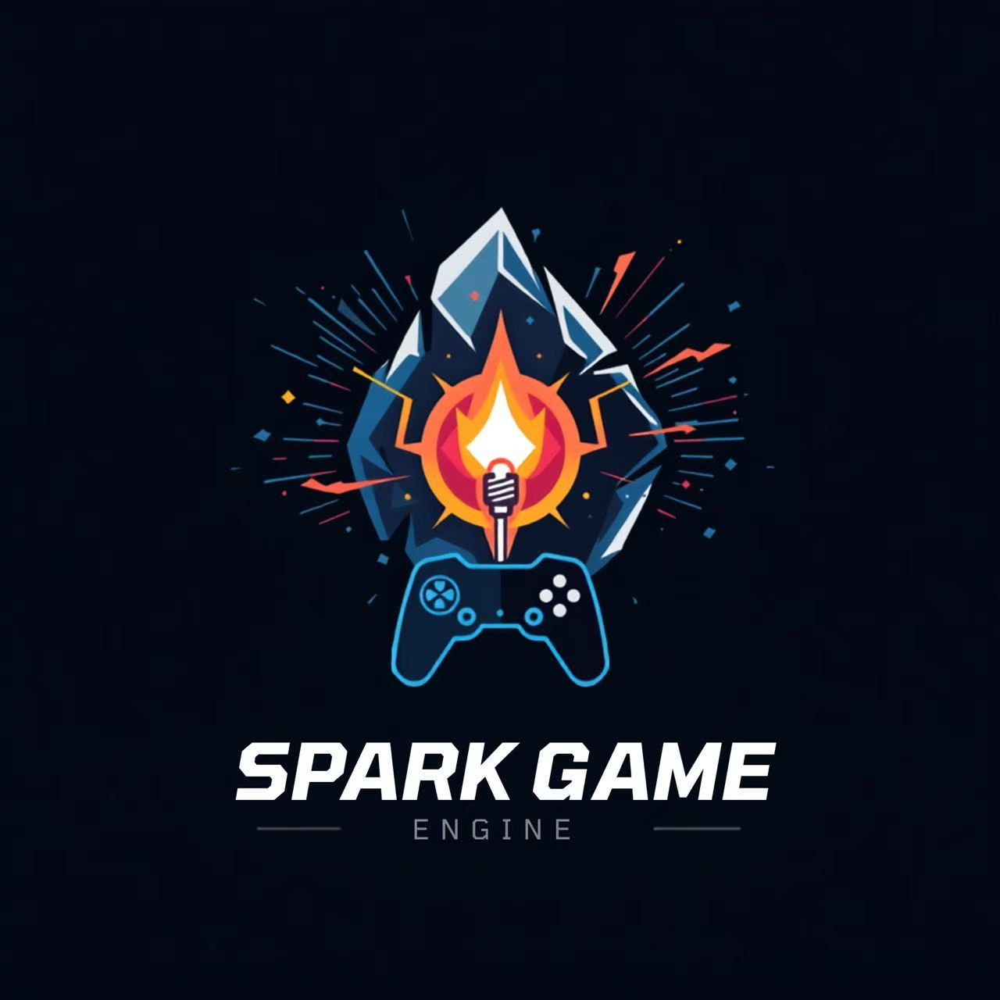
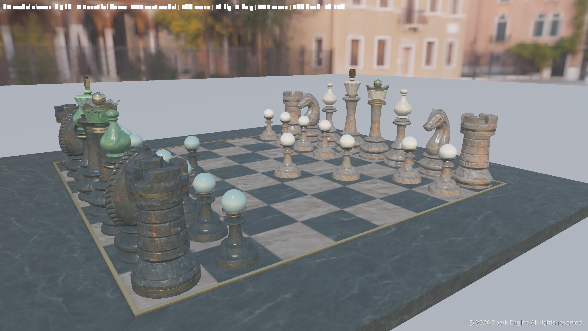
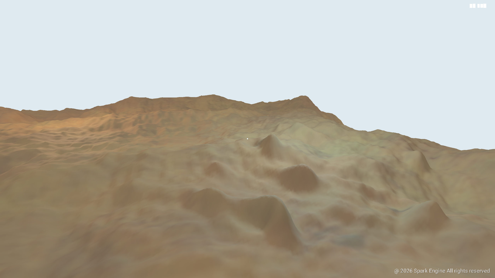
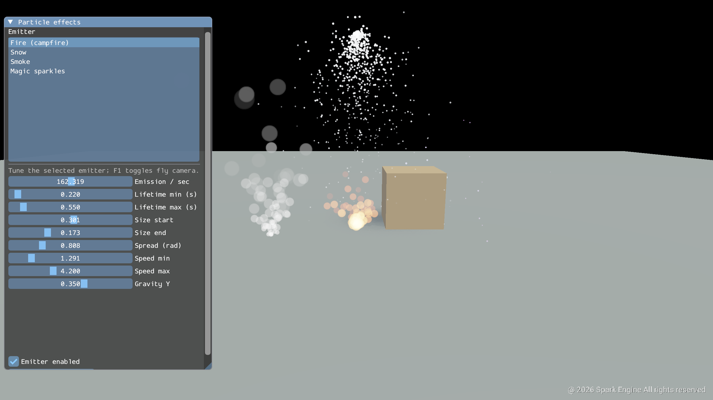
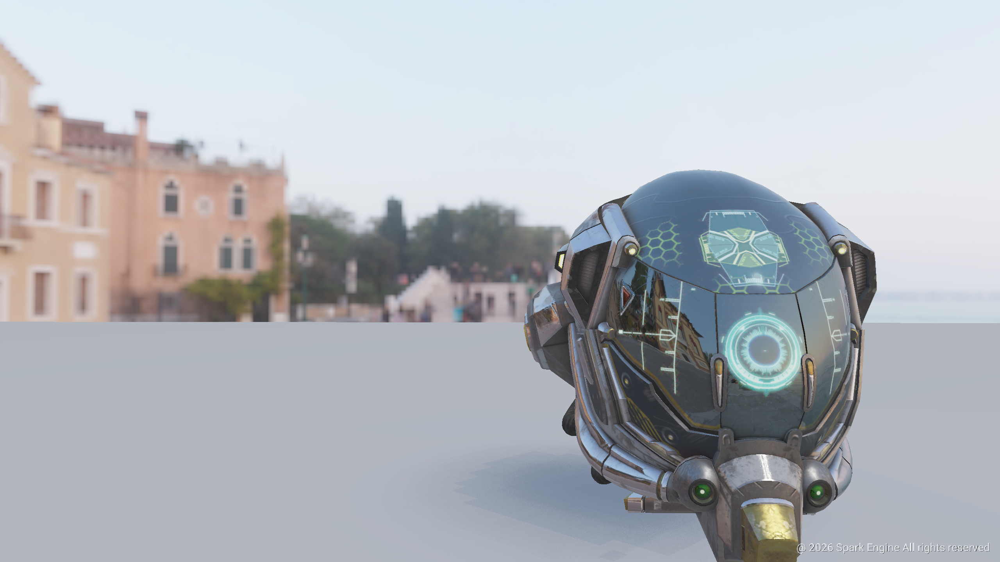
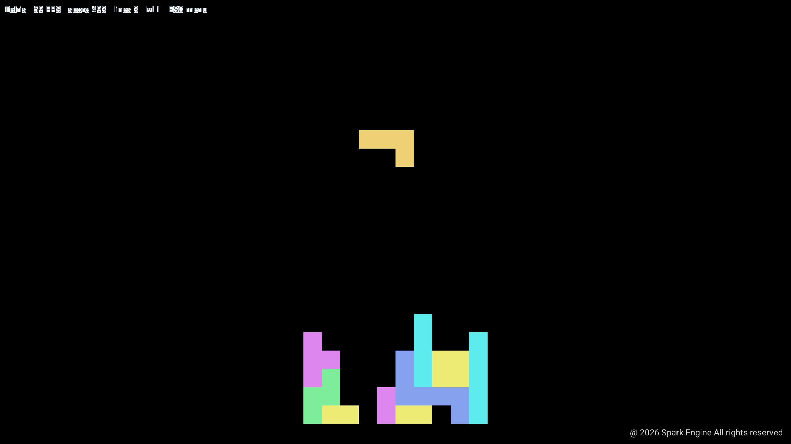
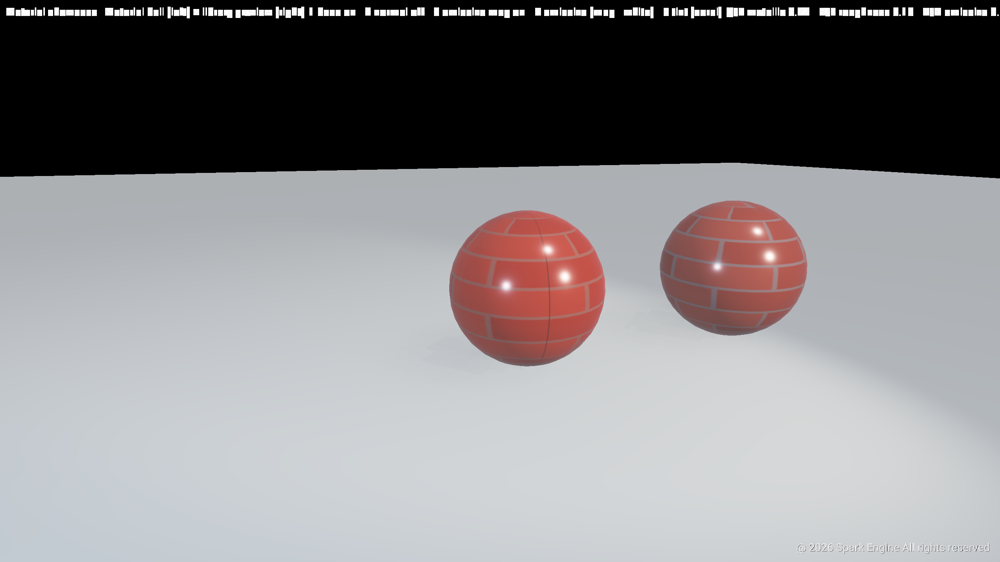
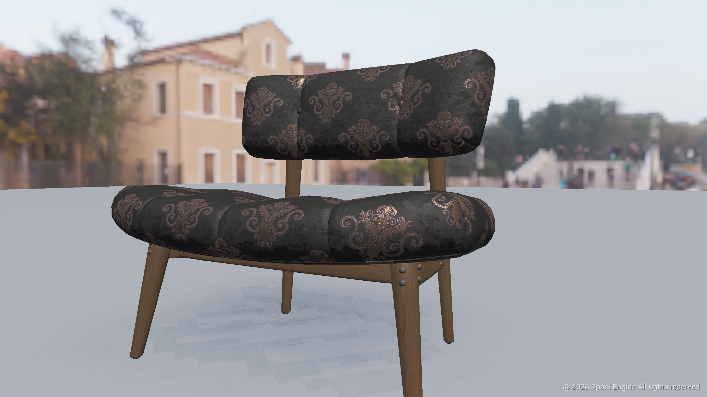
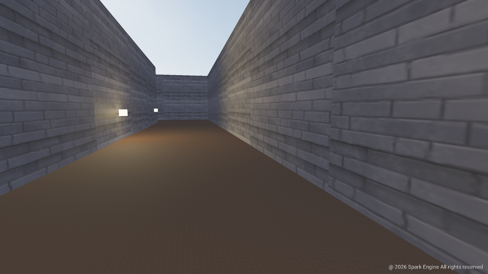

<p align="center">
  
</p>

# Spark

Spark is a **C++23** game engine with a Vulkan forward renderer, entity–component scene model, retained-mode GUI, optional **Dear ImGui** tool UI, optional C# scripting, and an in-progress editor.

## Showcase

In-engine captures from **SparkDemo** (F12 screenshot, F9 video recording).

### Screenshots

| | | |
|:---:|:---:|:---:|
|  |  |  |
|  |  |  |
|  |  |  |
 

## Quick start

**Requirements:** CMake ≥ 3.28, C++23, [Vulkan SDK](https://vulkan.lunarg.com/) (`glslangValidator` on `PATH`), network on first configure (GLFW FetchContent, fonts, sample assets).

```bash
cmake --preset debug
cmake --build cmake-build-debug -j
./cmake-build-debug/SparkDemo
```

| Target | Path (debug preset) | Purpose |
|--------|---------------------|---------|
| **SparkDemo** | `cmake-build-debug/SparkDemo` | Interactive launcher + **19** built-in modes |
| **SparkEditor** | `cmake-build-debug/spark_editor/SparkEditor` | 3D editor shell (edit mode, dock UI) |
| **SparkScriptHost** | `cmake-build-debug/SparkScriptHost` | CoreCLR host for C# games |

**Editor-only slim build:** `cmake --preset editor-debug && cmake --build cmake-build-editor --target SparkEditor`

See [`docs/CLION.md`](docs/CLION.md) and [`.run/README.md`](.run/README.md) for CLion presets and run configurations.

## Documentation

| Document | Contents |
|----------|----------|
| [**Programming guide**](docs/programming-guide/index.md) | Tutorials + [UI toolkits](docs/programming-guide/1-overview-architecture/08-ui-and-toolkits.md) + [component reference](docs/programming-guide/1-overview-architecture/07-game-component-reference.md) |
| [**Architecture & Developer Guide**](docs/ARCHITECTURE_AND_DEVELOPER_GUIDE.md) | Engine loop, ECS, rendering data path, feature catalog |
| [**Scene & Rendering API Gaps**](docs/SCENE_AND_RENDERING_GAPS.md) | C++ public API gap analysis (`include/spark/`, scene + 3D render) |
| [**Lighting & Shadows**](docs/LIGHTING_AND_SHADOWS.md) | CSM, punctual lights, SSAO, HDR/tonemap |
| [**Materials & Lighting**](docs/MATERIALS_AND_LIGHTING.md) | PBR channels, IBL, material limits |
| [**Spark Editor Plan**](docs/SPARK_EDITOR_PLAN.md) | Editor milestones, project/asset workflow |
| [**GUI & Editor Roadmap**](docs/GUI_EDITOR_ROADMAP.md) | GUI toolkit and authoring UI tasks |
| [**C# Scripting**](docs/CSHARP_SCRIPTING.md) | CoreCLR host, bindings, HelloCsGame |
| [**3D Animation Roadmap**](docs/ANIMATION_3D_ROADMAP.md) | Skeletal animation milestones |
| [**Open World Roadmap**](docs/OPEN_WORLD_ACTION_ROADMAP.md) | Long-horizon streaming/combat/AI plan |
| [**2D ARPG Features**](docs/2D_ARPG_FEATURES.md) | 2D gameplay backlog |

## Repository layout

```
include/spark/     Public API (engine, ecs, scene, render, gui, imgui, editor, …)
src/spark/         Implementations
src/Engine.cpp     Engine loop (not under src/spark/engine/)
assets/            Runtime fonts, models, textures
shaders/           GLSL → SPIR-V (SparkShaders target)
docs/              Design docs and roadmaps
spark_editor/      SparkEditor executable
scripting/         SparkInterop + SparkScriptHost + C# SDK
game_template/     Minimal external game CMake project
samples/           FPS and 2D platformer templates
```

**Render headers** live under `include/spark/render/` in stage subfolders (not flat `render/*.hpp`):

| Subfolder | Examples |
|-----------|----------|
| `platform/` | `Window.hpp` |
| `core/` | `VulkanRenderer.hpp`, `VulkanDeviceContext.hpp`, `VulkanFrameSync.hpp`, `VulkanFrameCapture.hpp` |
| `gpu/` | `VulkanGpuBufferImage.hpp`, `VulkanSpvShaderLoader.hpp` |
| `present/` | `VulkanPresentRenderPass.hpp`, `VulkanPresentationFramebuffers.hpp`, `VulkanDepthResources.hpp` |
| `scene/` | `VulkanScenePipeline.hpp`, `VulkanSceneDescriptors.hpp`, `VulkanSceneOpaquePass.hpp` |
| `shadow/` | `VulkanDirectionalShadowPass.hpp`, `VulkanPunctualShadowPass.hpp` |
| `post/` | `VulkanHdrTonemapPass.hpp`, `VulkanScreenSpaceEffectsPass.hpp` |
| `sprites2d/` | `VulkanSpritePass.hpp`, `VulkanTilemapPass.hpp`, `VulkanParticlePass.hpp` |
| `ui/` | `VulkanScreenUiPass.hpp` |
| `capture/` | `VulkanScreenshotCapture.hpp`, `VulkanVideoCapture.hpp` |
| `lighting/` | `SceneLightingResolver.hpp`, `SceneLightingProfile.hpp` |

## Mental model

1. **Simulation** — `GameWorld` + `GameObject` + `GameComponent`; tick via `IGame::OnUpdate`.
2. **Render snapshot** — Each frame, gameplay fills `SceneRenderParams` (draws, lights, sprites, UI).
3. **Presentation** — `VulkanRenderer` orchestrates passes under `render/*/` (shadow → HDR scene → SSAO → tonemap → screen UI). Instance/device/swapchain live in `VulkanDeviceContext`; frame sync in `VulkanFrameSync`.

Games implement `IGame` (`spark/engine/IGame.hpp`). Optional `Game` base owns a `Scene` and forwards component updates.

## External game projects

- [`game_template/`](game_template/README.md) — empty shared-library game
- [`samples/fps_game_template/`](samples/fps_game_template/README.md) — FPS starter
- [`samples/platformer2d_game_template/`](samples/platformer2d_game_template/README.md) — 2D platformer starter

Set `SPARK_ROOT` to this repository when building templates.

## Asset credits

See [`assets/CREDITS.md`](assets/CREDITS.md).
