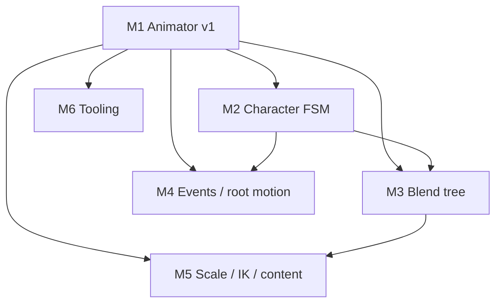

# 3D Animation — Engine Roadmap & Tracked Tasks

Living plan for **skeletal mesh playback**, **gameplay-driven clip control**, **blending**, **events**, and **scale**. It complements the high-level traversal/combat items in [`OPEN_WORLD_ACTION_ROADMAP.md`](OPEN_WORLD_ACTION_ROADMAP.md) (Phase F) with concrete engine work items.

**Architecture anchors:** [`ARCHITECTURE_AND_DEVELOPER_GUIDE.md`](ARCHITECTURE_AND_DEVELOPER_GUIDE.md) §5.8, `include/spark/animation/Skeleton.hpp`, `include/spark/ecs/components/AnimatorComponent.hpp`, `include/spark/ecs/components/Character3DAnimFsmComponent.hpp`, `src/spark/scene/skinned_mesh_gltf.cpp`, `src/spark/scene/SceneSubmit*.cpp`, `shaders/scene.vert`.

**2D reference (target parity for gameplay drivers):** `SpriteAnimatorComponent`, `Sprite2DCharacterAnimFsmComponent` — see [`2D_ARPG_FEATURES.md`](2D_ARPG_FEATURES.md).

---

## How to track work

| Convention | Meaning |
|------------|---------|
| **Task ID** | `AN3D-M{milestone}-{nn}` — stable across PRs and issues |
| **Priority** | **P0** must for milestone exit · **P1** should · **P2** nice |
| **Status** | Use GitHub issue state, or check boxes in this file when merging |

**Suggested GitHub labels:** `animation`, `3d`, `milestone-M1` … `milestone-M6`

**Issue title format:** `[AN3D-M1-03] Animator: loop modes (Loop / Once / Hold)`

Copy the **Issue body** block under each task when filing issues (or use the bulk script in [§8](#8-bulk-github-issue-creation-optional)).

---

## Current baseline (as of this doc)

| Area | Status |
|------|--------|
| glTF skinned load (first skinned node) | Done — `TryLoadSkinnedCharacterFromGltf`, `GameWorld::LoadSkinnedGltf` |
| Joint palette GPU skinning (≤64 joints) | Done — SSBO + `scene.vert` / shadow pass |
| Single-clip playback | Done — `AnimatorComponent` (loop modes, crossfade, `ComputeJointPalette`) |
| Lit + shadow skinned draws | Done — `SceneSubmit`, `VulkanRenderer` |
| Walk clip heuristic | Done — name contains `"walk"` |
| Bind-up / facing yaw helpers | Done — `SkinnedGltfAsset` |
| Loop modes / crossfade / clip API (M1) | Done — `AnimLoopMode`, `SetClipIndexWithCrossfade`, C/C# bindings |
| 3D animation state machine (M2) | Partial — `Character3DAnimFsmComponent` (locomotion + attack) |
| Clip blending / crossfade | Done (M1 two-clip crossfade); blend tree (M3) not started |
| Animation events / root motion / IK | **Not started** |
| C# / C API clip control | Done (M1) — loop mode, finished, crossfade, clip names |

---

## Milestone overview

| Milestone | Goal | Depends on | Maps to open-world |
|-----------|------|------------|-------------------|
| **M1** | Animator v1 — API, loop modes, crossfade, cull | — | F3 prerequisite |
| **M2** | 3D character FSM — locomotion + combat overlays | M1 | F3, F4 |
| **M3** | Blend tree lite — 2-clip + 1D speed tree | M1 | F3 |
| **M4** | Gameplay hooks — events, root motion, attachments | M1, M2 | F4, G1 |
| **M5** | Scale & content — joints, materials, morph, IK | M1–M3 | F5, A2 budgets |
| **M6** | Tooling & pipeline — export rules, debug viz | M1 | §0 content pipeline |

**Recommended order:** M1 → M2 → M3 → M4 (M5/M6 in parallel where possible).

---

## M1 — Animator v1 (API + playback semantics)

**Exit criteria:** A C# or gameplay module can switch clips, play one-shots, and query clip finished **without** custom engine C++. `SceneSubmit` skips off-screen skinned draws when spatial policy is enabled.

| ID | Task | P | Status |
|----|------|---|--------|
| AN3D-M1-01 | **C++ API:** `AnimatorComponent` — `GetClipCount`, `GetClipName`, `FindClipIndexByName`, document thread/ownership | P0 | [x] |
| AN3D-M1-02 | **Loop mode:** `enum class AnimLoopMode { Loop, Once, Hold }` on animator; `Skeleton::ComputePalette` respects mode (no `fmod` for Once/Hold) | P0 | [x] |
| AN3D-M1-03 | **`IsClipFinished()`** for `Once` (mirror `SpriteAnimatorComponent`) | P0 | [x] |
| AN3D-M1-04 | **Clip change:** `SetClipIndex` resets time (configurable); optional `SetClipIndexWithCrossfade(index, durationSec)` | P0 | [x] |
| AN3D-M1-05 | **Crossfade v1:** two-clip palette lerp (fixed duration, e.g. 0.15–0.25 s) — lerp TRS per joint then solve hierarchy | P0 | [x] |
| AN3D-M1-06 | **C API:** `spark_animator_set_clip`, `get/set_time`, `get/set_speed`, `get_loop_mode`, `is_finished`, clip count/name | P0 | [x] |
| AN3D-M1-07 | **C# bindings:** expose M1 API on `AnimatorComponent` (not only `Create`) | P0 | [x] |
| AN3D-M1-08 | **`SceneSubmit`:** skinned collection via `ForEachSkinnedDrawableInViewFrustum` when `Scene` has spatial partition (match rigid cull path) | P1 | [x] |
| AN3D-M1-09 | **Tests / demo:** Character or ThreeDDemo — switch idle/walk/run by key; one-shot clip with finished callback | P1 | [x] |
| AN3D-M1-10 | **Docs:** update ARCHITECTURE §5.8 + bindings README with animator usage | P1 | [x] |

<details>
<summary>Issue template — AN3D-M1-02 (example)</summary>

**Title:** `[AN3D-M1-02] Animator: loop modes (Loop / Once / Hold)`

**Body:**
```
Milestone: M1 — Animator v1
Priority: P0

## Summary
Add loop mode to AnimatorComponent and stop unconditional fmod looping in Skeleton::ComputePalette for Once/Hold.

## Acceptance
- [ ] Once: clip stops at duration; IsClipFinished true
- [ ] Hold: clip stops at last frame
- [ ] Loop: current behavior preserved
- [ ] C# + C API exposed

## Files (expected)
- include/spark/ecs/components/AnimatorComponent.hpp
- src/spark/animation/Skeleton.cpp
- bindings (C API + C#)
```
</details>

---

## M2 — 3D character animation FSM

**Exit criteria:** Maze3D / CharacterCamera demo use a reusable component; no hard-coded `walkClipIndex` in game code. Locomotion + optional combat overlay behave like 2D FSM.

| ID | Task | P | Status |
|----|------|---|--------|
| AN3D-M2-01 | **New component:** `CharacterAnim3DComponent` (or `SkeletalAnimFsmComponent`) — drives `AnimatorComponent` on same or child object | P0 | [ ] |
| AN3D-M2-02 | **Locomotion input:** speed from `Rigidbody3DComponent` velocity and/or character motor; thresholds for idle / move / sprint | P0 | [ ] |
| AN3D-M2-03 | **Clip resolution:** by explicit indices or name patterns (`idle`, `walk`, `run`, `sprint`) | P0 | [ ] |
| AN3D-M2-04 | **Combat overlay:** optional attack/hurt clips (non-loop); priority over locomotion; clear when finished | P1 | [ ] |
| AN3D-M2-05 | **Blackboard hook:** optional `AiAgentComponent` int slot for combat command (parity with `kAiBlackboardIntSprite2DCombatCommand`) | P1 | [ ] |
| AN3D-M2-06 | **`RequestAttack` / `RequestHurt`** public API on FSM component | P1 | [ ] |
| AN3D-M2-07 | **Component order:** document “FSM before Animator” update order; enforce or sort in `GameWorld::UpdateGameObjects` if needed | P1 | [ ] |
| AN3D-M2-08 | **Refactor demos:** `Maze3DDemo`, `CharacterCameraDemo` use FSM; remove ad-hoc walk-only setup | P0 | [ ] |
| AN3D-M2-09 | **C# + C API:** add component from gameplay; configure clip indices or name table | P1 | [ ] |
| AN3D-M2-10 | **Docs:** `docs/ANIMATION_3D_ROADMAP.md` + short “Character animation” section in developer guide | P1 | [ ] |

---

## M3 — Blend tree lite

**Exit criteria:** Walk→run transition is smooth via blend parameter (e.g. normalized speed). No visible pop when crossing threshold.

| ID | Task | P | Status |
|----|------|---|--------|
| AN3D-M3-01 | **`Skeleton::ComputeBlendedPalette(clipA, clipB, t)`** — blend local TRS per joint, then hierarchy + bind | P0 | [ ] |
| AN3D-M3-02 | **Animator blend state:** `SetBlend(clips, weight)` or dual-clip + `blend01` updated each frame | P0 | [ ] |
| AN3D-M3-03 | **1D blend tree data:** ordered `{threshold, clipIndex}` pairs; evaluator returns clip pair + local t | P0 | [ ] |
| AN3D-M3-04 | **FSM integration:** `CharacterAnim3DComponent` feeds speed01 into blend tree instead of discrete switches | P0 | [ ] |
| AN3D-M3-05 | **Crossfade interaction:** blend tree output composes with M1 crossfade (define precedence) | P1 | [ ] |
| AN3D-M3-06 | **Debug:** log/display active clips + blend weight (dev overlay or HUD line) | P2 | [ ] |
| AN3D-M3-07 | **Demo:** CharacterCamera — analog walk/run from stick magnitude | P1 | [ ] |
| AN3D-M3-08 | **Unit tests:** blend at t=0, 1, 0.5 matches single-clip palettes | P2 | [ ] |

---

## M4 — Gameplay hooks (events, root motion, attachments)

**Exit criteria:** One melee attack can spawn hitbox from an animation event; optional root motion moves character with “in place” toggle.

| ID | Task | P | Status |
|----|------|---|--------|
| AN3D-M4-01 | **Event schema:** clip name + time + event name (+ optional float/int payload) — JSON sidecar or glTF extras | P0 | [ ] |
| AN3D-M4-02 | **Runtime:** fire `SignalId::AnimationEvent` (or dedicated callback) when playback crosses event time (once per crossing) | P0 | [ ] |
| AN3D-M4-03 | **Editor/export note:** document Blender → glTF event naming convention | P1 | [ ] |
| AN3D-M4-04 | **Root motion extraction:** per-frame delta from chosen root/hips joint in clip space | P1 | [ ] |
| AN3D-M4-05 | **`RootMotionComponent`:** apply delta to owner transform or motor; `inPlace` flag disables translation | P1 | [ ] |
| AN3D-M4-06 | **Attachment component:** bind child `GameObject` to joint index/name; update local/world each frame | P1 | [ ] |
| AN3D-M4-07 | **Hit windows:** sample doc + demo sphere/capsule enabled between event `active_start` / `active_end` | P1 | [ ] |
| AN3D-M4-08 | **Combat demo slice:** minimal attack clip + event-driven hit trace (ties to OPEN_WORLD G1) | P2 | [ ] |
| AN3D-M4-09 | **C# events:** subscribe from gameplay module | P1 | [ ] |

---

## M5 — Scale & content breadth

**Exit criteria:** Documented path for 100+ skinned NPCs within frame budget OR art rules for ≤64 joints + shared clips; glTF validation catches common failures at load.

| ID | Task | P | Status |
|----|------|---|--------|
| AN3D-M5-01 | **Joint limit strategy:** raise `MaxJoints` to 128 *or* split palette across two SSBO binds (design doc + pick one) | P1 | [ ] |
| AN3D-M5-02 | **Palette cache:** keyed by `(skeleton*, clip, quantizedTime)` for identical instances | P1 | [ ] |
| AN3D-M5-03 | **Budget enforcement:** max skinned draws / palette updates per frame (OPEN_WORLD A2) | P1 | [ ] |
| AN3D-M5-04 | **glTF interpolation:** STEP path type for stepped keys | P2 | [ ] |
| AN3D-M5-05 | **glTF interpolation:** CUBICSPLINE (or document unsupported + exporter preset) | P2 | [ ] |
| AN3D-M5-06 | **Multi-primitive skinned mesh:** all primitives of skin node merged (material slots later) | P1 | [ ] |
| AN3D-M5-07 | **Skinned glTF PBR:** normal + ORM textures from materials (align with `MaterialComponent`) | P1 | [ ] |
| AN3D-M5-08 | **Morph targets:** load + CPU blend 1–4 shapes (or GPU attribute stream) | P2 | [ ] |
| AN3D-M5-09 | **Foot IK (v1):** raycast down; adjust ankle/knee with simple two-bone IK | P2 | [ ] |
| AN3D-M5-10 | **Aim / look-at IK (v1):** spine chain partial blend toward target | P2 | [ ] |
| AN3D-M5-11 | **Retargeting:** *spike only* — document defer; optional later milestone | P2 | [ ] |

---

## M6 — Tooling & content pipeline

**Exit criteria:** Artists have a one-page export checklist; engineers get skeleton debug draw and load-time warnings.

| ID | Task | P | Status |
|----|------|---|--------|
| AN3D-M6-01 | **`docs/BLENDER_GLTF_ANIMATION_EXPORT.md`** — joints ≤64, naming, clip names, no unsupported interpolators | P0 | [ ] |
| AN3D-M6-02 | **Load validation:** warnings for joint count, zero duration, missing inverse bind, no animations | P0 | [ ] |
| AN3D-M6-03 | **Debug draw:** skeleton lines in world (dev key / demo flag) | P1 | [ ] |
| AN3D-M6-04 | **Debug HUD:** clip name, time, loop mode, blend weight | P1 | [ ] |
| AN3D-M6-05 | **Sample assets:** document CesiumMan / Fox expected clips; add minimal humanoid with idle/walk/run/attack | P1 | [ ] |
| AN3D-M6-06 | **CI smoke:** load skinned glTF headless; assert joint count & one palette sample | P2 | [ ] |

---

## Dependency graph



---

## Mapping to OPEN_WORLD_ACTION_ROADMAP (Phase F)

| Open-world ID | 3D animation milestone |
|---------------|--------------------------|
| F3 Locomotion blend tree | M3 (+ M2 thresholds) |
| F4 Hit reactions, staggers | M2 combat overlay + M4 events |
| F5 IK foot / aim | M5-09, M5-10 |
| G1 Hit model (animation windows) | M4-07, M4-08 |
| A2 Frame budgets (skinned cap) | M5-03 |

---

## 8. Bulk GitHub issue creation (optional)

From repo root, with [`gh`](https://cli.github.com/) authenticated:

```bash
# Example — one issue; repeat with title/body from tables above
gh issue create \
  --title "[AN3D-M1-01] Animator: clip count, names, FindClipIndexByName" \
  --label "animation,3d,milestone-M1" \
  --body "$(cat <<'EOF'
Milestone: M1 — Animator v1
Priority: P0

## Summary
Expose clip enumeration and lookup on AnimatorComponent / Skeleton.

## Acceptance
- [ ] GetClipCount / GetClipName on AnimatorComponent
- [ ] FindClipIndexByName (case-insensitive optional)
- [ ] C API + C# bindings
EOF
)"
```

Create labels once:

```bash
gh label create "animation" --description "Skeletal / clip animation" --color "1d76db" 2>/dev/null || true
gh label create "3d" --description "3D engine features" --color "5319e7" 2>/dev/null || true
for m in 1 2 3 4 5 6; do
  gh label create "milestone-M${m}" --description "ANIMATION_3D_ROADMAP M${m}" --color "0e8a16" 2>/dev/null || true
done
```

**Task checklist file:** track completion by checking boxes in this document in the same PR that closes each issue.

---

## 9. References in this repo

| Path | Role |
|------|------|
| `include/spark/animation/Skeleton.hpp` | Clips, palette, joint limit |
| `src/spark/scene/skinned_mesh_gltf.cpp` | glTF import |
| `include/spark/ecs/components/AnimatorComponent.hpp` | Runtime playback |
| `include/spark/ecs/components/Sprite2DCharacterAnimFsmComponent.hpp` | 2D FSM pattern to mirror |
| `src/spark/scene/SceneSubmit.cpp` | Skinned draw submission (core walk) |
| `src/spark/scene/SceneSubmitLighting.cpp` | Directional light / profile overrides during submit |
| `src/spark/scene/SceneSubmitMaterial.cpp` | Material texture resolve into `sceneTextures` |
| `src/spark/scene/SceneSubmitDrawPartition.cpp` | Opaque vs transparent draw partition |
| `shaders/scene.vert` | GPU skinning |
| `src/spark/demo/Maze3DDemo.cpp` | Skinned character integration |
| `scripting/bindings/generated/Spark.Bindings/` | C# animator API (`AnimatorComponent`, loop modes, crossfade) |

---

*Last updated: 3D animation roadmap — all milestones M1–M6. Revise task status via PR checkbox edits or linked GitHub issues.*
