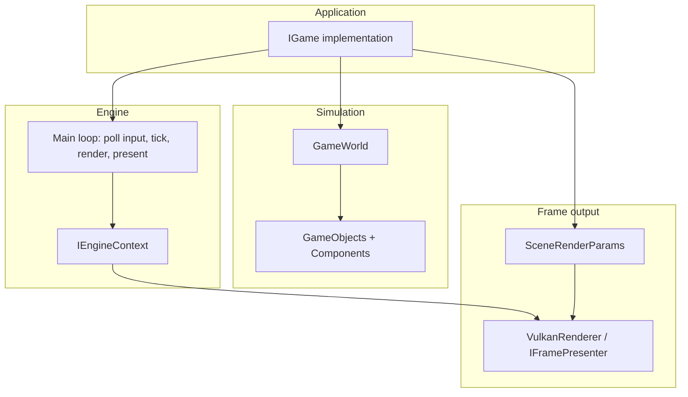
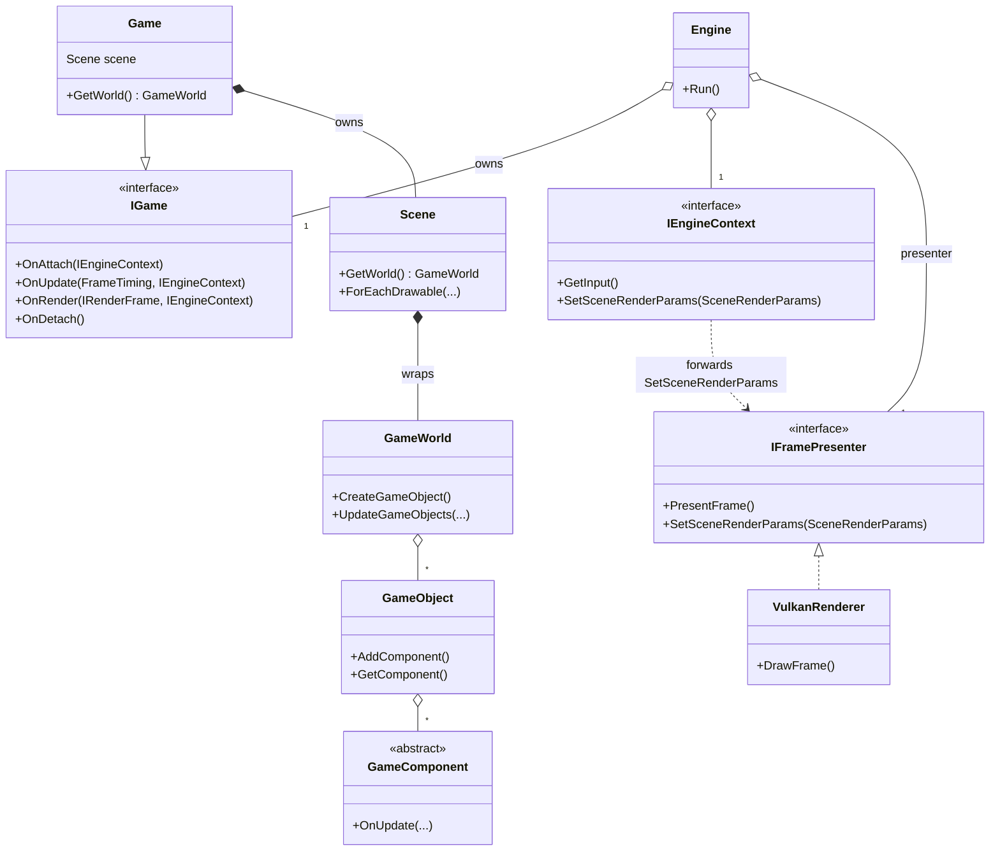
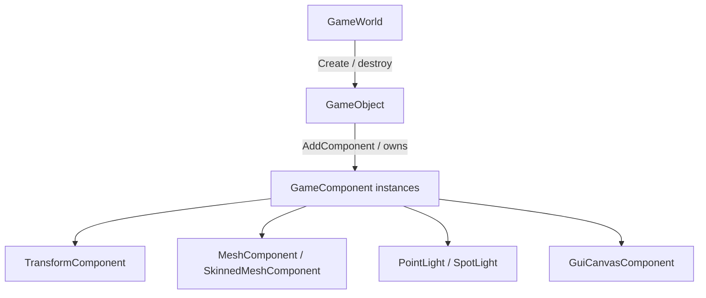

# Spark — Architecture & Developer Guide

This document describes how the **Spark** game engine is organized and how to build games on top of its C++ API. It is aimed at engine contributors and gameplay programmers reading the repository.

---

## 1. What Spark Is

Spark is a **C++23** codebase that provides:

- A **window + input** layer (GLFW).
- A **Vulkan** renderer (`VulkanRenderer` implements `IFramePresenter`).
- An **entity–component** style scene (`GameWorld`, `GameObject`, `GameComponent`).
- **Forward-lit 3D** with directional + optional **shadow map**, **point** and **spot** lights, **PBR** and **toon** shading, optional **normal** and **ORM** texture maps on draws.
- **Optional** 2D and **3D** toy physics (`SimulatePhysics2D`, `SimulatePhysics3D`).
- A **retained-mode GUI** (`GuiCanvasComponent`, widgets under `spark/gui/`).
- **Asset loading** (meshes, glTF, textures, fonts, skinned characters) with caching on `GameWorld`.
The default executable (`src/main.cpp`) constructs `Engine` with **`NewShellDemoGame()`** (`spark/demo/NewShellDemoGame.hpp`) — the interactive launcher plus built-in modes (3D fly scenes, maze, 2D demos, GUI showcase, etc.).

---

## 2. Repository Layout (Mental Map)

| Area | Role |
|------|------|
| `include/spark/` | Public headers: engine, ECS, scene, math, render, physics, GUI, demos. |
| `src/spark/` | Implementations matching the above. |
| `src/main.cpp` | Entry: `Engine` + concrete `IGame`. |
| `assets/` | Fonts, models, textures used by demos. |
| `docs/` | Supplementary design notes — e.g. [`LIGHTING_AND_SHADOWS.md`](LIGHTING_AND_SHADOWS.md), [`MATERIALS_AND_LIGHTING.md`](MATERIALS_AND_LIGHTING.md), [`SCENE_AND_RENDERING_GAPS.md`](SCENE_AND_RENDERING_GAPS.md), [`2D_ARPG_FEATURES.md`](2D_ARPG_FEATURES.md), [`OPEN_WORLD_ACTION_ROADMAP.md`](OPEN_WORLD_ACTION_ROADMAP.md). |
| `CMakeLists.txt` | Project, dependencies (e.g. GLFW via FetchContent), targets. |

Key header groups:

- **Engine loop:** `spark/engine/` — `Engine`, `IGame`, `Game`, `IEngineContext`, `FrameTiming`, `SceneRenderParams`.
- **World & entities:** `spark/scene/GameWorld.hpp`, `spark/ecs/GameObject.hpp`, `spark/scene/Scene.hpp`.
- **Components:** `spark/ecs/components/*.hpp` (catalog in §5.2 / §5.4; full list in §8).
- **Math & containers:** `spark/math/`, `spark/core/`, `spark/memory/` (`SharedPtr`, `UniquePtr`, `Array`, `Utf8String`).
- **Rendering contract:** `spark/engine/SceneRenderParams.hpp` — what the GPU path consumes each frame.
- **Fast path for lit scenes:** `spark/scene/SceneSubmit.hpp` — `SubmitStandardLitSceneFromWorld`.

---

## 3. Build & Run (C++)

- **CMake** ≥ 3.28, **C++23**, **Vulkan SDK** (`glslangValidator` on `PATH`).
- Dependencies are pulled by CMake (e.g. **GLFW 3.4**); UI fonts and sample assets may download on first configure (see root `CMakeLists.txt`).
- **Presets** ([`CMakePresets.json`](../CMakePresets.json)):

| Preset | Build dir | Targets |
|--------|-----------|---------|
| `debug` | `cmake-build-debug/` | SparkDemo, SparkEditor, SparkScriptHost |
| `editor-debug` | `cmake-build-editor/` | SparkEditor only (shared `SparkEngine`, no demos) |

```bash
cmake --preset debug
cmake --build cmake-build-debug -j
./cmake-build-debug/SparkDemo
./cmake-build-debug/spark_editor/SparkEditor
```

See [`README.md`](../README.md), [`docs/CLION.md`](CLION.md), and [`.run/README.md`](../.run/README.md) for CLion profiles and run configs.

External games: [`game_template/`](../game_template/README.md), [`samples/`](../samples/) — set `SPARK_ROOT` to this repo.

---

## 4. High-Level Architecture



**Design idea:** game code depends on **small interfaces** (`IGame`, `IEngineContext`, `IFramePresenter`) and on **data** (`SceneRenderParams`), not on the concrete Vulkan implementation inside `Engine`.

### 4.1 Class relationships (engine layer)

The runtime object graph is intentionally shallow: **`Engine`** owns the window, the concrete **`VulkanRenderer`** (as `IFramePresenter`), input, an **`IEngineContext`** implementation, and your **`IGame`**. Simulation state lives under **`GameWorld`**; rendering is a **pure data hand-off** via **`SceneRenderParams`** each frame.



**How to read this diagram**

- **`IGame`** is the only polymorphic “application” type the engine loop calls; **`Game`** is an optional base that owns **`Scene`** and forwards **`OnUpdate`** to **`GameWorld::UpdateGameObjects`**.
- **`Scene`** does not own entities; it is a **query façade** over the same **`GameWorld`** (iterators for drawables, lights, GUI roots, etc.).
- **`IEngineContext`** is the stable façade for gameplay; **`SetSceneRenderParams`** ultimately reaches **`VulkanRenderer`** without game code including Vulkan headers.
- **`GameObject` ↔ `GameComponent`**: one object holds a **set** of components (typically one instance per concrete `ComponentKind`); components receive **`OnUpdate`** when the world ticks.

---

## 5. Engine feature catalog (by subsystem)

This section is a **feature-oriented index**: what exists in the tree today, which headers to open first, and how features connect. Deeper lighting notes live in [`docs/LIGHTING_AND_SHADOWS.md`](LIGHTING_AND_SHADOWS.md); ARPG-oriented 2D notes in [`docs/2D_ARPG_FEATURES.md`](2D_ARPG_FEATURES.md).

### 5.1 Application shell and frame loop

| Feature | Role | Primary types / paths |
|--------|------|------------------------|
| **Engine entry** | Owns window, presenter, input, runs the loop | `spark/engine/Engine.hpp`, `src/Engine.cpp` |
| **Game contract** | Your simulation + render hooks | `IGame` (`spark/engine/IGame.hpp`), optional `Game` base (`spark/engine/Game.hpp`) |
| **Per-frame timing** | Delta time, wall time, frame counter | `FrameTiming` (`spark/engine/FrameTiming.hpp`) |
| **Engine façade to gameplay** | Input, framebuffer size, scene params hand-off | `IEngineContext` (`spark/engine/IEngineContext.hpp`) |
| **Presentation abstraction** | Swapchain / GPU without leaking into `IGame` | `IFramePresenter` (`spark/engine/IFramePresenter.hpp`), default impl `VulkanRenderer` |
| **Shell / demos** | Launcher and built-in modes | `NewShellDemoGame`, modes under `include/spark/demo/` |

### 5.2 World, entities, and scene queries

| Feature | Role | Primary types / paths |
|--------|------|------------------------|
| **Entity storage** | Create/destroy objects, hierarchy, tick components | `GameWorld` (`spark/scene/GameWorld.hpp`) |
| **Entity** | Named node + component bag + world matrix | `GameObject` (`spark/ecs/GameObject.hpp`) |
| **Local transform** | TRS; parent chain → `GetWorldMatrix` | `TransformComponent` |
| **Render-side queries** | Iterate drawables, lights, UI roots without owning entities | `Scene` (`spark/scene/Scene.hpp`) — `ForEachDrawable`, `ForEachSkinnedDrawable`, `ForEachPointLight`, `ForEachSpotLight`, `ForEachSky`, `ForEachTextOverlay`, `ForEachParticleEmitter`, `ForEachGuiCanvas` |
| **Optional culling** | Frustum-limited variants + partition policy | `SetSpatialPartitionKind`, `ForEachDrawableInViewFrustum`, `SceneSpatialPolicyComponent`, `ScenePartitionKind` |
| **Sibling messaging** | Decouple components on the same object | `EmitSignal` / `OnSignal` (`spark/ecs/Signal.hpp`) |

### 5.3 Forward 3D rendering (data path)

| Feature | Role | Primary types / paths |
|--------|------|------------------------|
| **Frame GPU snapshot** | Immutable description of one frame’s draws, lights, UI | `SceneRenderParams` (`spark/engine/SceneRenderParams.hpp`) |
| **Built-in mesh buckets** | Packed unit cube / ground in GPU VB/IB | `SceneMeshSlot` (`UnitCube`, `GroundPlane`, `Custom`) |
| **Per-object draw** | Model matrix, albedo, textures, PBR scalars, toon params, skin palette | `SceneDrawItem` — `textureLayer`, `normalMapLayer`, `metallicRoughnessMapLayer` index `sceneTextures`; optional `customMesh` / `skinnedMesh` + `jointPalette` |
| **Texture array** | Up to **16** RGBA8 layers bound as one array texture | `sceneTextures`, `MaxSceneTextures`; uploads in `VulkanRenderer::RecordSceneTextureUploads` |
| **Directional “sun”** | Key light direction + color + intensity on params | `lightDirectionWorld`, `lightColor`, `lightIntensity` |
| **Hemisphere / flat ambient** | Fill lighting | `ambientColor` |
| **Directional shadows** | CSM atlas + PCF in `scene.frag` | `directionalShadowsEnabled`, `shadowBias`, `shadowNormalBias`, `shadowDepthSampleFlipV` — details in [`LIGHTING_AND_SHADOWS.md`](LIGHTING_AND_SHADOWS.md) |
| **Punctual shadows** | Spot atlas + point depth array | `punctualShadowsEnabled`; `castsShadow` on point/spot lights — see [`LIGHTING_AND_SHADOWS.md`](LIGHTING_AND_SHADOWS.md) |
| **Point lights** | Omnidirectional; ECS → `pointLights`; **256** max on GPU | `ScenePointLight`, `PointLightComponent`, `MaxPointLights` |
| **Spot lights** | Cone lights; forward axis = object **local −Z** in world space; **128** max on GPU | `SceneSpotLight`, `SpotLightComponent`, `MaxSpotLights`; degrees on component, radians in `SceneSpotLight` |
| **SSAO** | Optional screen-space AO before tonemap | `ssaoEnabled`, `ssaoRadius`, `ssaoBias`, `ssaoStrength` — [`VulkanScreenSpaceEffectsPass`](include/spark/render/VulkanScreenSpaceEffectsPass.hpp), `post_process.frag` |
| **World sprites** | Alpha quads after opaque scene | `SceneSpriteDraw`, `sprites`, `spriteSortMode` (`SceneSpriteSortMode`) |
| **Particles** | CPU billboards, additive pass | `SceneParticleInstance`, `particles`, `particleCameraRight` / `Up` |
| **Screen UI** | Solid rects + text, three paint layers | `screenRects` / `screenTexts`, overlay, late; `ScreenRectDraw`, `ScreenTextDraw`, `NextUiPaintOrder` |
| **ECS → standard frame** | One-call fill for typical 3D scenes | `SubmitStandardLitSceneFromWorld` (`spark/scene/SceneSubmit.hpp`) |

Gap analysis (more light types, material channels, IBL, caps): [`MATERIALS_AND_LIGHTING.md`](MATERIALS_AND_LIGHTING.md).

### 5.4 Materials and shading

| Feature | Role | Primary types / paths |
|--------|------|------------------------|
| **Lit PBR** | GGX + Fresnel in `scene.frag` | `SceneShadingModel::LitPbr` on `MaterialComponent` / `SceneDrawItem` |
| **Toon / cel** | Stepped diffuse + rim | `SceneShadingModel::ToonCel`, `toonDiffuseBands`, `toonRimIntensity`, `toonRimPower` |
| **Base color map** | Optional albedo texture × tint | `MaterialComponent::SetBaseColorTexture` → `textureLayer` when using `ApplyMaterialComponentToSceneDrawItem` with texture resolution |
| **Normal map** | Tangent-space perturbation (derivative TBN in shader) | `MaterialComponent::SetNormalTexture` → `normalMapLayer` |
| **Occlusion–roughness–metallic** | glTF-style single map: **R** occlusion (modulates ambient), **G** roughness, **B** metallic | `MaterialComponent::SetMetallicRoughnessTexture` → `metallicRoughnessMapLayer` |
| **Emissive** | HDR glow + optional emissive map | `emissiveColor`, `emissiveIntensity`, `SetEmissiveTexture` → `emissiveMapLayer` |
| **Manual draw list** | Set `SceneDrawItem` fields yourself when not using the material helper | Demos that build `draws` by hand |

When resolving textures from components into `sceneTextures`, use **`ApplyMaterialComponentToSceneDrawItem(item, mat, &params)`** (third argument registers optional maps and sets layer indices). The two-argument overload leaves map layers at **−1**.

### 5.5 2D gameplay and rendering

| Feature | Role | Primary types / paths |
|--------|------|------------------------|
| **Sprites** | Textured quads, sorting, optional 2D lighting modes | `SpriteComponent`, `SceneSpriteDraw`, `SpriteLighting2DMode` (`spark/render/SpriteLighting2D.hpp`) |
| **Sprite animation** | Flipbook / state machine hooks | `SpriteAnimatorComponent`, `Sprite2DCharacterAnimFsmComponent` |
| **Tilemaps** | Grid of tiles | `TilemapComponent` |
| **2D camera** | Ortho view-projection helper | `Camera2D` (`spark/scene/Camera2D.hpp`) |
| **2D physics & queries** | Grid broad-phase, overlaps, raycasts, arcs | `SimulatePhysics2D`, `PhysicsQueries2D` (see §11) |

### 5.6 3D physics and joints

| Feature | Role | Primary types / paths |
|--------|------|------------------------|
| **Sphere vs static boxes** | Minimal 3D dynamics | `SimulatePhysics3D`, `SphereCollider3DComponent`, `BoxCollider3DComponent`, `Rigidbody3DComponent` |
| **Physics material** | Per-body friction/restitution-style data where used | `PhysicsMaterial3DComponent` |
| **Distance joint** | Constraint between bodies | `DistanceJoint3DComponent` |
| **Static broad-phase inclusion** | Which box colliders feed the grid | `ContributesStaticCollider3D` (`spark/physics/Collision3D.hpp`) |

### 5.7 Terrain and sky

| Feature | Role | Primary types / paths |
|--------|------|------------------------|
| **Heightfield terrain** | Procedural or authored height → mesh | `TerrainComponent`, `TerrainMeshGenerator`, settings in `spark/scene/TerrainGeneratorSettings.hpp` |
| **Sky backdrop** | Box / dome / plane modes | `SkyComponent`, `SceneSkyMode` on draws; often combined with `MeshComponent` |

### 5.8 Characters and animation

| Feature | Role | Primary types / paths |
|--------|------|------------------------|
| **Skinned mesh** | GPU skinned draws | `SkinnedMeshComponent`, joint palette on `SceneDrawItem` |
| **Skeletal animation** | Clip playback, loop modes, crossfade | `AnimatorComponent` (`AnimLoopMode`, `SetClipIndexWithCrossfade`, `ComputeJointPalette`), `Skeleton` under `spark/animation/` |
| **3D character FSM (M2)** | Locomotion + optional attack overlay | `Character3DAnimFsmComponent` drives `AnimatorComponent` from speed |
| **3D animation roadmap** | Milestones M1–M6 (API, FSM, blend, events, scale, tooling) | [`docs/ANIMATION_3D_ROADMAP.md`](ANIMATION_3D_ROADMAP.md) — **M1 complete** |
| **Character camera** | Third-person style rig (demos) | `CharacterCameraRig` (`spark/scene/CharacterCameraRig.hpp`) |

### 5.9 GUI (retained mode)

| Feature | Role | Primary types / paths |
|--------|------|------------------------|
| **Widget tree** | Layout + controls | `spark/gui/` — `Widget`, `GuiControls.hpp`, themes (`GuiTheme.hpp`) |
| **Screen canvas** | Root + sort order | `GuiCanvasComponent` |
| **Input → focus** | Hit testing, focus | `ProcessGuiCanvasesInput` (`spark/gui/GuiScene.hpp`) |
| **Paint → params** | Emit rects/text into `SceneRenderParams` | `PaintGuiCanvases` |
| **Editor module** | `SparkEditor` shell: dock UI, hierarchy/inspector stubs, viewport camera | `spark/editor/`, `spark_editor/SparkEditor` — see [`SPARK_EDITOR_PLAN.md`](SPARK_EDITOR_PLAN.md) |
| **Editor roadmap** | Scene / material / animation / script tools on this GUI | [`docs/GUI_EDITOR_ROADMAP.md`](GUI_EDITOR_ROADMAP.md) |

### 5.10 Audio

| Feature | Role | Primary types / paths |
|--------|------|------------------------|
| **Playback stack** | Clip loading, mixing, platform output | `SoundSubsystem`, `SoundEngine`, `SoundMixer`, `ISoundOutput` (`spark/audio/`) |
| **ECS cue** | Gameplay-triggered sounds | `SoundCueComponent` |
| **Asset decode** | WAV → `SoundClip` | `WavDecoder`, `SoundFileLoader` |

### 5.11 AI (optional subsystem)

| Feature | Role | Primary types / paths |
|--------|------|------------------------|
| **Central tick** | Walks agents after your simulation unless reordered | `SimulateGameAi` (`spark/ai/GameAiSubsystem.hpp`) |
| **Agent host** | One component ties blackboard + behaviors | `AiAgentComponent` |
| **Behaviors** | FSM, GOAP, fuzzy logic, steering, grid pathfinding | `spark/ai/fsm/`, `spark/ai/goap/`, `spark/ai/fuzzy/`, `spark/ai/steering/`, `spark/ai/path/` |

Call **`SimulateGameAi(world, timing, context)`** from your game tick when you want ECS-driven AI to run.

### 5.12 C# scripting

Native **CoreCLR** hosting (`SparkScriptHost` via **nethost** + **hostfxr**) loads managed games; **ClangSharp** generates C# from `include/spark/scripting/SparkInterop.h`. See **`docs/CSHARP_SCRIPTING.md`**. Enabled by default (`SPARK_BUILD_SCRIPT_HOST=ON`; set `OFF` to skip). Gameplay without scripting remains **C++** via `IGame` / `GameComponent`.

---

## 6. Runtime Lifecycle (`IGame`)

Your game implements `spark/engine/IGame.hpp`:

| Callback | When |
|----------|------|
| `OnAttach(IEngineContext&)` | Once after window / presenter / input exist. Load assets, build scene. |
| `OnUpdate(FrameTiming, IEngineContext&)` | Every frame **after** input poll. Simulation, physics, gameplay. |
| `OnRender(IRenderFrame&, IEngineContext&)` | After `OnUpdate`, before present. Fill rendering parameters. |
| `OnDetach()` | Shutdown; release external resources if needed. |

`spark/engine/Game.hpp` is a convenient base: it owns a `Scene`, and `OnUpdate` forwards to `GameWorld::UpdateGameObjects` so **any** `GameComponent::OnUpdate` runs automatically.

`FrameTiming` provides `deltaTimeSeconds`, `totalTimeSeconds`, and `frameIndex`.

**Starting the engine:**

```cpp
#include "spark/engine/Engine.hpp"
#include "spark/engine/IGame.hpp"

Spark::Engine engine(Spark::Engine::NewGame<MyGame>());
engine.Run();
```

`Engine::NewGame<MyGame>(...)` wraps your type in `UniquePtr<IGame>`.

---

## 7. Scene, World, and Entities

### 7.1 `GameWorld`

`GameWorld` (`spark/scene/GameWorld.hpp`):

- Allocates **`GameObject`** instances (`CreateGameObject` / `DestroyGameObject`).
- Maintains **parent/child** links (`SetParent` on world or object).
- Runs **`UpdateGameObjects`** → each object’s components receive `OnUpdate`.
- **Caches assets:** `LoadMesh`, `LoadGltf`, `LoadSkinnedGltf`, `LoadTexture`, `RegisterMesh`, `RegisterTexture`, `RegisterGltf`, `RegisterSkinnedGltf`, plus lookups by path/key.
- **Async path:** use `GameWorldAssetLoader` (or `SceneManager::GetAssetLoader()`) and `Pump` each frame; caches update only on the main thread.
- Holds **UI fonts** for screen text: `SetUiFont` / `SetUiBoldFont` (used with `TextOverlayComponent` / `SceneRenderParams::uiFont`).

### 7.2 `GameObject`

`GameObject` (`spark/ecs/GameObject.hpp`):

- Named entity (`Utf8String` name).
- **`TransformComponent`** + world matrix: `GetWorldMatrix()` walks the parent chain.
- **`AddComponent<T>(...)`** / **`GetComponent<T>()`** — at most **one** component of a given concrete type per object in the default storage model.
- **Signals:** `EmitSignal` / `OnSignal` on `GameComponent` for sibling chatter (`spark/ecs/Signal.hpp`).

### 7.3 `Scene`

`Scene` (`spark/scene/Scene.hpp`) wraps a `GameWorld` and adds **render queries**:

- `ForEachDrawable`, `ForEachSkinnedDrawable`, `ForEachPointLight`, `ForEachSpotLight`, `ForEachSky`, `ForEachTextOverlay`, `ForEachParticleEmitter`, `ForEachGuiCanvas`, etc.
- Optional **view-frustum** variants (`SetSpatialPartitionKind`, `ForEachDrawableInViewFrustum`, …) driven by `SceneSpatialPolicyComponent` / `ScenePartitionKind`.

Use these iterators to build **`SceneRenderParams`** manually (demos often do this for full control).

### 7.5 Scene files, runtime load, and async assets

| API | Header | Role |
|-----|--------|------|
| `SceneSerializer` / `SceneDeserializer` | `spark/scene/serialization/SceneSerializer.hpp` | Capture / apply `SceneDocument` (writes **v4**, reads v3 + v4) |
| `SceneManager` | `spark/scene/SceneManager.hpp` | `LoadSceneFromFile`, `BeginLoadSceneAsync`, `Pump`, `UnloadScene` |
| `GameWorldAssetLoader` | `spark/scene/GameWorldAssetLoader.hpp` | Worker-thread I/O + decode; `Pump(GameWorld&)` commits caches on main thread |
| `SceneInstanceId` | `spark/scene/SceneInstanceId.hpp` | Opaque id per loaded scene instance; stored on `GameObject` |

Typical async usage from `IGame::OnUpdate`:

```cpp
// member: SceneManager sceneManager_{world};

sceneManager_.Pump();
if (sceneManager_.IsSceneReady(levelId)) { /* play */ }
```

`SceneLoadOptions::additive` defaults to `true`. Set `additive = false` to replace all loaded instances. `assetsRoot` resolves relative mesh/texture paths in the file; v4 `H assets_root` is used when options omit it.

Registered snapshot kinds (18): Transform, Mesh, Material, PointLight, SpotLight, Camera, SkinnedMesh, Animator, Sky, Sprite, SceneSpatialPolicy, TextOverlay, ParticleEmitter, Terrain, BoxCollider3D, SphereCollider3D, Rigidbody3D, PhysicsMaterial3D. Mesh/material/sky/sprite restores may defer until `GameWorldAssetLoader` finishes the path.

**Demo:** `SceneEditor3DDemo` uses `SceneManager` for v3/v4 load (async asset decode + `Pump` each frame). Legacy v1/v2 editor format still loads synchronously.

### 7.6 Simulation vs rendering (per frame)

Simulation updates **mutable world state** (`GameWorld`, transforms, physics, components). Rendering **samples** that state (or cached matrices) into an immutable **snapshot** (`SceneRenderParams`) for the GPU. The two concerns meet only at **`IEngineContext::SetSceneRenderParams`**.

```mermaid
sequenceDiagram
    participant Loop as Engine loop
    participant Game as IGame
    participant World as GameWorld / Scene
    participant Ctx as IEngineContext
    participant Present as IFramePresenter

    Loop->>Game: OnUpdate(timing, context)
    Game->>World: logic, physics, components
    Loop->>Game: OnRender(frame, context)
    Game->>World: queries (ForEach..., matrices)
    Game->>Ctx: SetSceneRenderParams(params)
    Ctx->>Present: SetSceneRenderParams (VulkanRenderer stores copy)
    Loop->>Present: PresentFrame
    Note over Present: acquire, record, submit, present
```

---

## 8. Components (ECS)

All gameplay building blocks inherit **`GameComponent`** (`spark/ecs/GameComponent.hpp`):

- **`Kind()`** returns a **`ComponentKind`** enum value; each subclass defines `static constexpr ComponentKind TypeKind`.
- Lifecycle: **`OnAttach`**, **`OnDetach`**, **`OnUpdate`**, **`OnSignal`**.

Representative **3D / rendering** components:

| Component | Purpose |
|-----------|---------|
| `TransformComponent` | Local TRS; drives `GameObject::GetWorldMatrix`. |
| `MeshComponent` | `SharedPtr<Mesh>` + `SceneMeshSlot` + mesh tint; static drawable. |
| `MaterialComponent` | Shading model, tint, metallic/roughness scalars, emissive; optional **base color**, **normal**, and **ORM** (`SetMetallicRoughnessTexture`) textures. |
| `SkinnedMeshComponent` | Skinned mesh asset; pairs with `AnimatorComponent` for joint palettes. |
| `AnimatorComponent` | Skeletal clip playback: `AnimLoopMode`, crossfade, `IsClipFinished`, `ComputeJointPalette`. |
| `PointLightComponent` | Omnidirectional light; position from world matrix. |
| `SpotLightComponent` | Cone light; axis = **local −Z** in world space; inner/outer cone in **degrees** on the component. |
| `SkyComponent` | Sky rendering mode + enable flag; used with `MeshComponent`. |
| `TextOverlayComponent` | Screen-space HUD text (separate from GUI canvas). |
| `ParticleEmitterComponent` | CPU particles; standard submit fills `SceneRenderParams::particles`. |
| `TerrainComponent` | Heightfield terrain mesh. |
| `GuiCanvasComponent` | Root widget tree for retained GUI (`spark/gui/`). |

**Gameplay / world policy:**

| Component | Purpose |
|-----------|---------|
| `CollisionComponent` | Simple **local sphere** collider; recenters on `TransformChanged` (`RefreshWorldBounds`). |
| `SceneSpatialPolicyComponent` | Chooses `ScenePartitionKind` for frustum iterators. |
| `AiAgentComponent` | Host for AI blackboard + behaviors (`SimulateGameAi`). |
| `SoundCueComponent` | Plays cues through the audio subsystem. |

**2D rendering & physics:**

| Component | Purpose |
|-----------|---------|
| `SpriteComponent` | 2D sprite drawable + atlas path. |
| `SpriteAnimatorComponent` | Flipbook / clip-style animation. |
| `SpriteLighting2DComponent` | Modes consumed by `SceneSpriteDraw::lightingMode`. |
| `Sprite2DCharacterAnimFsmComponent` | Higher-level 2D character animation state. |
| `Character3DAnimFsmComponent` | Locomotion / attack overlay for `AnimatorComponent` (add before animator on same object). |
| `TilemapComponent` | Tile grid for 2D levels. |
| `BoxCollider2DComponent` / `CircleCollider2DComponent` | 2D colliders. |
| `Rigidbody2DComponent` | 2D dynamics body. |

**3D physics (minimal solver):**

| Component | Purpose |
|-----------|---------|
| `BoxCollider3DComponent` | Local AABB collider; contributes to **static** broad-phase when body is not dynamic. |
| `SphereCollider3DComponent` | Dynamic **sphere** collider for `SimulatePhysics3D`. |
| `Rigidbody3DComponent` | `Dynamic` / `Static` / `Kinematic`, velocity, gravity scale, **restitution** for the sphere solver. |
| `PhysicsMaterial3DComponent` | Surface parameters for the 3D solver where applied. |
| `DistanceJoint3DComponent` | Distance constraint between two 3D bodies. |

The authoritative list of kinds is **`enum class ComponentKind`** in `spark/ecs/GameComponent.hpp`.

Include umbrella **`spark/ecs/Ecs.hpp`** in tooling if you want a single include for registration patterns (headers still remain modular).

### 8.1 Component storage model (mental diagram)

Each **`GameObject`** owns a **closed set** of **`GameComponent`** instances keyed by `ComponentKind`. Components are **not** stored in external archetype arrays (no EnTT-style sparse sets in the open-source tree); instead, **`GameWorld::UpdateGameObjects`** walks active objects and dispatches **`OnUpdate`** to each attached component. Rendering does **not** iterate components directly — it uses **`Scene`** helpers or **`SubmitStandardLitSceneFromWorld`**, which read the same components (`MeshComponent`, `TransformComponent`, …) to emit **`SceneDrawItem`** entries.



---

## 9. Rendering: Two Common Patterns

### 9.1 Manual: iterate `Scene` → fill `SceneRenderParams`

1. Query framebuffer size: `IEngineContext::GetFramebufferSize`.
2. Build **view-projection** (e.g. `Matrix4::PerspectiveVulkan` × camera view).
3. Clear / reserve fields on `SceneRenderParams` (`draws`, `pointLights`, `spotLights`, `screenTexts`, `sceneTextures`, …).
4. Use `scene.ForEachPointLight`, `ForEachSpotLight`, `ForEachSky`, `ForEachDrawable`, … to push `SceneDrawItem`, lights, etc.
5. Set `params.uiFont` / `params.uiBoldFont` from `world.GetUiFont()` when using text or GUI.
6. Optional: `PaintGuiCanvases(world, params, fbW, fbH)` after building the 3D lists if you use `GuiCanvasComponent`.
7. **`context.SetSceneRenderParams(params)`** — the presenter uploads and draws.

See `include/spark/demo/ThreeDDemo.hpp` and related demos for full examples (sorting helpers live in `spark/demo/ShellDemoSceneUtil.hpp`).

### 9.2 Convenience: `SubmitStandardLitSceneFromWorld`

`SubmitStandardLitSceneFromWorld` (`spark/scene/SceneSubmit.hpp`) walks the world and fills **standard lit** parameters (sky, rigid meshes, skinned meshes via `DispatchSkinnedDrawableFrustumCull` when a `SceneSpatialPolicyComponent` is present, point lights, **spot lights**, optional particles, time for sprite effects). Materials pick up **base color**, **normal**, and **metallic–roughness (ORM)** textures when you pass the **`SceneRenderParams*`** overload of `ApplyMaterialComponentToSceneDrawItem` inside the submitter. Optional **`SceneSpriteSortMode::SortOrderThenWorldY`** enables top-down sprite occlusion by world Y after `sortOrder`.

Use this when your game matches the **stock lit pipeline** and you do not need custom draw ordering beyond what the submitter provides.

### 9.3 VulkanRenderer internals (rendering logic)

`VulkanRenderer` (`include/spark/render/VulkanRenderer.hpp`, `src/spark/render/VulkanRenderer.cpp`) is the default **`IFramePresenter`**. It owns the **Vulkan instance**, **device**, **swapchain**, **depth buffer**, **command pool / per–swapchain-image command buffers**, **synchronization** (semaphores + fences), and **all GPU resources** needed to interpret a `SceneRenderParams` snapshot.

#### Frame loop and presentation

- Each engine frame, after `IGame::OnRender`, the loop calls **`PresentFrame()`**, which forwards to **`DrawFrame()`**.
- **`DrawFrame`** follows the usual swapchain pattern: **`vkAcquireNextImageKHR`** → wait/reset fences → **`WriteUniformBuffer`** → **`RecordSceneCommandBuffer`** for the acquired image → **`vkQueueSubmit`** (graphics queue) → **`vkQueuePresentKHR`**.
- **Frames in flight:** `maxFramesInFlight == 2` — there are **two** in-flight fence slots and **paired** uniform/skin SSBO resources indexed by `frameIndex % 2`, while **`renderFinishedSemaphores`** are sized **per swapchain image** so presentation never reuses a semaphore still waited-on by the display stack.
- **Resize:** `NotifySwapchainResize` sets a flag; acquire / present may return **`OUT_OF_DATE`** / suboptimal, triggering **`RecreateSwapchain`** (tear down framebuffers, depth, HDR/SSAO targets, swapchain views, then rebuild pipelines that depend on extent).

#### Multi-pass frame graph

`VulkanRenderer` composes several subsystems (`VulkanDirectionalShadowPass`, `VulkanPunctualShadowPass`, `VulkanHdrTonemapPass`, `VulkanScreenSpaceEffectsPass`, `VulkanSceneOpaquePass`, `VulkanSpritePass`, `VulkanParticlePass`, `VulkanScreenUiPass`). One primary command buffer per swapchain image records:

| Stage (order in `RecordSceneCommandBuffer`) | Target / pass |
|---------------------------------------------|----------------|
| **Deferred uploads** | Scene texture array, UI font atlases |
| **Punctual shadow maps** | Spot atlas + point depth array (`VulkanPunctualShadowPass`) |
| **Directional shadow maps** | CSM atlas (`VulkanDirectionalShadowPass`) |
| **HDR scene** | Offscreen **R16G16B16A16** + depth (`VulkanHdrTonemapPass::HdrRenderPass`) — opaque/sky, sprites, particles |
| **SSAO (optional)** | When `ssaoEnabled`: depth copy → fullscreen `post_process.frag` → scratch HDR (`VulkanScreenSpaceEffectsPass`) |
| **Tonemap** | Scratch HDR or scene HDR → swapchain image (`VulkanHdrTonemapPass::RecordTonemap`) |
| **Screen UI** | Solid rects + text in the **present** render pass (`VulkanScreenUiPass`) |

Inside the **HDR scene** subpass the renderer switches pipelines:

| Sub-stage | Pipeline / notes |
|-----------|------------------|
| **Scene (opaque + sky)** | Lit mesh pipeline; **sky** pipeline when `SceneSkyMode != None` (relaxed depth for backdrop). |
| **Sprites** | Alpha-blended world quads (`SceneSpriteDraw`), sorted by `spriteSortMode`. |
| **Particles** | Additive billboards (`SceneParticleInstance`). |

**Viewport / clip space:** the code uses a **normal positive-height viewport**; Vulkan clip-space Y is corrected in **`Matrix4::PerspectiveVulkan`** (rather than a negative viewport height, which is brittle on some MoltenVK stacks).

#### Scene geometry and draws

- **Static packed mesh:** `CreateSceneGeometry` uploads one **vertex + index** buffer containing the **unit cube**, **ground plane**, and a **sprite quad** topology. `SceneMeshSlot::UnitCube` / `GroundPlane` draws index into that buffer with per-draw **`ModelPushConstants`** (model matrix, albedo, `textureLayer`, `normalMapLayer`, `metallicRoughnessMapLayer`, sky mode, PBR, emissive, skinning summary).
- **Custom rigid meshes:** CPU `Mesh` data is packed into **dynamic `customVertexBuffer` / `customIndexBuffer`** when fingerprints change (`RebuildCustomMeshGeometry`, `ComputeCustomGeometryFingerprint`). Each `SceneDrawItem` with `mesh == Custom` maps to a **`CustomMeshGpuSlice`** (first index, count, vertex offset).
- **Skinned meshes:** joint matrices are copied each draw into a **per–frame-in-flight storage buffer** (`skinSsboBuffers`, std430 palette, up to **`kMaxSkinJoints` = 64**). Push constants select skinning on the same scene pipeline path.

#### Scene uniforms and textures

- **`WriteUniformBuffer`** fills **`SceneUniformGpu`** via `VulkanSceneUniformWriter` — view-projection, directional light, camera position, ambient, inverse view-projection, viewport size (shadow V-flip in `.w`), CSM data, cluster grid metadata, IBL params, and time. Punctual lights are uploaded to **cluster SSBOs** (not the UBO).
- **Descriptor set (scene):** binding **0** UBO, **1** scene texture array, **2** skin SSBO, **3** directional shadow atlas, **4**–**5** cluster lights/grid SSBOs, **6**–**8** punctual shadow SSBO + atlases.
- **`RecordSceneTextureUploads`** resizes/stages **RGBA8** textures from `SceneRenderParams::sceneTextures` into the array image when the **pointer set** changes (dirty tracking via `lastSceneUploadedTexturePtrs`), so unchanged frames skip redundant **`vkCmdCopyBufferToImage`**.

#### UI recording (`RecordScreenUi`)

Screen-space draws are **not** interleaved arbitrarily: the renderer batches geometry into **CPU scratch buffers**, then issues draws with optional **Vulkan scissor** derived from `ScreenRectDraw` / `ScreenTextDraw` clip rectangles.

Order within the UI pass:

1. **`screenRects`** (solid) → **`screenTexts`** (text)
2. **`screenOverlayRects`** → **`screenOverlayTexts`**
3. **`screenLateRects`** → **`screenLateTexts`** (e.g. dropdowns above semi-transparent parents)

**Font GPU path:** `EnsureUiFontGpuTexture` uploads the CPU `Font` atlas for `uiFont` (and bold layer when available); text draws are skipped if no valid font/image view.

#### Shaders and SPIR-V

The main mesh path loads **`scene.vert.spv`** / **`scene.frag.spv`**; post-processing uses **`post_process.frag.spv`** + **`tonemap.vert.spv`**; UI, particles, and sprites use their own SPIR-V pairs. GLSL sources live under **`shaders/`**; shared includes: `scene_ubo.glsl`, `post_common.glsl`, `clustered_lights.glsl`, `punctual_shadows.glsl`, `ibl.glsl`. See `SHADER_DIR` / `SPV_DIR` in `CMakeLists.txt`.

#### Extending the GPU path

Any change that alters **shader inputs** must stay consistent across three places: **`SceneRenderParams` / draw structs**, **`VulkanRenderer` upload + push/descriptor logic**, and **GLSL** (`*.vert` / `*.frag` sources that compile to the shipped `.spv`). Prefer documenting packed layouts in comments beside **`SceneUniformGpu`** / **`ModelPushConstants`** in `VulkanRenderer.hpp` and the public structs in `SceneRenderParams.hpp`.

---

## 10. Input & Window

From **`IEngineContext`**:

- **`GetInput()`** → `IInput` (GLFW-backed): key/mouse state, cursor capture, etc.
- **`GetWindow()`**, **`GetFramePresenter()`** — rarely needed in gameplay; prefer `SetSceneRenderParams`.

Demos typically toggle **mouse capture** (e.g. **F1**) for first-person cameras.

---

## 11. Physics APIs (Summary)

| API | Header | Notes |
|-----|--------|------|
| `SimulatePhysics2D` | `spark/physics/PhysicsWorld2D.hpp` | Dynamics vs statics (grid broad-phase); dynamic–dynamic pairs use the same grid pattern, then triggers + optional `resolveDynamicVsDynamic`. |
| `PhysicsQueries2D` | `spark/physics/PhysicsQueries2D.hpp` | Overlap circle/AABB and raycast vs static broad-phase (same bake as simulation); no trigger signals. **Also:** `QueryOverlapCircleDynamics2D`, `QueryOverlapArcStatics2D` / `QueryOverlapArcDynamics2D` (attack arc / cone), and `QueryOverlapArcWorld*` helpers. |
| `SimulatePhysics3D` | `spark/physics/PhysicsWorld3D.hpp` | **Dynamic spheres** vs **static box** AABBs; rebuilds `SpatialHashGrid3D` each step. Settings: gravity, clamp speed, iteration count. |

Call these from your **`OnUpdate`** (or from a `GameComponent::OnUpdate`) **after** integrating player intent and **before** relying on transforms for render.

**Static geometry rule (3D):** `ContributesStaticCollider3D` (`spark/physics/Collision3D.hpp`) decides which `BoxCollider3D` instances enter the broad-phase (non-dynamic rigidbodies or no rigidbody).

---

## 12. GUI (`spark/gui/`)

- Compose widgets (`Panel`, `StackPanel`, `GridPanel`, `GroupBox`, `Label`, `Button`, `MenuBar`, `Slider`, `RadioGroup`/`RadioButton`, `NumericStepper`, `Separator`, …) — see `spark/gui/GuiControls.hpp`.
- **Docking** — `DockManager`, `DockPanel`, `DockSidePane`, `DockFrameLayout` (`spark/gui/docking/`) for editor-style left/center/right workspaces with persisted layout state.
- **Text layout** — `DrawTextInRect`, `EllipsizeUtf8`, `TextOverflow` / `TextWrap` on labels and buttons.
- **Context menu** — `GuiContextMenu` (right-click menus; wired from `GuiScene.cpp`).
- Attach a **`GuiCanvasComponent`** to a `GameObject` and **`SetRoot(UniquePtr<Widget>)`**.
- Each frame: **`ProcessGuiCanvasesInput(world, input, fbW, fbH)`** (shell already does this for shared worlds).
- When building `SceneRenderParams`: **`PaintGuiCanvases(world, params, fbW, fbH)`** so widgets render in framebuffer space.

Sort order: `GuiCanvasComponent::SetSortOrder` — lower draws first. Overlay/late layers via `GuiPaintContext::PushOverlayLayer` / `PushLateLayer`.

**UI GPU note:** `VulkanScreenUiPass` draws all solid rects then all text per layer (main, overlay, late) for stable Vulkan batching.

---

## 13. Conventions & Types

- **Strings:** gameplay-visible strings often use **`Utf8String`** (`spark/core/Utf8String.hpp`).
- **Ownership:** `SharedPtr` / `UniquePtr` (`spark/memory/`) instead of `std::shared_ptr` in hot paths (project style).
- **Collections:** `spark/core/Array.hpp`, `HashMap`, etc.
- **Math:** `Vector2/3/4`, `Matrix4`, `Quaternion`, `Transform` under `spark/math/`.

---

## 14. Learning Path (Recommended Reading Order)

1. `spark/engine/IGame.hpp`, `Game.hpp`, `Engine.hpp`, `IEngineContext.hpp`
2. `spark/scene/GameWorld.hpp`, `spark/ecs/GameObject.hpp`, `spark/scene/Scene.hpp`
3. `spark/engine/SceneRenderParams.hpp` (what a frame expects on the GPU side)
4. **This guide — §4.1 (class map), §7.4 (sim vs render), §9.3 (`VulkanRenderer` internals), §5 (feature catalog)**
5. `include/spark/render/VulkanRenderer.hpp` + `src/spark/render/VulkanRenderer.cpp` (implementation detail; large)
6. `include/spark/demo/ThreeDDemo.hpp` — camera + glTF + lights + manual submit pattern
7. `include/spark/demo/PhysicsBallThrow3DDemo.hpp` — minimal **3D physics** usage
8. `spark/gui/GuiScene.hpp` + `spark/demo/ShellDemoUi.hpp` — layout helpers used by the shell
9. [`docs/SCENE_AND_RENDERING_GAPS.md`](SCENE_AND_RENDERING_GAPS.md) — C++ public API gaps for scene management and 3D rendering
---

## 15. Extending the Engine Safely

- Prefer **new `GameComponent` types** or **new demos** under `include/spark/demo/` instead of editing `Engine` internals.
- New **GPU data** usually means extending **`SceneRenderParams`** / shaders / `VulkanRenderer` together — keep layouts documented in comments next to structs.

---

## 16. Glossary

| Term | Meaning |
|------|---------|
| `SceneRenderParams` | CPU-side description of one frame’s draws, lights, UI, textures for Vulkan. |
| `SceneMeshSlot` | Built-in mesh bucket (`UnitCube`, `GroundPlane`, `Custom` CPU mesh). |
| `IFramePresenter` | Abstract “present this frame” — implemented by `VulkanRenderer`. |
| `SubmitStandardLitSceneFromWorld` | ECS → standard lit `SceneRenderParams` in one call; optional `SceneSpriteSortMode` for Y-sort. |
| `SceneUniformGpu` | std140 UBO (`VulkanSceneUniformGpu.hpp`): matrices, directional + ambient, shadow params, cluster/IBL metadata — must match `scene_ubo.glsl`. |
| `VulkanScreenSpaceEffectsPass` | Optional SSAO: depth copy + fullscreen composite to scratch HDR before tonemap. |
| `SceneSpotLight` | CPU cone light: position, range, **normalized** `directionWorld`, inner/outer **full cone angles in radians**, color, intensity. |
| `ModelPushConstants` | Per-draw push constant block on the main scene pipeline (transform, material, `textureLayer`, **normal / ORM layer indices**, sky mode, skinning summary). |
| `DrawFrame` | `VulkanRenderer` implementation: acquire swapchain image, record commands, submit graphics work, present. |

---

*This guide reflects the layout and public surfaces of the Spark tree at the time of writing. For the exact behavior of a subsystem, prefer the header comments next to the type you are calling.*
