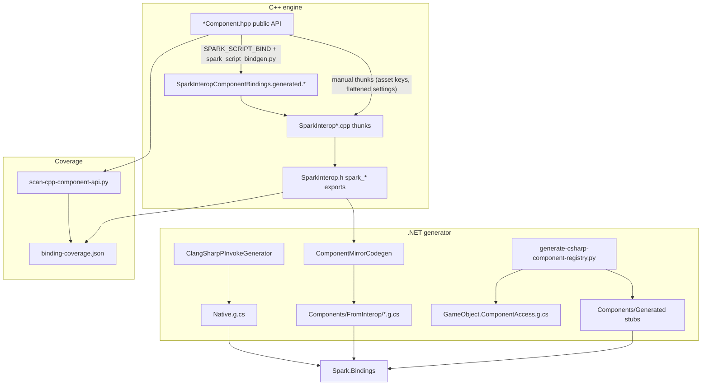

# Component script bindings — architecture

C# cannot call C++ `GameComponent` methods directly. The pipeline treats **`SparkInterop.h` as the scriptable contract** (stable C ABI). C++ component headers are the *source of truth for what should exist*; interop exports are the *source of truth for what C# can call today*.



## Layers

| Layer | Artifact | Role |
|-------|----------|------|
| 1 | `SparkInterop.h` + `SparkInterop*.cpp` | C ABI mirroring scriptable C++ surface |
| 2 | `Native.g.cs` (ClangSharp) | `DllImport` declarations |
| 3 | `Components/FromInterop/*.g.cs` | Usable C# types generated from `spark_<prefix>_*` grouping |
| 4 | `Components/Generated/*` | Handle-only stubs for kinds with **no** interop prefix yet |
| 5 | Generated glue | `GameObject.ComponentAccess.g.cs`, `GameComponentHandle.g.cs`, `Native.Interop.g.cs` companion |

## Naming convention

Interop functions use **`spark_<componentPrefix>_<verb>`**:

- `spark_transform_get_translation` / `spark_transform_set_translation` → `TransformComponent.Translation`
- `spark_animator_is_clip_finished` → `bool` property
- Irregular prefixes are listed in `scripting/bindings/spark-interop-bindings.json`.

## Regenerate

```bash
./tools/generate-csharp-bindings.sh
```

This runs `spark_script_bindgen.py`, manifest generation, ClangSharp, component mirror codegen, native P/Invoke companion, and registry (accessors + C++ default-add factory).

## Closing gaps (C++ → interop)

1. Run `python3 tools/scan-cpp-component-api.py` and open `scripting/bindings/binding-coverage.json`.
2. Prefer `SPARK_SCRIPT_BIND(suffix)` on `*Component.hpp` members, then rebuild `SparkInterop` (CMake runs bindgen) or `python3 tools/spark_script_bindgen.py`.
3. Include new declarations via `SparkInteropComponentBindings.generated.h` (included from `SparkInterop.h`).
4. Re-run `./tools/generate-csharp-bindings.sh` — C# mirrors update from the manifest + header parser.

`skipMirrorCodegenClasses` in `generate_interop_manifest.py` is only for APIs that need custom C# (e.g. `AnimationEventReceiverComponent` callbacks).
