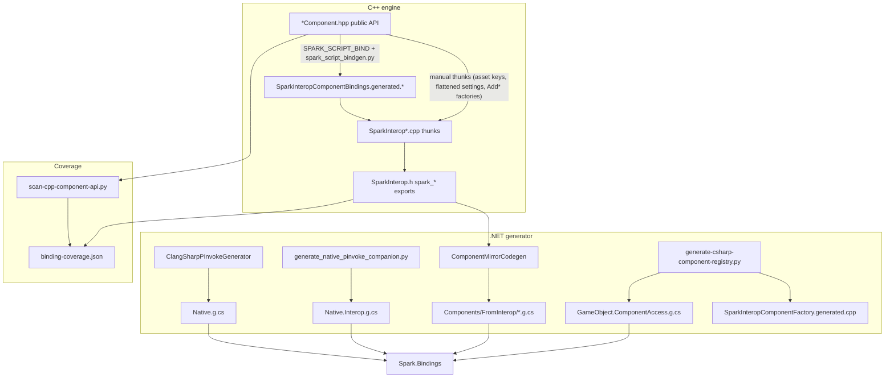

# Component script bindings — architecture

C# cannot call C++ `GameComponent` methods directly. The pipeline treats **`SparkInterop.h` as the scriptable contract** (stable C ABI). C++ component headers are the *source of truth for what should exist*; interop exports are the *source of truth for what C# can call today*.



## Layers

| Layer | Artifact | Role |
|-------|----------|------|
| 1 | `SparkInterop.h` + `SparkInterop*.cpp` | C ABI mirroring scriptable C++ surface |
| 1b | `SparkInteropComponentBindings.generated.h/.cpp` | Auto thunks from `SPARK_SCRIPT_BIND` in component headers |
| 2 | `Native.g.cs` + `Native.Interop.g.cs` | `DllImport` declarations (ClangSharp + companion) |
| 3 | `Components/FromInterop/*.g.cs` | Usable C# types from `spark_<prefix>_*` grouping |
| 4 | `Components/Generated/*` | Handle-only stubs when **no** `spark_<prefix>_` group exists yet |
| 5 | Generated glue | `GameObject.ComponentAccess.g.cs`, `SparkComponentKind.g.cs`, C++ default-add factory |

**Ergonomics (hand-maintained):** `CppMirrors.g.cs` (`Game`, `GameWorld`, `GameObject` `Add*` helpers), `InteropPtr.cs`, `InteropUtf8.cs`, small `*.Extensions.g.cs` files for enums/overloads.

## Naming convention

Interop functions use **`spark_<componentPrefix>_<verb>`**:

- `spark_transform_get_translation` / `spark_transform_set_translation` → `TransformComponent.Translation`
- `spark_sound_cue_queue_bundled_clip` → `SoundCueComponent.QueueBundledClip` (UTF-8 path)
- Irregular prefixes live in `scripting/bindings/spark-interop-bindings.json` (from `generate_interop_manifest.py`).

**Creation vs get-or-add:** Some kinds are denied in `generate-csharp-component-registry.py` (`FACTORY_DENY`) because C++ needs extra constructor args. Expose **`spark_object_add_*`** in `SparkInterop.h` and mirror as `GameObject.AddTerrain()`, `AddSoundCue()`, etc. in `CppMirrors.g.cs`.

## Regenerate (full stack)

```bash
./tools/generate-csharp-bindings.sh
```

This runs, in order:

1. `inject_spark_script_bind.py` / `spark_script_bindgen.py`
2. `generate_interop_manifest.py` → `spark-interop-bindings.json`
3. `dotnet run` → **Spark.Bindings.Generator** (ClangSharp + mirrors)
4. `sync-component-kind-bindings.sh`
5. `scan-cpp-component-api.py` → `binding-coverage.json`
6. `generate_native_pinvoke_companion.py`
7. `generate-csharp-component-registry.py`

CMake also runs `spark_script_bindgen.py` when building **`SparkInterop`** (`SparkInteropBindingsCodegen` target).

## Closing gaps (C++ → interop)

1. Run `python3 tools/scan-cpp-component-api.py` and open `scripting/bindings/binding-coverage.json`.
2. Prefer `SPARK_SCRIPT_BIND(suffix)` on `*Component.hpp` members, then `python3 tools/spark_script_bindgen.py` (or build `SparkInterop`).
3. Ensure new symbols are not duplicated in manual `SparkInterop.h` (bindgen skips existing names).
4. Re-run `./tools/generate-csharp-bindings.sh` — mirrors and `GameObject` accessors update from the manifest.

`skipMirrorCodegenClasses` in `generate_interop_manifest.py` is for APIs that need custom C# (e.g. `AnimationEventReceiverComponent` callbacks).

## Managed host (optional)

When `-DSPARK_BUILD_SCRIPT_HOST=ON`, **`SparkScriptHost`** loads a game `.dll` and registers managed `Game` callbacks via `ScriptHostEntry` (`Spark.Scripting`). See **[CSHARP_SCRIPTING.md](CSHARP_SCRIPTING.md)**.

## Related docs

| Doc | Topic |
|-----|--------|
| [CSHARP_SCRIPTING.md](CSHARP_SCRIPTING.md) | Build, run, game authoring, CMake flags |
| [`.github/workflows/csharp-bindings.yml`](../.github/workflows/csharp-bindings.yml) | CI regen + compile |
