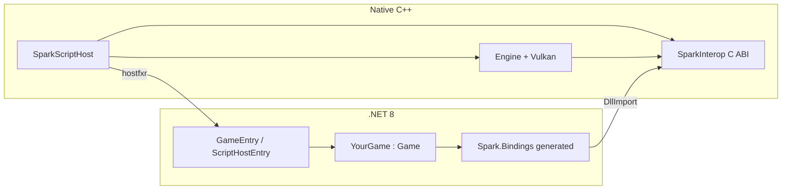

# C# scripting (CoreCLR + ClangSharp)

Spark hosts **CoreCLR** from native code using **nethost** + **hostfxr**. Managed game code uses C# types that **mirror** the C++ public API (`IGame`, `Game`, `FrameTiming`, `IEngineContext`, …). Bindings are **generated** from `include/spark/scripting/SparkInterop.h` with **ClangSharp** whenever the native surface changes.

## Architecture



| Piece | Role |
|-------|------|
| **SparkScriptHost** | Executable: loads `nethost` → `hostfxr` → game `.dll`, runs `Engine::Run()` |
| **SparkInterop** | Shared library: stable C exports (`spark_*`) implemented with real C++ types |
| **Spark.Bindings.Generator** | ClangSharp tool: parses `SparkInterop.h`, emits `Native.g.cs` + `CppMirrors.g.cs` |
| **Spark.Scripting** | SDK: `ScriptHostEntry`, `GameBootstrap`, wires managed `Game` to native loop |
| **HelloCsGame** | Sample game assembly |

## One-to-one C++ ↔ C# mapping

| C++ | C# |
|-----|-----|
| `Spark::FrameTiming` | `Spark.Bindings.FrameTiming` |
| `Spark::IGame` | `Spark.Bindings.IGame` |
| `Spark::Game` | `Spark.Bindings.Game` |
| `Spark::IEngineContext` | `Spark.Bindings.IEngineContext` |
| `Spark::IInput` | `Spark.Bindings.IInput` |
| `Spark::Scene` / `GameWorld` / `GameObject` | Same names under `Spark.Bindings` |
| `ComponentKind` | `SparkComponentKind` (from `SparkInterop.h`, ClangSharp) |

Virtual C++ APIs are mirrored as C# classes that call `spark_*` exports. Plain structs/enums come from ClangSharp with sequential layout matching the headers.

**When C++ changes:** extend `SparkInterop.h` (and C++ engine if needed), then regenerate:

```bash
./tools/generate-csharp-bindings.sh
```

From the repo root (uses [.config/dotnet-tools.json](../.config/dotnet-tools.json)):

```bash
dotnet tool restore
./tools/generate-csharp-bindings.sh
```

This writes **`scripting/bindings/generated/Spark.Bindings/Native.g.cs`** (ClangSharp P/Invoke from `SparkInteropTypes.h` + `SparkInterop.h`). Companion files **`CppMirrors.g.cs`**, **`ComponentMirrors.g.cs`**, **`InteropPtr.cs`** are hand-maintained ergonomic wrappers.

CI (`.github/workflows/csharp-bindings.yml`) regenerates and fails if `Native.g.cs` drifts from the headers.

## Build

Prerequisites: **.NET 8 SDK**, **CMake 3.28+**, Vulkan/GLFW (same as engine).

### CLion

A shared run configuration is at [`.run/SparkScriptHost.run.xml`](../.run/SparkScriptHost.run.xml). See [`.run/README.md`](../.run/README.md) if **Target** / **Executable** show **Not found**.

1. Enable scripting in CMake: **`-DSPARK_BUILD_SCRIPT_HOST=ON`** (also set in [CMakePresets.json](../CMakePresets.json) preset `debug`).
2. **Reload CMake Project** — **SparkScriptHost** must appear in the CMake targets list.
3. Run **SparkScriptHost (HelloCsGame)**.

If your build directory is not `cmake-build-debug`, edit `DYLD_LIBRARY_PATH` / `LD_LIBRARY_PATH` in the `.run.xml` file.

### Command line

```bash
cmake -B build
cmake --build build --target SparkScriptHost SparkScriptingBuild
```

Copy `libSparkInterop.dylib` (or `.so`) next to `SparkScriptHost` and managed outputs, then:

```bash
./build/SparkScriptHost \
  scripting/samples/HelloCsGame/bin/Release/net8.0/HelloCsGame.runtimeconfig.json \
  scripting/samples/HelloCsGame/bin/Release/net8.0/HelloCsGame.dll
```

Optional entry override:

```bash
SparkScriptHost <runtimeconfig> <assembly.dll> <TypeName> <MethodName>
```

## Writing a game

1. Class library targeting `net8.0`, reference `Spark.Scripting`.
2. Subclass `Game` (same hooks as C++ `Spark::Game`).
3. Register in `[ModuleInitializer]`:

```csharp
[ModuleInitializer]
internal static void Init() => GameBootstrap.Factory = static () => new MyGame();
```

4. Expose native entry (sample uses `HelloCsGame.GameEntry.Initialize`).

## Interop surface (expanded)

`SparkInterop.h` now exports bindings for:

| Area | Examples |
|------|----------|
| **Components** | `spark_transform_*`, `spark_mesh_*`, `spark_material_*`, `spark_sprite_*`, lights, colliders, rigidbodies |
| **Add component** | `spark_object_add_mesh`, `spark_object_add_skinned_character_from_gltf`, … |
| **Scene** | `spark_scene_submit_standard_lit_from_world`, `spark_scene_fill_standard_lit_from_world` |
| **GUI** | `spark_gui_process_canvases_input`, `spark_gui_paint_canvases`, `spark_context_process_gui_input` |
| **Animation** | `spark_animator_*` — clip index/time/speed, `loop_mode`, `is_clip_finished`, `set_clip_index_with_crossfade`, `find_clip_index_by_name`, `get_clip_name`; C# `AnimatorComponent` mirror |
| **Physics / AI** | `spark_world_physics_simulate_2d`, `spark_world_simulate_game_ai` |
| **Math** | `spark_mat4_perspective_vulkan`, `spark_mat4_mul`, … |
| **2D platformer** | `spark_world_register_platformer2d_demo_textures`, `spark_world_mount_platformer_ui_font`, `spark_platformer2d_kenney_tile_uv`, `spark_sprite_2d_fsm_*`, `spark_object_add_sprite_2d_character_anim_fsm` |
| **2D physics queries** | `spark_physics_query_overlap_circle_world_2d`, `spark_physics_query_overlap_arc_world_statics_2d`, `spark_collision_filter_2d_*` |
| **2D collider layers** | `spark_box_collider_2d_set_category_bits`, `spark_circle_collider_2d_set_is_trigger`, … |

C# mirrors: `CppMirrors.g.cs` (engine types) + `ComponentMirrors.g.cs` (sample component wrappers). Regenerate P/Invoke with `./tools/generate-csharp-bindings.sh` after header changes.

### HelloCsGame (2D platformer sample)

`HelloCsGame` registers Kenney tilesheet + player atlas + gem texture via `GameWorld.RegisterPlatformer2DDemoTextures`, mounts UI fonts for `TextOverlayComponent`, drives locomotion/combat through `Sprite2DCharacterAnimFsmComponent` + `SpriteAnimatorComponent`, collects gems by proximity and **J** attack arc (`QueryOverlapArcWorldStatics2D` + layer masks), and implements fall respawn + summit goal. See `assets/sprites/kenney_simplified-platformer-pack/README.md` for optional PNG paths.

## Roadmap

- SpriteAnimator, Terrain, AiAgent, SoundCue, GUI widget builders (old `spark_shell_*` helpers).
- Parse additional engine headers directly once ClangSharp config includes `compile_commands.json`.
- In-editor `dotnet build` + hot reload (GUI roadmap E5).

Legacy **P/Invoke / SparkNative** remains removed; this stack replaces it.
