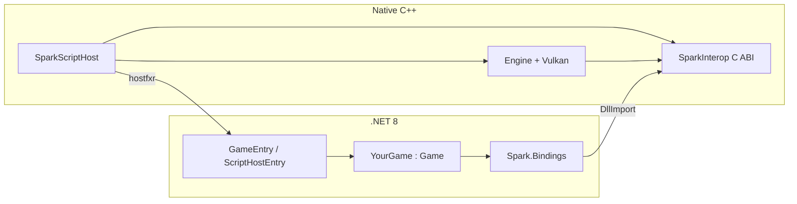

# C# interop (ClangSharp + SparkInterop)

Spark exposes a stable **C ABI** (`SparkInterop`) for managed games, editors, and tools. C# P/Invoke and component mirrors are **generated** from `include/spark/scripting/SparkInterop.h` (and generated component bindings) via **ClangSharp** and **ComponentMirrorCodegen**.

> **CMake:** `-DSPARK_BUILD_INTEROP=ON` builds `libSparkInterop` + optional `SparkBindingsBuild`. Add `-DSPARK_BUILD_SCRIPT_HOST=ON` for **`SparkScriptHost`** (CoreCLR + `HelloCsGame`). Both interop flags are **ON** in the `debug` preset ([`CMakePresets.json`](../CMakePresets.json)).

## Repository layout (`scripting/`)

| Path | Role |
|------|------|
| `bindings/generated/Spark.Bindings/` | Generated + companion C# (`Native.g.cs`, `Components/FromInterop/*.g.cs`, `CppMirrors.g.cs`, …) |
| `bindings/generator/` | `Spark.Bindings.Generator` (ClangSharp + mirror codegen) |
| `Spark.Scripting/` | Thin SDK: `ScriptHostEntry`, `GameBootstrap`, `SparkGame` helpers |
| `samples/HelloCsGame/` | Sample game DLL wired to `SparkScriptHost` |
| `cmake/DotNetHost.cmake` | Locates SDK **nethost** when building the host |

Native implementation: `src/spark/scripting/SparkInterop*.cpp`, `SparkScriptHost.cpp`, `CoreClrHost.cpp`, `ManagedGameBridge.cpp`.

## Architecture


```mermaid
flowchart LR
  subgraph native [Native C++]
    Host[SparkScriptHost]
    Engine[Engine + Vulkan]
    Interop[SparkInterop C ABI]
    Host --> Engine
    Host --> Interop
    Engine --> Interop
  end
  subgraph managed [.NET 8]
    Entry[GameEntry / ScriptHostEntry]
    Game[YourGame : Game]
    Bindings[Spark.Bindings]
    Entry --> Game
    Game --> Bindings
  end
  Host -->|hostfxr| Entry
  Bindings -->|DllImport| Interop
```

| Piece | Role |
|-------|------|
| **SparkScriptHost** | Executable: **nethost** → **hostfxr** → game `.dll` → `Engine::Run()` with `ManagedGameBridge` |
| **SparkInterop** | Shared library: stable `spark_*` exports backed by C++ engine types |
| **Spark.Bindings.Generator** | ClangSharp → `Native.g.cs`; **ComponentMirrorCodegen** → `Components/FromInterop/*.g.cs` |
| **Spark.Scripting** | `ScriptHostEntry.Initialize`, `GameBootstrap`, optional `SparkGame` base |
| **HelloCsGame** | Minimal sample (`HelloGame` + `GameEntry`) — compile-check and host smoke test |

## One-to-one C++ ↔ C# mapping

| C++ | C# |
|-----|-----|
| `Spark::FrameTiming` | `Spark.Bindings.FrameTiming` |
| `Spark::IGame` / `Spark::Game` | `Spark.Bindings.IGame` / `Game` |
| `Spark::IEngineContext` / `IInput` | `Spark.Bindings.IEngineContext` / `IInput` |
| `Spark::Scene` / `GameWorld` / `GameObject` | Same names under `Spark.Bindings` |
| `ComponentKind` | `SparkComponentKind` — must match `GameComponent.hpp` via `SparkInteropComponentKinds.h` |

Virtual gameplay APIs are mirrored as C# types that call `spark_*`. Structs/enums in `SparkInteropTypes.h` are emitted by ClangSharp with sequential layout.

**Pipeline details:** **[COMPONENT_SCRIPT_CODEGEN.md](COMPONENT_SCRIPT_CODEGEN.md)** (`SPARK_SCRIPT_BIND`, manifest, registry, coverage).

### Regenerate bindings

```bash
dotnet tool restore   # once, uses .config/dotnet-tools.json
./tools/generate-csharp-bindings.sh
```

Outputs (under `scripting/bindings/generated/Spark.Bindings/`):

| Artifact | Source |
|----------|--------|
| `Native.g.cs` | ClangSharp on `SparkInteropTypes.h` + `SparkInterop.h` |
| `Native.Interop.g.cs` | Companion P/Invoke for symbols ClangSharp misses |
| `Components/FromInterop/*.g.cs` | `ComponentMirrorCodegen` from interop manifest |
| `GameObject.ComponentAccess.g.cs` | `generate-csharp-component-registry.py` |
| `SparkComponentKind.g.cs` | Synced from `SparkInteropComponentKinds.h` |

Hand-maintained companions (not overwritten by ClangSharp): **`CppMirrors.g.cs`**, **`InteropPtr.cs`**, **`InteropUtf8.cs`**, occasional `*.Extensions.g.cs` (e.g. `ProceduralSoundPreset`, typed `QueuePreset`).

**CI:** [`.github/workflows/csharp-bindings.yml`](../.github/workflows/csharp-bindings.yml) regenerates bindings, builds `Spark.Bindings` / `Spark.Scripting` / `HelloCsGame`, and builds `SparkInterop` + `SparkScriptHost` on macOS.

## CMake targets

| Option | Default (repo) | Targets |
|--------|----------------|---------|
| `SPARK_BUILD_INTEROP` | OFF globally; **ON** in `debug` preset | `SparkInterop`, `SparkBindingsBuild` |
| `SPARK_BUILD_SCRIPT_HOST` | OFF globally; **ON** in `debug` preset | `SparkScriptHost`, `SparkScriptingBuild` (HelloCsGame Release) |

`SPARK_BUILD_SCRIPT_HOST` requires `SPARK_BUILD_INTEROP=ON`.

## Build & run

Prerequisites: **.NET 8 SDK**, **CMake ≥ 3.28**, Vulkan/GLFW (same as engine).

### CLion

Run configuration: [`.run/SparkScriptHost.run.xml`](../.run/SparkScriptHost.run.xml). See [`.run/README.md`](../.run/README.md).

1. Load CMake preset **debug** (interop + script host ON).
2. Build **SparkScriptHost** (depends on **SparkScriptingBuild**).
3. Run **SparkScriptHost (HelloCsGame)** from repo root (`assets/` resolution).

Set `DYLD_LIBRARY_PATH` / `LD_LIBRARY_PATH` to `<build-dir>/scripting` (done in the run config for `cmake-build-debug`).

### Command line

```bash
cmake -B cmake-build-debug -DSPARK_BUILD_INTEROP=ON -DSPARK_BUILD_SCRIPT_HOST=ON
cmake --build cmake-build-debug --target SparkScriptHost
```

From repo root (defaults point at HelloCsGame Release output):

```bash
DYLD_LIBRARY_PATH=cmake-build-debug/scripting ./cmake-build-debug/scripting/SparkScriptHost
```

Explicit paths:

```bash
./cmake-build-debug/scripting/SparkScriptHost \
  scripting/samples/HelloCsGame/bin/Release/net8.0/HelloCsGame.runtimeconfig.json \
  scripting/samples/HelloCsGame/bin/Release/net8.0/HelloCsGame.dll
```

Optional entry override (default type/method: `HelloCsGame.GameEntry.Initialize`):

```bash
SparkScriptHost <runtimeconfig> <assembly.dll> <TypeName> <MethodName>
```

### Managed-only compile check

```bash
dotnet build scripting/samples/HelloCsGame/HelloCsGame.csproj -c Release -p:NuGetAudit=false
```

Game libraries need **`GenerateRuntimeConfigurationFiles`** (see `HelloCsGame.csproj`) so hostfxr can load them.

## Writing a game

1. **Class library** `net8.0`, project reference **`Spark.Scripting`** (pulls in `Spark.Bindings`).
2. Subclass **`SparkGame`** or **`Game`** (same hooks as C++ `Spark::Game`). `SparkGame` adds `PlayBundledSound` / `PlayPresetSound`.
3. **Factory-only components** (terrain, directional light, sound cue, …): use `GameObject.AddTerrain()`, `AddDirectionalLight()`, `AddSoundCue()`, etc. in **`CppMirrors.g.cs`** — not `GetOrAdd*` (see registry `FACTORY_DENY`).
4. **Audio:** `soundCue.QueueBundledClip("path/under/assets")`; procedural SFX via `ProceduralSoundPreset` + `QueuePreset`.
5. **Host entry** in your game assembly:

```csharp
// GameEntry.cs
[ModuleInitializer]
internal static void Register() => GameBootstrap.Factory = static () => new MyGame();

[UnmanagedCallersOnly]
public static int Initialize(IntPtr hostApiPtr) => ScriptHostEntry.InitializeCore(hostApiPtr);
```

6. Build Release; point `SparkScriptHost` at your `.runtimeconfig.json` + `.dll` (or pass custom `TypeName` / `MethodName`).

## Component surface (C#)

| Layer | Location |
|-------|----------|
| Enum parity | `SparkComponentKind.g.cs` ↔ `SparkInteropComponentKinds.h` |
| Full mirrors | `Components/FromInterop/*Component.g.cs` (from `spark_<prefix>_*`) |
| Handle stubs | `Components/Generated/` — only kinds **without** interop prefix yet (often empty) |
| `GameObject` accessors | `GameObject.ComponentAccess.g.cs` + `CppMirrors.g.cs` factories |
| Default add | `spark_object_get_or_add_default_component` + `GetOrAdd*` for allowed kinds |

**Coverage:** `python3 tools/scan-cpp-component-api.py` → `scripting/bindings/binding-coverage.json`.

**Manual interop** (non-`SPARK_SCRIPT_BIND`): creation helpers `spark_object_add_terrain`, `spark_object_add_directional_light`, `spark_object_add_sound_cue`, platformer texture registration, physics queries — in `SparkInterop.h` / `SparkInterop*.cpp`.

## HelloCsGame (sample)

Minimal loop to validate bindings + host wiring (not a full Kenney platformer clone):

- `OnAttach`: creates `CsPlayer`, transform, `SoundCue`, `GameState` → Playing.
- `OnUpdate`: **Space** queues `ProceduralSoundPreset.Jump`.

For the full 2D platformer reference, use C++ **`Platformer2DDemo`** and optional Kenney assets ([`assets/sprites/kenney_simplified-platformer-pack/README.md`](../assets/sprites/kenney_simplified-platformer-pack/README.md)).

## Roadmap

- Hot reload / in-editor `dotnet build` (GUI roadmap E5).
- Broader header-driven ClangSharp (beyond `SparkInterop.h`).
- Remaining `binding-coverage.json` gaps — prefer `SPARK_SCRIPT_BIND` + regen.

Legacy **SparkNative** P/Invoke stack is removed; **`SparkInterop` + generated `Spark.Bindings`** replace it.
