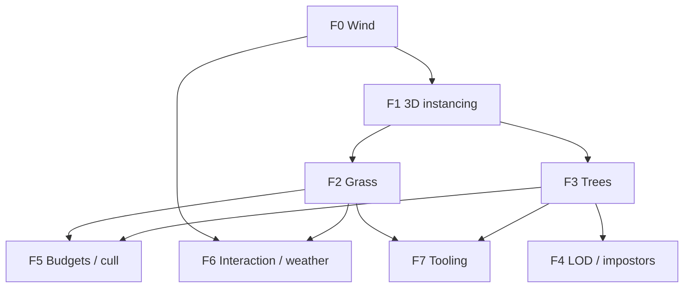

# Foliage — Engine Roadmap & Tracked Tasks

Living plan for **grass fields**, **wind-reactive tree foliage**, **GPU instancing**, and **LOD/impostors** at open-world scale without melting the forward renderer. Complements [`OPEN_WORLD_ACTION_ROADMAP.md`](OPEN_WORLD_ACTION_ROADMAP.md) Phase C (LOD/visibility) and Phase D (weather/wind), and shares a global **wind field** with [`WATER_ROADMAP.md`](WATER_ROADMAP.md).

**Architecture anchors:** [`ARCHITECTURE_AND_DEVELOPER_GUIDE.md`](ARCHITECTURE_AND_DEVELOPER_GUIDE.md) §5.7 (terrain/sky), [`SCENE_AND_RENDERING_GAPS.md`](SCENE_AND_RENDERING_GAPS.md) (instancing gap), [`LIGHTING_AND_SHADOWS.md`](LIGHTING_AND_SHADOWS.md), `include/spark/engine/SceneRenderParams.hpp`, `src/spark/scene/SceneSubmit*.cpp`, `src/spark/scene/submit/SceneSpatialCull.cpp`, `src/spark/render/sprites2d/VulkanTilemapPass.cpp` (2D instancing reference), `src/spark/render/scene/VulkanSceneOpaquePass.cpp`, `shaders/scene.vert`, `shaders/scene.frag`.

**Related content:** Khronos sample trees `assets/models/Tree_1_C_Color1.gltf`, `Tree_3_A_Color1.gltf` (placed per-entity in `CharacterCameraDemo` today); `TerrainComponent` for height/slope masks; `BillboardComponent` for impostor direction.

**Non-goals (defer):** per-blade rigid-body physics, skeletal animation on leaves, Nanite-style virtualized geometry, full procedural tree generation in-engine.

---

## How to track work

| Convention | Meaning |
|------------|---------|
| **Task ID** | `FOLIAGE-F{milestone}-{nn}` — stable across PRs and issues |
| **Priority** | **P0** must for milestone exit · **P1** should · **P2** nice |
| **Status** | Use GitHub issue state, or check boxes in this file when merging |

**Suggested GitHub labels:** `foliage`, `rendering`, `milestone-F0` … `milestone-F7`

**Issue title format:** `[FOLIAGE-F2-04] Grass chunk scatter from terrain height + slope mask`

Copy the **Issue body** block under each task when filing issues (see [§9](#9-bulk-github-issue-creation-optional)).

---

## Current baseline (as of this doc)

| Area | Status |
|------|--------|
| Heightfield terrain + brush / raycast | Done — `TerrainComponent`, `TerrainDemo` |
| Frustum culling (optional spatial partition) | Done — `Scene::ForEachDrawableInViewFrustum`, quadtree/octree |
| Alpha-tested / double-sided opaque draws | Done — `alphaCutoff`, `doubleSided` on `SceneDrawItem` |
| Transparent pass + transmission | Done — not the primary foliage path (use alpha test in opaque pass) |
| Directional CSM + punctual lights | Done — foliage shadow cost must be budgeted |
| 2D GPU instancing (sprites / tilemaps) | Done — `VulkanSpritePass`, `VulkanTilemapPass` |
| glTF tree props (single entity each) | Done — `CharacterCameraDemo`, `GltfSceneGraphTest` |
| `BillboardComponent` | Done — camera-facing quads (impostor precursor) |
| **Global wind / gust system** | **Not started** |
| **3D mesh GPU instancing** | **Not started** — `vkCmdDrawIndexed` uses `instanceCount = 1` today |
| **Grass field / chunked scatter** | **Not started** |
| **Tree instancing + LOD** | **Not started** |
| **Foliage wind vertex shader** | **Not started** |
| **Mesh LOD metadata in submit** | **Not started** — gap in `SCENE_AND_RENDERING_GAPS.md` |
| **Impostor / baked tree cards** | **Not started** |

---

## Visual target tiers

Milestones below target **Tier B** (action-game realistic) with optional **Tier C** in F6.

| Tier | Grass | Trees | Wind |
|------|-------|-------|------|
| **A — Stylized** | Crossed cards, uniform color, simple sin wave | Repeated glTF instances, no LOD | Global sin(time) |
| **B — Realistic (default exit)** | Chunked instancing, density map, distance dither, blade bend | Instanced LOD0/1 + billboard far, trunk/foliage split, alpha foliage | Layered noise + gusts + per-instance phase |
| **C — High-end** | GPU cull + interaction flatten radius | Octahedral impostor atlas, GPU LOD select | Weather-driven wind field texture |

---

## Milestone overview

| Milestone | Goal | Depends on | Maps to open-world |
|-----------|------|------------|-------------------|
| **F0** | Wind subsystem + foliage UBO on `SceneRenderParams` | — | D6 weather/wind |
| **F1** | 3D GPU instancing + foliage shading model | F0 | A2 budgets, C4 culling |
| **F2** | Grass fields — chunks, scatter, vertex wind, fade | F0, F1 | C4, biome content |
| **F3** | Tree instancing — trunk/foliage split, wind leaves | F0, F1 | C1 mesh LOD precursor |
| **F4** | Mesh LOD + impostors / billboards | F3 | C1, C2, C3 |
| **F5** | Culling budgets, shadow LOD, optional GPU compact | F2, F3 | A2, C4, C5 |
| **F6** | Interaction + weather coupling + shared wind with water | F0, F2 | D6, WATER W6-06 |
| **F7** | Tooling, presets, docs, CI smoke, demo | F2, F3 | §0 content pipeline |

**Recommended order:** F0 → F1 → F2 and F3 in parallel → F4 → F5; F6/F7 when core visuals land.

**First vertical slice:** windy grass on `TerrainDemo` + a ring of instanced `Tree_1_C` — proves F0–F3 without impostors.

---

## F0 — Wind subsystem

**Exit criteria:** One global wind vector + gust parameters uploaded each frame; grass and tree foliage shaders read the same UBO; optional `WindVolumeComponent` data path (GPU may use global only in v1).

| ID | Task | P | Status |
|----|------|---|--------|
| FOLIAGE-F0-01 | **`WindSettings` struct** — direction (XZ), base speed, gust amplitude, gust frequency, turbulence | P0 | [ ] |
| FOLIAGE-F0-02 | **`WindSubsystem` per `GameWorld`** — advances time, combines volumes, writes frame state | P0 | [ ] |
| FOLIAGE-F0-03 | **`SceneRenderParams::wind`** + GPU UBO slot in scene descriptor set (document binding) | P0 | [ ] |
| FOLIAGE-F0-04 | **`WindVolumeComponent`** — box/sphere override: local direction, strength multiplier (data path) | P1 | [ ] |
| FOLIAGE-F0-05 | **CPU `WindSampleAt(worldPos)`** — for gameplay VFX/audio (leaves rustle trigger) | P2 | [ ] |
| FOLIAGE-F0-06 | **Unit test** — gust envelope periodicity; volume blend at boundary | P2 | [ ] |

<details>
<summary>Issue template — FOLIAGE-F0-03 (example)</summary>

**Title:** `[FOLIAGE-F0-03] Wind UBO on SceneRenderParams + scene descriptor`

**Body:**
```
Milestone: F0 — Wind subsystem
Priority: P0

## Summary
Add WindSettings to SceneRenderParams and upload each frame for foliage shaders.

## Acceptance
- [ ] VulkanSceneUniformWriter fills wind block
- [ ] GLSL struct matches std140 layout
- [ ] Default wind disabled = zero displacement

## Files (expected)
- include/spark/engine/SceneRenderParams.hpp
- include/spark/scene/foliage/WindSettings.hpp
- src/spark/render/scene/VulkanSceneUniformWriter.cpp
- shaders/foliage_common.glsl
```
</details>

---

## F1 — 3D GPU instancing & foliage material

**Exit criteria:** One grass blade mesh drawn **N** times via instanced indexed draw; per-instance transform + tint in SSBO; new `SceneShadingModel::Foliage` or dedicated pass.

| ID | Task | P | Status |
|----|------|---|--------|
| FOLIAGE-F1-01 | **`FoliageInstanceGpu`** — model matrix or pos/rotY/scale, tint, random phase (std430 SSBO) | P0 | [ ] |
| FOLIAGE-F1-02 | **`SceneRenderParams::foliageBatches`** — `{mesh, material, instances[]}` or chunked ranges | P0 | [ ] |
| FOLIAGE-F1-03 | **`VulkanFoliageInstancedPass`** — `vkCmdDrawIndexed` with `instanceCount > 1`; mirror tilemap instance reserve pattern | P0 | [ ] |
| FOLIAGE-F1-04 | **`shaders/foliage.vert` / `foliage.frag`** — alpha test, double-sided, wind include, lit PBR simplified | P0 | [ ] |
| FOLIAGE-F1-05 | **Submit collection** — `FillFoliageBatchesFromWorld` or extend `SceneSubmit` | P0 | [ ] |
| FOLIAGE-F1-06 | **Shadow pass instancing** — foliage casts shadows optional; default grass **no cast** | P1 | [ ] |
| FOLIAGE-F1-07 | **Frame order** — instanced foliage after opaque rigid, before water/transparent; document in LIGHTING_AND_SHADOWS | P1 | [ ] |
| FOLIAGE-F1-08 | **Headless test** — build batch with 100 instances, submit without validation error | P2 | [ ] |

---

## F2 — Grass fields

**Exit criteria:** Camera-centered grass chunks on terrain; blades bend in wind; density respects slope; instances fade at distance; frame budget cap enforced.

| ID | Task | P | Status |
|----|------|---|--------|
| FOLIAGE-F2-01 | **`GrassFieldComponent`** — bounds, blade mesh ref, density, max distance, terrain object link | P0 | [ ] |
| FOLIAGE-F2-02 | **Chunk grid** (e.g. 32 m) — activate 3×3 or 5×5 neighborhood around camera | P0 | [ ] |
| FOLIAGE-F2-03 | **Scatter algorithm** — jitter XZ in chunk; sample terrain height + normal; reject slope > threshold | P0 | [ ] |
| FOLIAGE-F2-04 | **Density / exclusion mask** — optional R8 texture (paint or procedural); zero = no blades | P1 | [ ] |
| FOLIAGE-F2-05 | **Blade mesh** — crossed quads or 3-triangle strip; single albedo + optional alpha | P0 | [ ] |
| FOLIAGE-F2-06 | **Vertex wind** — bend tip along wind; stiffness by height; per-instance phase offset | P0 | [ ] |
| FOLIAGE-F2-07 | **Distance fade** — dither or alpha at far radius; hard cull beyond `maxDistance` | P0 | [ ] |
| FOLIAGE-F2-08 | **`maxGrassInstancesPerFrame` budget** — drop farthest chunks first (A2 alignment) | P1 | [ ] |
| FOLIAGE-F2-09 | **Fake subsurface** — wrap diffuse / back-light tint for sunset readability | P1 | [ ] |
| FOLIAGE-F2-10 | **Demo** — extend `TerrainDemo` or `FoliageMeadowDemo` with grass + wind hotkeys | P1 | [ ] |

---

## F3 — Tree instancing & foliage materials

**Exit criteria:** Many copies of `Tree_1_C` / `Tree_3_A` via instancing (not one `GameObject` per tree); foliage submesh uses wind shader; trunk remains static lit opaque.

| ID | Task | P | Status |
|----|------|---|--------|
| FOLIAGE-F3-01 | **`TreeSpeciesAsset`** — glTF path, trunk vs foliage material indices, bounds radius | P0 | [ ] |
| FOLIAGE-F3-02 | **`TreeInstanceComponent` or batch** — species id + transform; optional non-uniform scale | P0 | [ ] |
| FOLIAGE-F3-03 | **glTF import tag** — materials matching `leaves` / `foliage` / `canopy` → foliage shader path | P1 | [ ] |
| FOLIAGE-F3-04 | **Draw split** — trunk submesh: standard `LitPbr`, casts shadow; foliage: `Foliage` alpha test, wind vert | P0 | [ ] |
| FOLIAGE-F3-05 | **Procedural scatter** — Poisson disk on terrain XZ with min separation; biome mask | P1 | [ ] |
| FOLIAGE-F3-06 | **Grounding** — snap instance Y to terrain height; align yaw only (keep vertical trunk) | P0 | [ ] |
| FOLIAGE-F3-07 | **Per-instance variation** — scale 0.85–1.15, hue shift, wind phase from instance id | P1 | [ ] |
| FOLIAGE-F3-08 | **Replace `CharacterCameraDemo` tree loop** — use `TreeInstance` batch API | P2 | [ ] |
| FOLIAGE-F3-09 | **Tests** — load Tree glTF, assert trunk/foliage material split count | P2 | [ ] |

---

## F4 — LOD & impostors

**Exit criteria:** Trees beyond LOD1 distance switch to simplified mesh or camera-facing impostor; hysteresis reduces popping.

| ID | Task | P | Status |
|----|------|---|--------|
| FOLIAGE-F4-01 | **`TreeLodSettings`** — distances for LOD0 / LOD1 / impostor; hysteresis meters | P0 | [ ] |
| FOLIAGE-F4-02 | **LOD mesh assets** — optional simplified glTF per species or auto decimate doc | P1 | [ ] |
| FOLIAGE-F4-03 | **CPU LOD select per instance** — during batch build, bucket instances by LOD | P0 | [ ] |
| FOLIAGE-F4-04 | **`TreeImpostorAsset`** — atlas or single billboard texture + depth-friendly alpha | P1 | [ ] |
| FOLIAGE-F4-05 | **Impostor pass** — `BillboardComponent` pattern or instanced camera-facing quad in foliage pass | P1 | [ ] |
| FOLIAGE-F4-06 | **Light wind on impostor** — UV scroll or normal sway (cheap) | P2 | [ ] |
| FOLIAGE-F4-07 | **Debug viz** — color instances by LOD bucket | P2 | [ ] |

---

## F5 — Culling, shadows & budgets

**Exit criteria:** Documented perf profile: 100k grass instances + 2k trees within agreed ms budget on reference hardware; shadow cost bounded.

| ID | Task | P | Status |
|----|------|---|--------|
| FOLIAGE-F5-01 | **Chunk frustum cull** — reject grass chunks outside view frustum before instance generation | P0 | [ ] |
| FOLIAGE-F5-02 | **Tree instance frustum cull** — use spatial partition or batch AABB test | P0 | [ ] |
| FOLIAGE-F5-03 | **`FoliageBudgetComponent`** — max instances / max tree draws per frame (mirror `SkinnedAnimationBudgetComponent`) | P1 | [ ] |
| FOLIAGE-F5-04 | **Shadow LOD** — foliage stops casting beyond N m; grass never casts in v1 | P1 | [ ] |
| FOLIAGE-F5-05 | **Receive-only grass** — `kSceneShadowReceive` without cast | P0 | [ ] |
| FOLIAGE-F5-06 | **GPU compact (optional)** — compute frustum cull + write indirect draw count | P2 | [ ] |
| FOLIAGE-F5-07 | **Profiling hooks** — log instance counts, batch count, cull stats per frame (dev overlay) | P2 | [ ] |

---

## F6 — Interaction & weather coupling

**Exit criteria:** Player proximity flattens grass in shader radius; global wind can be driven by weather preset; shared wind struct documented for water waves.

| ID | Task | P | Status |
|----|------|---|--------|
| FOLIAGE-F6-01 | **Interaction buffer** — camera or player XZ + radius pushed to grass UBO | P1 | [ ] |
| FOLIAGE-F6-02 | **Grass flatten in vert shader** — radial bend toward ground in interaction disc | P1 | [ ] |
| FOLIAGE-F6-03 | **`WeatherPreset` wind hook** — rain/storm increases `WindSettings` (OPEN_WORLD D6) | P1 | [ ] |
| FOLIAGE-F6-04 | **Shared `WindSettings` with water** — single subsystem; WATER roadmap W6-06 alignment | P1 | [ ] |
| FOLIAGE-F6-05 | **Rustle audio trigger** — wind speed threshold → `SoundCue` on enter bush (optional) | P2 | [ ] |

---

## F7 — Tooling, content & docs

**Exit criteria:** Artist-facing preset doc; programming guide section; CI smoke; sample meadow scene.

| ID | Task | P | Status |
|----|------|---|--------|
| FOLIAGE-F7-01 | **`docs/FOLIAGE_ARTIST_GUIDE.md`** — glTF tree export, material naming, LOD distances | P1 | [ ] |
| FOLIAGE-F7-02 | **Programming guide** — extend [Terrain and Sky](programming-guide/3-3d-graphics/06-terrain-and-sky.md) with grass/trees section | P1 | [ ] |
| FOLIAGE-F7-03 | **`.sparkfoliage` preset** — JSON: wind, grass density, LOD distances, species list | P1 | [ ] |
| FOLIAGE-F7-04 | **Editor paint** — grass density / tree exclusion on terrain (scene editor prototype) | P2 | [ ] |
| FOLIAGE-F7-05 | **Debug draw** — wind arrow, chunk bounds, instance count HUD | P2 | [ ] |
| FOLIAGE-F7-06 | **CI smoke** — scatter 1 chunk, build 1 foliage batch, no GPU required | P2 | [ ] |
| FOLIAGE-F7-07 | **Sample scene** — `assets/scenes/meadow.sparkscene` + launcher demo entry | P2 | [ ] |

---

## Dependency graph



---

## Mapping to OPEN_WORLD_ACTION_ROADMAP

| Open-world ID | Foliage milestone |
|---------------|-------------------|
| C1 Mesh LOD | F4 |
| C2 LOD hysteresis | F4-01 |
| C3 Impostors / billboards | F4-04, F4-05 |
| C4 Frustum culling | F5-01, F5-02; existing `Scene` spatial policy |
| C5 GPU occlusion | F5-06 (optional) |
| A2 Frame budgets | F2-08, F5-03 |
| D6 Weather | F6-03, F6-04 |
| §0 Content pipeline | F7 |
| “E3 vertical” biome polish | F2 + F3 + F4 at sunset |

---

## Mapping to WATER_ROADMAP

| Water ID | Foliage link |
|----------|--------------|
| WATER-W4-01 `WaterSubsystem` wind fetch | Share **`WindSubsystem`** (F0) |
| WATER-W6-06 weather wind | F6-04 single global wind field |

---

## Renderer frame order (target)

After F1–F2, insert foliage before water/transparent:

1. Shadow maps (foliage cast optional per budget)
2. HDR opaque + sky
3. **Instanced foliage** — grass + tree trunks + tree foliage (`VulkanFoliageInstancedPass`)
4. Copy depth/color if needed for water
5. Water pass ([`WATER_ROADMAP.md`](WATER_ROADMAP.md))
6. Other transparent meshes
7. SSAO → tonemap → UI

---

## Key types (proposed)

```cpp
struct WindSettings {
    Vector3 direction{1.0F, 0.0F, 0.0F};  // world XZ dominant
    float baseSpeed = 2.0F;
    float gustAmplitude = 0.6F;
    float gustFrequency = 0.25F;
    float turbulence = 0.35F;
};

struct FoliageInstanceGpu {
    Vector3 position;
    float rotationY;
    float uniformScale;
    Vector3 tint{1.0F, 1.0F, 1.0F};
    float windPhase;
};

class GrassFieldComponent final : public GameComponent {
    float densityPerM2 = 12.0F;
    float maxSlopeDegrees = 45.0F;
    float maxViewDistance = 64.0F;
    float chunkSizeMeters = 32.0F;
    // terrain link, blade mesh, mask texture ...
};

class TreeInstanceBatchComponent final : public GameComponent {
    TreeSpeciesId species;
    // instances stored in SOA or external buffer ...
};
```

---

## 9. Bulk GitHub issue creation (optional)

```bash
gh issue create \
  --title "[FOLIAGE-F1-03] VulkanFoliageInstancedPass indexed instancing" \
  --label "foliage,rendering,milestone-F1" \
  --body "$(cat <<'EOF'
Milestone: F1 — 3D GPU instancing
Priority: P0

## Summary
Add instanced indexed draws for foliage with per-instance SSBO, following VulkanTilemapPass patterns.

## Acceptance
- [ ] instanceCount > 1 for grass blade mesh
- [ ] Instance data survives frame-in-flight ring
- [ ] Integrates with VulkanRenderer after opaque pass

## Files (expected)
- include/spark/render/foliage/VulkanFoliageInstancedPass.hpp
- src/spark/render/foliage/VulkanFoliageInstancedPass.cpp
- shaders/foliage.vert
EOF
)"
```

Create labels once:

```bash
gh label create "foliage" --description "Grass, trees, wind-reactive vegetation" --color "2da44e" 2>/dev/null || true
for m in 0 1 2 3 4 5 6 7; do
  gh label create "milestone-F${m}" --description "FOLIAGE_ROADMAP F${m}" --color "0e8a16" 2>/dev/null || true
done
```

---

## 10. References in this repo

| Path | Role |
|------|------|
| `include/spark/ecs/components/rendering/TerrainComponent.hpp` | Height/slope for scatter |
| `include/spark/scene/core/Scene.hpp` | Frustum iteration |
| `src/spark/scene/submit/SceneSpatialCull.cpp` | Spatial partition |
| `src/spark/render/sprites2d/VulkanTilemapPass.cpp` | 2D instancing reference |
| `src/spark/render/scene/VulkanSceneOpaquePass.cpp` | Opaque draw path |
| `include/spark/ecs/components/rendering/BillboardComponent.hpp` | Impostor precursor |
| `src/spark/demo/CharacterCameraDemo.cpp` | Per-entity tree placement (to replace) |
| `assets/models/Tree_1_C_Color1.gltf` | Sample tree asset |
| `tests/scene/GltfSceneGraphTest.cpp` | Tree load validation |
| `docs/WATER_ROADMAP.md` | Shared wind field |
| `docs/SCENE_AND_RENDERING_GAPS.md` | Instancing + LOD gaps |
| `docs/programming-guide/3-3d-graphics/06-terrain-and-sky.md` | Guide home (F7) |

---

*Last updated: Foliage roadmap — milestones F0–F7. Revise task status via PR checkbox edits or linked GitHub issues.*
