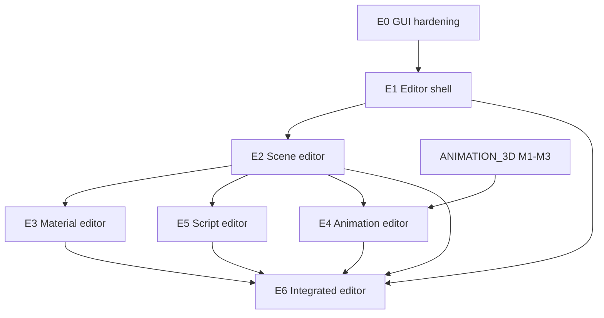

# GUI System & Game Editor — Roadmap & Tracked Tasks

Plan for evolving Spark’s **retained-mode GUI** (`spark/gui/`) into **in-engine authoring tools** (scene, material, animation, scripting) and an **integrated editor** comparable in *workflow* to Unity, Unreal Editor, or Godot 4.5+ — built on Spark’s Vulkan forward renderer and ECS.

**Dear ImGui** (`SPARK_ENABLE_IMGUI`) is available as an **optional immediate-mode layer** for internal tools and the docking demo (**#20**); retained GUI remains the primary stack for shipped menus and `SparkEditor`.

**Related:** [`ARCHITECTURE_AND_DEVELOPER_GUIDE.md`](ARCHITECTURE_AND_DEVELOPER_GUIDE.md) §5.9–§5.10 / §12, [`programming-guide/1-overview-architecture/08-ui-and-toolkits.md`](programming-guide/1-overview-architecture/08-ui-and-toolkits.md), [`SCENE_AND_RENDERING_GAPS.md`](SCENE_AND_RENDERING_GAPS.md), [`ANIMATION_3D_ROADMAP.md`](ANIMATION_3D_ROADMAP.md), demo **#10** `SceneEditor3DDemo`.

---

## How to track work

| Convention | Meaning |
|------------|---------|
| **Task ID** | `GUI-E{milestone}-{nn}` |
| **Priority** | **P0** exit criteria · **P1** should · **P2** nice |
| **Labels** | `gui`, `editor`, `milestone-E1` … |

**Issue title:** `[GUI-E2-04] Scene hierarchy TreeView bound to GameWorld`

---

## 1. Current GUI system (inventory)

### 1.1 Architecture

| Piece | Role |
|-------|------|
| `Widget` | Base tree: `Arrange`, `Paint`, pointer + optional `ProcessKeyInput` |
| `GuiCanvasComponent` | ECS root; sort order; hot / active / focus widgets |
| `ProcessGuiCanvasesInput` | Full-viewport layout, topmost canvas under cursor, scroll routing |
| `PaintGuiCanvases` | Emits `ScreenRectDraw` / `ScreenTextDraw` into `SceneRenderParams` |
| `GuiPaintContext` | Solid/gradient/rounded rects, strokes, drop shadow, text; **overlay** + **late** layers for popups |
| `GuiTheme` / `GuiThemeCatalog` | Semantic colors per canvas; **6** presets (`ClassicMint` default, `TwilightSlate`, high-contrast variants, `SceneEditorDark`) |

**Rendering:** CPU-drawn 2D (no GPU widget atlas). Text via `Font` / stb. **Not** retained mesh UI.

### 1.2 Built-in controls (`GuiControls.hpp`)

| Category | Controls |
|----------|----------|
| **Layout** | `StackPanel`, `GridPanel`, `WrapPanel`, `DockLayout`, `Splitter`, `ScrollPanel`, `EditorSidebarLayout`, `EditorTopChromeLayout`, `Separator` |
| **Docking** | `DockManager`, `DockPanel`, `DockSidePane`, `DockFrameLayout` (`spark/gui/docking/`) |
| **Chrome** | `Panel`, `GroupBox`, `Dialog`, `TabControl`, `MenuBar` |
| **Input** | `Button`, `CheckBox`, `Switch`, `RadioButton` + `RadioGroup`, `Slider`, `NumericBox`, `NumericStepper`, `TextBox`, `Dropdown` |
| **Lists** | `List`, `MultiSelectList`, `TreeView`, `Carousel` |
| **Display** | `Label`, `WrappingLabel`, `ProgressBar`, `ScrollBar`, `AlbumCard`, `TileSwatch` |

**Also:** `GuiContextMenu` for right-click menus; `GuiTheme::SceneEditorDark()` for editor chrome.

### 1.3 Demo / product usage today

| Consumer | What it proves |
|----------|----------------|
| **Shell menu** | `LauncherMenuLayout`, `List`, themes |
| **Scene editor (#10)** | `SceneEditor3DDemo` — left strip UI + 3D pick/place (prototype) |
| **Dear ImGui (#20)** | `ImGuiShowcaseDemo` — docking tool panels, hotkey **G** |
| **SparkEditor** | `spark_editor/SparkEditor` — dock shell, hierarchy/inspector stubs, fly viewport (`EditorApplication`) |
| **Shell UI** | C++ `ShellDemoUi` / `GuiCanvasComponent` — launcher menu |

### 1.4 Scene editor prototype (not a general editor)

`SceneEditor3DDemo` already combines GUI + 3D:

- Configurable left strip (`GetSceneEditorSidebarWidthPx`, `editor_layout.ini`); 3D input gated by `GuiConsumesGamePointer()`.
- Place meshes (3 presets) / user point lights; drag on ground plane; text **save/load** (`scene_editor/scene.txt`, **`spark_scene_v3`**).
- Light inspector sliders; tool mode list; translate gizmo.
- **SparkEditor** (separate exe) supersedes this for product work — see [`SPARK_EDITOR_PLAN.md`](SPARK_EDITOR_PLAN.md).

---

## 2. Gaps, limitations, and known pain points

### 2.1 GUI framework (vs. modern editor UI)

| Gap | Status / notes |
|-----|----------------|
| **No flex/grid measure pass** | Layout is mostly explicit heights or simple stacks; no `*` star sizing |
| **Docking** | **Partial:** `DockManager` + `DockFrameLayout` (left/center/right, collapse, gutters); no float windows or tab drag between dock areas |
| **Menu bar / toolbar** | **Partial:** `MenuBar` + `EditorTopChromeLayout` in SparkEditor; not a reusable editor chrome package |
| **No icon font / SVG** | `Button` supports glyph string + optional texture; no standard icon set |
| **Context menu** | **Implemented:** `GuiContextMenu` |
| **Tooltip** | **Partial:** hover tooltip in `GuiScene.cpp`; not wired to all controls |
| **No clipboard** | Copy/paste for text fields and property values |
| **TextBox** | Single-line; no caret navigation, selection, IME, or multiline |
| **Text overflow** | **Implemented:** `EllipsizeUtf8`, `DrawTextInRect`, `WrappingLabel` |
| **No virtualized lists** | `List` / `TreeView` hold all rows in memory |
| **GUI surface** | `GuiCanvasComponent`; UIs built in C++ (`ShellDemoUi`, editor widgets) |
| **Input model** | LMB primary; scroll routed to List/Tree/ScrollPanel; editor viewport uses `GuiConsumesGamePointer()` |
| **Multi-canvas** | Sort order works; focus per-canvas |
| **DPI / UI scale** | `GuiLayoutMetrics::Scaled()` partial; no global editor scale slider |
| **Accessibility** | No screen reader bridge or full keyboard nav |

### 2.2 Rendering / performance risks

| Risk | Notes |
|------|--------|
| **Draw call volume** | Each rounded rect / shadow may add multiple `ScreenRectDraw` entries; complex panels = many quads |
| **No batching UI** | Unlike retained GPU UI toolkits; worth profiling before huge inspectors |
| **Overlay popups** | `Dropdown` uses overlay/late layers; z-order depends on paint order within canvas |
| **Hit-test vs paint** | `EditorSidebarLayout` sets right pane `hitTest=false` so 3D receives clicks — pattern must be systematic for viewports |

### 2.3 Editor-specific (missing vs Unity / Unreal / Godot)

| Capability | Spark today |
|------------|-------------|
| **Project / asset database** | `GameWorld` path caches only; `EditorProject` stub |
| **Scene hierarchy** | `HierarchyPanel` + `TreeView` stub bound to `GameWorld` |
| **Inspector / property grid** | `InspectorPanel` text dump; no typed property editors |
| **Viewport (Scene)** | `SparkEditor` fly camera + `worldViewportScissor`; no gizmo service |
| **Transform gizmo** | Translate in `SceneEditor3DDemo` only |
| **Play mode / edit mode** | `EditorMode::Edit` only; shell switches demos separately |
| **Undo/redo** | None |
| **Serialization** | `spark_scene_v4` (reads v3); **23 / 37** component kinds; `SceneManager` in scene editor demo |
| **Material editor** | Runtime `MaterialComponent` only |
| **Animation editor** | See [`ANIMATION_3D_ROADMAP.md`](ANIMATION_3D_ROADMAP.md) |
| **Script editor** | C# host exists; no in-engine IDE |
| **Plugin / extension API** | None |

### 2.4 Bugs / fragile behaviors (code-level)

These are **documented risks** to fix in milestone **E0** (not an exhaustive bug list):

| ID | Area | Issue |
|----|------|--------|
| **GUI-BUG-01** | Scene editor | ~~Ground-plane XZ only~~ — **fixed**: `TryPickEditorRay` + `MeshRaycast` (mesh triangles + light spheres) |
| **GUI-BUG-02** | Scene editor | ~~Hard-coded strip~~ — **fixed**: shared `GetSceneEditorSidebarWidthPx` + layout ini |
| **GUI-BUG-03** | Input | ~~Manual `mx >= strip`~~ — **fixed**: `GuiPointerState` / `GuiConsumesGamePointer()` |
| **GUI-BUG-04** | Focus | Click outside focusables clears focus; **no** click-to-focus on all control types consistently |
| **GUI-BUG-05** | Dropdown | Popup list must close on outside click; verify interaction with overlapping widgets |
| **GUI-BUG-06** | Layout | ~~Shrink-to-fit overflow~~ — **fixed**: fixed row heights + `ScrollPanel` inspector host |
| **GUI-BUG-07** | Lists | Deep trees + expand arrows — keyboard nav exists on `TreeView`; **List** has no arrow-key selection |
| **GUI-BUG-08** | Text | `TextBox` — limited punctuation; paste from OS clipboard not supported |

---

## 3. North star: “Spark Editor”

A single executable (or shell mode) with:

```text
┌─────────────────────────────────────────────────────────────┐
│ Menu  File  Edit  Assets  GameObject  Window  Help          │
├──────────┬──────────────────────────────────────┬───────────┤
│ Hierarchy│  [Scene] [Game] [Asset] tabs         │ Inspector │
│ Project  │  ┌────────────────────────────────┐  │ (props)   │
│          │  │ 3D viewport + gizmos           │  │           │
│          │  └────────────────────────────────┘  │           │
├──────────┴──────────────────────────────────────┴───────────┤
│ Console │ Animation (dope) │ Material │ Script              │
└─────────────────────────────────────────────────────────────┘
```

**Principle:** Reuse `GuiCanvasComponent` for **panels**; add **editor services** (selection, undo, serialization, asset DB) as engine modules the GUI binds to — avoid coupling game logic into widgets.

---

## 4. Milestone overview

| Milestone | Goal | Horizon (indicative) |
|-----------|------|----------------------|
| **E0** | GUI hardening + editor UX primitives | 4–6 weeks |
| **E1** | Editor shell (dock, menus, project, preferences) | 6–8 weeks |
| **E2** | Scene editor (hierarchy, viewport, inspector, save) | 8–12 weeks |
| **E3** | Material editor | 4–6 weeks |
| **E4** | Animation editor | 6–10 weeks (depends on ANIMATION_3D M1–M3) |
| **E5** | Script editor + debug console | 8–12 weeks |
| **E6** | Integrated Spark Editor + polish | 8–16 weeks |

**Parallel:** E0→E1→E2 is the critical path; E3–E5 can start after E2 inspector exists; E6 merges.

---

## E0 — GUI foundation & editor primitives

**Exit criteria:** Reusable layout for docked panels; pointer capture API; scrollable inspector column; documented patterns for “3D viewport + chrome.”

| ID | Task | P | Status |
|----|------|---|--------|
| GUI-E0-01 | **`GuiLayoutMetrics`**: padding, row height, font scale, DPI factor (default 1.0) | P0 | [ ] |
| GUI-E0-02 | **`ScrollPanel` as default inspector host** — replace shrink-to-fit-only forms for long panels | P0 | [x] |
| GUI-E0-03 | **`IUiInputSink` / `GuiInputCapture`**: engine reports `bool IsPointerOverUi()` + `WantsGameInput()` for demos | P0 | [x] |
| GUI-E0-04 | **Sync scene editor strip width** — single constant shared by layout + picking | P0 | [x] |
| GUI-E0-05 | **List**: keyboard Up/Down + Enter selection | P1 | [ ] |
| GUI-E0-06 | **TextBox**: caret, left/right, Home/End, Ctrl+A; optional OS paste | P1 | [x] |
| GUI-E0-07 | **Multiline `TextArea`** (for scripts / long strings) | P1 | [x] |
| GUI-E0-08 | **Context menu** widget (popup on RMB, overlay layer) | P1 | [x] |
| GUI-E0-09 | **Tooltip** (hover delay, late layer) | P2 | [x] |
| GUI-E0-10 | **Theming**: `GuiThemeCatalog` presets + `LabelTone` on labels | P1 | [x] |
| GUI-E0-11 | **GUI perf harness**: N rects/texts frame cost in `SceneRenderParams` | P2 | [ ] |

---

## E1 — Editor shell

**Exit criteria:** Dockable panels persist to disk; menu commands route to editor services; open project folder.

| ID | Task | P | Status |
|----|------|---|--------|
| GUI-E1-01 | **`EditorApplication`** module — mode flag (Edit / Play), project path, active scene | P0 | [ ] |
| GUI-E1-02 | **`DockWorkspace`** — N-pane dock with tabs (build on `Splitter` + `TabControl`) | P0 | [ ] |
| GUI-E1-03 | **Layout persistence** — JSON: split fractions, tab selection, panel visibility | P0 | [~] |
| GUI-E1-04 | **Menu bar** widget + command IDs (`EditorCommand::SaveScene`) | P0 | [~] |
| GUI-E1-05 | **Toolbar** — icon buttons (texture atlas or glyph font) | P1 | [ ] |
| GUI-E1-06 | **Status bar** — selection name, coords, FPS, save dirty flag | P1 | [ ] |
| GUI-E1-07 | **Project browser** panel — folder tree (`TreeView`) + file list | P0 | [ ] |
| GUI-E1-08 | **Preferences** dialog — UI scale, keybindings, default paths | P1 | [ ] |
| GUI-E1-09 | **Replace shell demo #12** with thin launcher → `EditorApplication` | P1 | [ ] |

---

## E2 — Scene editor

**Exit criteria:** Author `.sparkscene` (or equivalent) with hierarchy, transforms, components; viewport select/move/rotate; play-in-scene optional stub.

| ID | Task | P | Status |
|----|------|---|--------|
| GUI-E2-01 | **Scene serialization v4** — extend handler coverage; hierarchy, parent links, component blobs | P0 | [~] |
| GUI-E2-02 | **`EditorSelection`** service — selected `GameObject*`, multi-select policy | P0 | [ ] |
| GUI-E2-03 | **Hierarchy panel** — `TreeView` ↔ `GameWorld` (create/rename/delete/parent) | P0 | [ ] |
| GUI-E2-04 | **`EditorViewport` region** — rect + `hitTest=false`; central render target | P0 | [ ] |
| GUI-E2-05 | **Pick pass** — ray vs AABB / mesh; respect viewport rect | P0 | [ ] |
| GUI-E2-06 | **Transform gizmo** — translate on XZ/XYZ (later rotate/scale) | P0 | [ ] |
| GUI-E2-07 | **Inspector framework** — reflect `ComponentKind` → property rows | P0 | [ ] |
| GUI-E2-08 | **Built-in inspectors**: Transform, Mesh, Material, PointLight, Rigidbody3D | P0 | [ ] |
| GUI-E2-09 | **Add component menu** — searchable list of component types | P1 | [ ] |
| GUI-E2-10 | **Undo/redo** command stack (transform, create, delete, property) | P0 | [ ] |
| GUI-E2-11 | **Snap grid** + optional angle snap | P1 | [ ] |
| GUI-E2-12 | **Prefab / asset drag** from project browser into viewport | P1 | [ ] |
| GUI-E2-13 | **Play mode** — duplicate world or snapshot; disable editor mutators | P1 | [ ] |
| GUI-E2-14 | **Script sample**: minimal scene open/save via new C# host | P2 | [ ] |

---

## E3 — Material editor

**Exit criteria:** Edit `MaterialComponent` and preview on mesh/sphere; assign textures from project; live refresh in viewport.

| ID | Task | P | Status |
|----|------|---|--------|
| GUI-E3-01 | **Material asset** — `.sparkmat` or embedded in scene; reference by path | P0 | [ ] |
| GUI-E3-02 | **Material inspector** — tint, metallic, roughness, emissive, shading model, toon params | P0 | [ ] |
| GUI-E3-03 | **Texture slots** — base, normal, ORM, emissive (`TileSwatch` + picker) | P0 | [ ] |
| GUI-E3-04 | **Preview panel** — lit sphere + optional custom mesh | P0 | [ ] |
| GUI-E3-05 | **UV preview** — 2D thumbnail of active texture | P1 | [ ] |
| GUI-E3-06 | **Material library** — list + duplicate + assign to selection | P1 | [ ] |
| GUI-E3-07 | **Batch assign** — selected objects share material asset | P2 | [ ] |

---

## E4 — Animation editor

**Exit criteria:** Preview skinned glTF clips; scrub timeline; assign clips to `AnimatorComponent`; event markers (when ANIMATION M4 exists).

Depends on [`ANIMATION_3D_ROADMAP.md`](ANIMATION_3D_ROADMAP.md) **M1–M3** minimum.

| ID | Task | P | Status |
|----|------|---|--------|
| GUI-E4-01 | **Animation panel** — clip list from `Skeleton::GetClipName` | P0 | [ ] |
| GUI-E4-02 | **Timeline scrubber** — `Slider` + time readout; drives `SetTimeSeconds` | P0 | [ ] |
| GUI-E4-03 | **Viewport preview** — skinned mesh + loop/once | P0 | [ ] |
| GUI-E4-04 | **Blend preview** — when M3 exists, 1D speed blend UI | P1 | [ ] |
| GUI-E4-05 | **Skeleton debug draw** — joint lines toggle (pairs ANIMATION M6) | P1 | [ ] |
| GUI-E4-06 | **Event track** — markers on timeline (after ANIMATION M4) | P1 | [ ] |
| GUI-E4-07 | **Export clip rename / retarget notes** | P2 | [ ] |

---

## E5 — Script editor

**Exit criteria:** Edit C# game scripts in-project; native CoreCLR host + generated bindings; errors in console.

| ID | Task | P | Status |
|----|------|---|--------|
| GUI-E5-01 | **Script asset** registration in project browser (`.cs`) | P0 | [ ] |
| GUI-E5-02 | **`CodeEditor` widget** — multiline `TextArea` + line numbers (CPU text) | P0 | [ ] |
| GUI-E5-03 | **Syntax highlight v1** — keywords/strings/comments (simple tokenizer) | P1 | [ ] |
| GUI-E5-04 | **Open/save** with dirty indicator + hotkey Ctrl+S | P0 | [ ] |
| GUI-E5-05 | **Build / run** — shell `dotnet build` + load game assembly | P0 | [ ] |
| GUI-E5-06 | **Console panel** — stdout/stderr from game + build | P0 | [ ] |
| GUI-E5-07 | **Breakpoint stub** — line gutter; defer full debugger to VS/Rider | P2 | [ ] |
| GUI-E5-08 | **Component script attach** — GUID / type name on `GameObject` | P1 | [ ] |

*Long-term:* LSP or Roslyn-powered IntelliSense is a **separate program** (6+ months); do not block E6 on it.

---

## E6 — Integrated Spark Editor

**Exit criteria:** One “Spark Editor” binary; default layout; new project wizard; documentation for designers.

| ID | Task | P | Status |
|----|------|---|--------|
| GUI-E6-01 | **`SparkEditor` target** — links E1–E5 panels | P0 | [ ] |
| GUI-E6-02 | **New project wizard** — folder, template (empty / 3D / 2D) | P0 | [ ] |
| GUI-E6-03 | **Default workspace** — Hierarchy | Viewport | Inspector | Project | Console | Animation | Material | Script tabs | P0 | [ ] |
| GUI-E6-04 | **Global shortcuts** — Save, Undo, Focus viewport, Play/Stop | P0 | [ ] |
| GUI-E6-05 | **Documentation** — `docs/EDITOR_USER_GUIDE.md` | P1 | [ ] |
| GUI-E6-06 | **CI** — headless open scene + save round-trip | P1 | [ ] |
| GUI-E6-07 | **Compare matrix** — document parity vs Unity/UE/Godot (honest gaps) | P1 | [ ] |

---

## 5. Comparison matrix (honest scope)

| Feature | Unity | Unreal | Godot 4.5 | Spark (target) |
|---------|-------|--------|-----------|----------------|
| Retained UI toolkit | UIElements | Slate | Control nodes | **Custom `spark/gui`** |
| Visual scene tree | Yes | Yes | Yes | **E2** |
| Viewport + gizmos | Yes | Yes | Yes | **E2** |
| Material graph | Shader Graph | Material Editor | VisualShader | **E3 numeric + textures first** (no node graph in v1) |
| Animation | Mecanim | Sequencer | AnimationPlayer | **E4 + ANIMATION_3D** |
| Script IDE | Roslyn | C++ / BP | Built-in script editor | **E5 text + build** (no full IDE v1) |
| Asset pipeline | Full | Full | Full | **E1 browser + caches** |
| Undo | Yes | Yes | Yes | **E2** |
| Extensibility | Packages | Plugins | GDExtension | **Defer** (post E6) |

**Node-based material/animation graphs** are **Phase 2** (post E6) if needed — plan E3/E4 as **inspector + timeline** first to ship faster on existing widgets.

---

## 6. Dependency graph



---

## 7. Suggested 24-month critical path (small team)

| Phase | Months | Deliverable |
|-------|--------|-------------|
| **Foundation** | 1–2 | E0 + scene editor picking fix |
| **Shell + scene** | 3–6 | E1 + E2 (hierarchy, inspector, save, gizmo) |
| **Content tools** | 7–10 | E3 + ANIMATION M1–M2 + E4 basic |
| **Scripting** | 11–14 | E5 + C# game loop from editor |
| **Productize** | 15–18 | E6 + polish + docs |
| **Parity gaps** | 19–24 | Node graphs, visual shader, debugger, plugins (optional) |

Adjust if team size > 3 or if editor is **tools-only** (no ship-as-product).

---

## 8. References in this repo

| Path | Role |
|------|------|
| `include/spark/gui/Widget.hpp` | Widget contract |
| `src/spark/gui/GuiScene.cpp` | Input + paint |
| `include/spark/gui/GuiPaintContext.hpp` | Draw API |
| `src/spark/demo/SceneEditor3DDemo.cpp` | Editor prototype |
| `include/spark/demo/SceneEditor3DDemo_detail.hpp` | Sidebar layout |
| `src/spark/demo/SparkShellDemo.cpp` | Demo launcher shell |
| `src/spark/demo/ImGuiShowcaseDemo.cpp` | Dear ImGui docking demo (#20) |
| *(removed)* | Legacy `ShellUiNative.cpp` (C# UI builders) |
| `include/spark/ecs/components/ui/GuiCanvasComponent.hpp` | Canvas ECS |

---

*Last updated: GUI + game editor roadmap E0–E6. Check boxes or link GitHub issues as work lands.*
