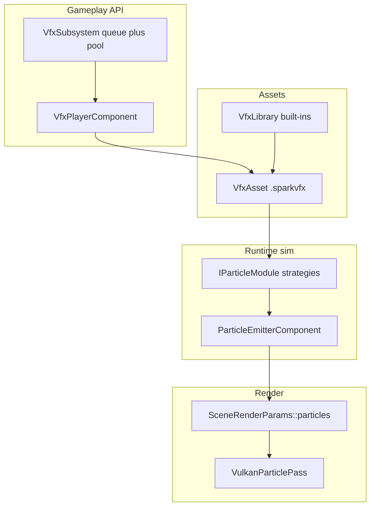

# VFX & Particles — Roadmap

Plan for evolving Spark’s **CPU particle pipeline** into a flexible, extensible VFX system with built-in effects (explosion, fireworks, impact, …) and asset-driven authoring.

**Related:** [`programming-guide/3-3d-graphics/07-particles.md`](programming-guide/3-3d-graphics/07-particles.md), [`MATERIALS_AND_LIGHTING.md`](MATERIALS_AND_LIGHTING.md) (material assets), [`SPARK_EDITOR_PLAN.md`](SPARK_EDITOR_PLAN.md), demo **#3** `ParticleDemo`.

---

## 1. Current state

| Piece | Role |
|-------|------|
| `ParticleEmitterComponent` | CPU sim: rate, cone, gravity, color/size fade |
| `SceneRenderParams::particles` | Snapshot for render (`SceneParticleInstance`) |
| `VulkanParticlePass` | Additive camera-facing disc billboards |
| `ParticleEmitterSnapshotHandler` | Scene save/load of emitter params |
| `ParticleDemoDetail.hpp` | Four demo-only presets (fire, snow, smoke, sparkle) |

**Gaps:** no burst API, no VFX assets, emission ignores emitter rotation, 2D games use sprite pools for explosions, no editor support.

---

## 2. Target architecture (three layers)



### Layer 1 — Simulation primitive

**`ParticleEmitterComponent`** remains the only owner of particle slots.

Extensions (phased):

- **P1 (done):** `Burst()`, local-space emission direction, `VfxLibrary` built-ins
- **P2:** `VfxAsset` loader, `VfxPlayerComponent`, pooled one-shots
- **P3:** Composite multi-emitter effects (fireworks)
- **P4 (done):** `IParticleModule` registry, curves, editor inspector, textured billboards

### Layer 2 — VFX definitions (Composite + Factory)

**`VfxEffectDefinition`** — ordered `EmitterSpec` list with start time, duration, module params.

**`VfxAsset`** (`.sparkvfx`) — serializable effect; mirrors `MaterialAsset` / `.sparkmat`.

**`VfxLibrary`** — built-in registry (`explosion`, `fire`, `fireworks`, …).

### Layer 3 — Playback (Facade + Command)

**`VfxPlayerComponent`** — `Play()`, `PlayOnce()`, `Stop()`.

**`VfxSubsystem`** — drains `VfxPlayRequest` each frame (mirror `SoundCueComponent`).

---

## 3. Design patterns

| Pattern | Use in VFX |
|---------|------------|
| **Strategy** | `IEmissionModule` — continuous, burst, ring, trail |
| **Composite** | `VfxEffectDefinition` — fireworks = trail + timed burst + sparkle |
| **Factory** | `VfxAssetLoader`, `VfxLibrary::ApplyBuiltin` |
| **Facade** | `VfxPlayerComponent` hides emitters / prefab spawn |
| **Command** | `VfxPlayRequest` queued per frame |
| **Object pool** | `VfxSubsystem` reuses hidden effect entities |
| **Template method** | `VfxPlayer::Tick()` — apply modules → sim → finish |

---

## 4. Built-in catalog

| ID | Name | P1 | Notes |
|----|------|-----|-------|
| `fire` | Fire | ✓ | Continuous upward cone |
| `snow` | Snow | ✓ | Gentle fall |
| `smoke` | Smoke | ✓ | Slow rise, large end size |
| `sparkle` | Sparkle | ✓ | Magic / gem glints |
| `explosion` | Explosion | ✓ | Burst-oriented; call `Burst()` after apply |
| `impact` | Impact | ✓ | Tight directional burst |
| `fireworks` | Fireworks | ✓ | Timed composite (trail → burst → sparkle) |
| `confetti` | Confetti | ✓ | Burst + gravity drift |

---

## 5. Phased rollout

### P1 — Burst + built-ins ✓

- [x] `ParticleEmitterComponent::Burst(owner, count)`
- [x] Local-space emission direction (`SetUseLocalEmission`)
- [x] `VfxLibrary` with fire / snow / smoke / sparkle / explosion / impact
- [x] `ParticleDemo` delegates to `VfxLibrary`
- [x] Unit test: burst spawns expected living count (`ParticleEmitterBurstTest`)

### P2 — Assets + player ✓

- [x] `VfxAsset` + `.sparkvfx` file format
- [x] `VfxAssetLoader` (mirror `MaterialAssetLoader`)
- [x] `VfxPlayerComponent` + snapshot handler
- [x] `VfxSubsystem` pool + `VfxPlayRequest` queue

### P3 — Composites ✓

- [x] Multi-emitter `VfxEffectDefinition`
- [x] Fireworks preset (trail → burst → sparkle)
- [x] Confetti composite preset
- [x] Optional `.sparkscene` prefab path on asset (`prefab` line + `VfxPlayerComponent` spawn)

### P4 — Modules + editor ✓

- [x] `IParticleModule` registry (`continuous`, `burst_only`, `ring`)
- [x] Size/color curves over life (`ParticleFloatCurve`, `ParticleColorCurve`)
- [x] Inspector for `particle_emitter` / `vfx_player`
- [x] Texture atlas on `SceneParticleInstance` (`uvRect`, `textureLayer`)

### P5 — Integration ✓

- [x] Animation event → `VfxPlayRequest` (`AnimationEventVfxComponent`)
- [x] C# bindings `spark_vfx_play`, `spark_world_process_vfx`, `spark_vfx_player_*`
- [x] Platformer `ExplosionFx` delegates to `VfxSubsystem`

---

## 6. ECS usage (target)

```cpp
// One-shot explosion at hit point
if (auto* pe = fx->AddComponent<ParticleEmitterComponent>()) {
    VfxLibrary::ApplyBuiltin(VfxBuiltinId::Explosion, *pe);
    pe->Burst(*fx, 96);
}

// Continuous torch (local up = flame direction when entity rotates)
VfxLibrary::ApplyBuiltin(VfxBuiltinId::Fire, *pe);
pe->SetUseLocalEmission(true);

// P2+: decoupled spawn
world.GetVfxSubsystem().Queue("vfx/explosion", hitPosition);
// or attach a player:
auto* player = fxGo->AddComponent<VfxPlayerComponent>();
player->SetVfxAssetKey("vfx/explosion");
player->PlayOnce(*fxGo);
```

---

## 7. Suggested package layout

```text
include/spark/scene/vfx/
  VfxLibrary.hpp          # P1
  VfxAsset.hpp              # P2
  VfxAssetLoader.hpp        # P2
  modules/IParticleModule.hpp  # P4

include/spark/ecs/components/rendering/
  VfxPlayerComponent.hpp    # P2

src/spark/scene/vfx/
  VfxLibrary.cpp
  VfxSubsystem.cpp          # P2

assets/vfx/
  explosion.sparkvfx        # P2
```

---

## 8. Render notes

P1–P3 use the **additive disc** pass. P4 adds optional **textured billboards** via `SceneParticleInstance::uvRect` and `textureLayer` (sampled from the scene texture array when `textureLayer >= 0`).

---

Update this document at each phase completion.
