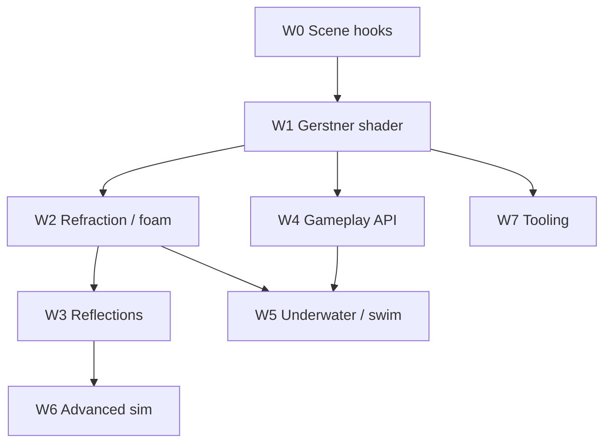

# Water — Engine Roadmap & Tracked Tasks

Living plan for **realistic water surfaces**, **wave simulation**, **shoreline integration**, and **gameplay coupling** (buoyancy, swimming, splashes). It complements atmosphere/weather items in [`OPEN_WORLD_ACTION_ROADMAP.md`](OPEN_WORLD_ACTION_ROADMAP.md) (Phase D) and rendering gaps in [`SCENE_AND_RENDERING_GAPS.md`](SCENE_AND_RENDERING_GAPS.md).

**Architecture anchors:** [`ARCHITECTURE_AND_DEVELOPER_GUIDE.md`](ARCHITECTURE_AND_DEVELOPER_GUIDE.md) §5.7 (terrain/sky), [`LIGHTING_AND_SHADOWS.md`](LIGHTING_AND_SHADOWS.md) (HDR frame flow, transparent pass), [`MATERIALS_AND_LIGHTING.md`](MATERIALS_AND_LIGHTING.md) (PBR / IBL), `include/spark/engine/SceneRenderParams.hpp`, `src/spark/scene/SceneSubmit*.cpp`, `src/spark/render/core/VulkanRenderer.cpp`, `src/spark/render/scene/VulkanSceneOpaquePass.cpp`, `shaders/scene.frag`.

**Related gameplay systems:** `TerrainComponent` (shore height), `VfxLibrary::WaterSplash`, `PhysicsQueryWorld3D`, `CharacterController3DComponent`, `FogVolumeComponent`, `PostProcessVolumeComponent`.

**Non-goals (defer):** full Navier–Stokes fluid simulation, large-scale ocean CFD, city-scale fluid coupling.

---

## How to track work

| Convention | Meaning |
|------------|---------|
| **Task ID** | `WATER-M{milestone}-{nn}` — stable across PRs and issues |
| **Priority** | **P0** must for milestone exit · **P1** should · **P2** nice |
| **Status** | Use GitHub issue state, or check boxes in this file when merging |

**Suggested GitHub labels:** `water`, `rendering`, `milestone-W0` … `milestone-W7`

**Issue title format:** `[WATER-M1-03] Water shader: Gerstner displacement + analytic normals`

Copy the **Issue body** block under each task when filing issues (see [§9](#9-bulk-github-issue-creation-optional)).

---

## Current baseline (as of this doc)

| Area | Status |
|------|--------|
| HDR forward lit meshes + depth buffer | Done — `VulkanSceneOpaquePass`, `R16G16B16A16` color |
| Transparent / transmission pass | Done — `transparentDraws`; opaque color copied to scratch (binding **13**) for screen-space refraction sampling |
| Sky dome + equirect IBL | Done — `SkyComponent`, `ibl.glsl`, BRDF LUT |
| Directional CSM + punctual lights | Done — sun glints feasible on water normals |
| Terrain heightfield + raycast | Done — `TerrainComponent::TryRaycastWorld` |
| Fog / time-of-day data path | Done — `FogVolumeComponent`, `TimeOfDayDriverComponent` |
| 2D tilemap animated water tiles | Done — cosmetic only (`TilemapShowcase2DDemo`) |
| `VfxLibrary::WaterSplash` | Done — particle burst preset; not wired to a water surface |
| **Water body component / submit path** | **Not started** |
| **Water material / shader** | **Not started** |
| **Wave height gameplay API** | **Not started** |
| **Buoyancy / swim controller** | **Not started** |
| **Offscreen render targets (planar reflection)** | **Not started** — documented gap in `SCENE_AND_RENDERING_GAPS.md` |
| **Reflection probes** | **Not started** — documented gap |
| **SSR** | **Not started** — depth buffer exists (SSAO path) |

---

## Visual target tiers

Pick a tier per project; milestones below build toward **Tier B** (action-game realistic) with optional **Tier C** tasks in M6.

| Tier | Technique | Typical use |
|------|-----------|-------------|
| **A — Stylized** | Flat plane + scrolling normal map + depth tint | Prototype, mobile min-spec |
| **B — Realistic (default exit)** | Gerstner waves + refraction + depth absorption + Fresnel + sky IBL + shoreline foam + SSR or planar reflection | Lakes, coasts, action games |
| **C — High-end** | FFT ocean spectrum + flow maps + wake ripple texture + caustics | Open ocean showcase |

---

## Milestone overview

| Milestone | Goal | Depends on | Maps to open-world |
|-----------|------|------------|-------------------|
| **W0** | Scene integration — water bodies, draw slot, depth/color hooks | — | D6 (weather/wetness precursor) |
| **W1** | Gerstner water shader v1 — displacement, Fresnel, sun specular | W0 | C1 (LOD content) |
| **W2** | Refraction, depth absorption, shoreline foam | W0, W1 | D6 surface wetness adjacency |
| **W3** | Reflections — sky IBL + SSR and/or planar RT | W1, W2 | Rendering scale (Phase C) |
| **W4** | Simulation API + buoyancy gameplay | W1 | Traversal / vehicles |
| **W5** | Underwater post, audio hooks, swim controller | W2, W4 | Weather / biomes |
| **W6** | Advanced sim — flow maps, FFT, wakes, caustics | W1–W3 | “E3 vertical” polish |
| **W7** | Tooling, presets, docs, CI smoke | W1 | §0 content pipeline |

**Recommended order:** W0 → W1 → W2 → W3 (rendering spine); W4 after W1 (gameplay height); W5 after W2+W4; W6/W7 parallel where possible.

---

## W0 — Scene integration & render hooks

**Exit criteria:** A `WaterBodyComponent` on a scene object produces a dedicated water draw in `SceneRenderParams`; renderer exposes **scene color + linear depth** textures usable by a water pass without breaking the existing transparent/transmission path.

| ID | Task | P | Status |
|----|------|---|--------|
| WATER-W0-01 | **`WaterBodyComponent`** — mode enum: `InfiniteOcean`, `FiniteLake`, `RiverSpline` (data only for v1); `waterLevelY`, extent, wave preset id | P0 | [x] |
| WATER-W0-02 | **`WaterSurfaceMesh`** — camera-centered clipmap or subdivided plane; rebuild when camera moves beyond threshold | P0 | [x] |
| WATER-W0-03 | **`SceneRenderParams::waterDraws`** (or `waterSurfaces`) — separate array from `transparentDraws`; max count + sort key (distance) | P0 | [x] |
| WATER-W0-04 | **`SceneSubmit` collection** — `ForEachWaterBodyInViewFrustum` (or tag query); fill `waterDraws` after opaque partition, before generic transparent | P0 | [x] |
| WATER-W0-05 | **Depth/color export for water** — per-flight `VulkanSceneOpaqueBackground`-style images: **linear depth** + **HDR color** after opaque (and optionally after sky); document binding indices | P0 | [x] |
| WATER-W0-06 | **`VulkanWaterPass` skeleton** — dedicated render pass slot in `VulkanRenderer` after opaque (+ sky), before generic transparent; no-op clear initially | P0 | [x] |
| WATER-W0-07 | **Shadow flags** — water receives shadows (`kSceneShadowReceive`); does not cast (or optional cast for very shallow ponds) | P1 | [x] |
| WATER-W0-08 | **Component reference + programming guide** stub under terrain/sky chapter | P1 | [ ] |
| WATER-W0-09 | **Scene serialization handler** — `water_body` snapshot in `spark_scene_v4` (level, extent, preset id) | P2 | [ ] |

<details>
<summary>Issue template — WATER-W0-05 (example)</summary>

**Title:** `[WATER-W0-05] Export scene color + linear depth for water refraction`

**Body:**
```
Milestone: W0 — Scene integration
Priority: P0

## Summary
After the opaque HDR pass (and sky if drawn in same pass), copy color + depth to per-flight sampled images for the water shader.

## Acceptance
- [ ] Depth is linear eye-space or reconstructable from stored depth
- [ ] Color is HDR (R16G16B16A16) matching scene pass
- [ ] Existing transmission pass (binding 13) unchanged or unified
- [ ] Documented in LIGHTING_AND_SHADOWS.md frame flow

## Files (expected)
- src/spark/render/scene/VulkanSceneOpaquePass.cpp
- include/spark/render/scene/VulkanSceneOpaqueBackground.hpp (extend or sibling)
- src/spark/render/core/VulkanRenderer.cpp
```
</details>

---

## W1 — Gerstner water shader v1

**Exit criteria:** A calm-to-moderate ocean/lake reads as water from orbit and ground camera: animated waves, Fresnel sky reflection, sun specular highlight. Demo: flat terrain + infinite ocean at Y=0.

| ID | Task | P | Status |
|----|------|---|--------|
| WATER-W1-01 | **`WaterWaveSettings`** — up to 4 Gerstner waves: amplitude, wavelength, speed, direction, steepness (Q) | P0 | [x] |
| WATER-W1-02 | **CPU `GerstnerWaveSurface`** — `SampleHeight`, `SampleNormal`, `SampleHorizontalDisplacement` at `(x,z,t)`; shared by shader and gameplay | P0 | [x] |
| WATER-W1-03 | **`shaders/water.vert`** — displace vertices; pass world position, wave normal, screen UV | P0 | [x] |
| WATER-W1-04 | **`shaders/water.frag` v1** — Fresnel (Schlick), sky IBL sample (`ibl.glsl`), directional sun specular (GGX), base water color | P0 | [x] |
| WATER-W1-05 | **Pipeline + descriptors** — `VulkanWaterPass` binds scene UBO, IBL, shadow maps, water push constants (wave array) | P0 | [x] |
| WATER-W1-06 | **`WaterPreset` assets** — `CalmLake`, `OceanModerate`, `StormySea` default parameter sets | P1 | [ ] |
| WATER-W1-07 | **Demo: `WaterLakeDemo`** — terrain island + infinite ocean; fly camera; time scale hotkey | P1 | [x] (menu **23** / **W**) |
| WATER-W1-08 | **Unit tests** — Gerstner height/normal at t=0 matches analytic reference; symmetry on flat sea state | P2 | [ ] |

---

## W2 — Refraction, absorption, shoreline foam

**Exit criteria:** Underwater objects visible with distortion; shallow water tint at shore; white foam where water meets terrain or steep wave crests.

| ID | Task | P | Status |
|----|------|---|--------|
| WATER-W2-01 | **Refraction** — sample W0 color buffer with normal-based UV offset; chromatic aberration optional (P2) | P0 | [ ] |
| WATER-W2-02 | **Depth-based absorption** — `waterDepth = waterY - sceneDepth`; Beer–Lambert or artist `shallowColor` / `deepColor` lerp | P0 | [ ] |
| WATER-W2-03 | **Shoreline foam mask** — compare water surface Y vs terrain height (heightmap sample or depth intersection); foam noise texture | P0 | [ ] |
| WATER-W2-04 | **Crest foam** — Jacobian or steepness threshold on Gerstner sum | P1 | [ ] |
| WATER-W2-05 | **Detail normals** — layered scrolling normal map (2–3 scales) added to Gerstner normal | P1 | [ ] |
| WATER-W2-06 | **Terrain integration** — `TerrainComponent` height query at foam generation (CPU debug + GPU approximate) | P1 | [ ] |
| WATER-W2-07 | **Transparency sort** — water draws after opaque, before other `transparentDraws`; document sort mode | P1 | [ ] |
| WATER-W2-08 | **Demo polish** — beach slope on terrain demo island; foam visible at shoreline | P1 | [ ] |

---

## W3 — Reflections (local + sky)

**Exit criteria:** Shore objects reflect in calm water; grazing angles fall back to sky IBL when SSR misses.

| ID | Task | P | Status |
|----|------|---|--------|
| WATER-W3-01 | **`IRenderTarget` / `RenderTexture` handle** — offscreen color+depth (prerequisite for planar reflection) | P0 | [ ] |
| WATER-W3-02 | **SSR pass** — ray march in screen space using scene depth; roughness-aware fade; reuse SSAO depth copy path | P1 | [ ] |
| WATER-W3-03 | **SSR + IBL composite** — Fresnel blends SSR hit vs `iblSpecular`; horizon fade | P1 | [ ] |
| WATER-W3-04 | **Planar reflection (optional v1)** — reflect camera below plane Y; render opaque+skinned subset to RT; sample in water.frag | P1 | [ ] |
| WATER-W3-05 | **Reflection probe stub** — single box probe component (deferred); water uses probe if SSR miss | P2 | [ ] |
| WATER-W3-06 | **Perf budget** — SSR half-res option; max ray steps; disable on min-spec profile | P1 | [ ] |
| WATER-W3-07 | **Tests / capture** — golden screenshot harness or headless pixel sample at fixed camera | P2 | [ ] |

---

## W4 — Simulation API & gameplay physics

**Exit criteria:** A `Rigidbody3D` sphere floats with plausible bobbing; gameplay code queries water height without duplicating wave math.

| ID | Task | P | Status |
|----|------|---|--------|
| WATER-W4-01 | **`WaterSubsystem` per `GameWorld`** — owns active bodies, time, global wind fetch | P0 | [ ] |
| WATER-W4-02 | **Public API** — `SampleWaterHeight(worldXZ, t)`, `SampleWaterNormal`, `IsUnderwater(worldPos)` | P0 | [ ] |
| WATER-W4-03 | **`BuoyancyComponent`** — sample submerged volume (approximate: sphere/capsule vs plane); Archimedes + linear/angular damping | P0 | [ ] |
| WATER-W4-04 | **Drag when submerged** — scale `Rigidbody3D` linear/angular damping by submerge fraction | P1 | [ ] |
| WATER-W4-05 | **Physics query extension** — vertical ray returns `WaterHit` vs `TerrainHit` (closest surface) | P1 | [ ] |
| WATER-W4-06 | **Splash triggers** — `OnWaterEnter` / `OnWaterExit` signals; queue `VfxLibrary::WaterSplash` at impact point | P1 | [ ] |
| WATER-W4-07 | **Audio hook** — `SoundCue` play on enter/splash (data path; no new audio engine work) | P2 | [ ] |
| WATER-W4-08 | **Demo** — buoyant crates + character wading depth line in `WaterLakeDemo` | P1 | [ ] |
| WATER-W4-09 | **Unit tests** — buoyancy net force sign; height API matches `GerstnerWaveMath` | P1 | [ ] |

---

## W5 — Underwater rendering & character swim

**Exit criteria:** Camera below surface gets fog/color shift; character can swim with distinct surface vs underwater motion.

| ID | Task | P | Status |
|----|------|---|--------|
| WATER-W5-01 | **`UnderwaterPostSettings`** on `SceneRenderParams` — enable when camera submerged; density, color, distortion strength | P0 | [ ] |
| WATER-W5-02 | **Underwater fullscreen pass** — after water surface, before tonemap; exponential fog using water depth | P0 | [ ] |
| WATER-W5-03 | **Split-plane camera** — optional dual fog when camera half-submerged (P2) | P2 | [ ] |
| WATER-W5-04 | **`CharacterSwimMotor` or FSM mode** — surface swim, dive, buoyancy assist; integrates with `CharacterController3D` | P1 | [ ] |
| WATER-W5-05 | **Regional post override** — `PostProcessVolumeComponent` underwater preset auto-blend | P2 | [ ] |
| WATER-W5-06 | **Demo hotkeys** — toggle dive, swim speed, underwater post strength | P1 | [ ] |

---

## W6 — Advanced simulation & effects (optional)

**Exit criteria:** Documented path for FFT ocean or river flow; boat wake ripples; no requirement for default demos.

| ID | Task | P | Status |
|----|------|---|--------|
| WATER-W6-01 | **Flow map river mode** — 2D flow/normal texture on `WaterBodyComponent`; advect UVs in shader | P2 | [ ] |
| WATER-W6-02 | **FFT ocean (compute)** — Phillips spectrum, IFFT height/normal on GPU; ping-pong buffers; fallback to Gerstner | P2 | [ ] |
| WATER-W6-03 | **Wake / ripple texture** — dynamic RG texture updated by moving objects (compute or CPU stamp); added to displacement | P2 | [ ] |
| WATER-W6-04 | **Caustics projection** — project animated caustic texture onto terrain below water (decal pass) | P2 | [ ] |
| WATER-W6-05 | **LOD tiers** — near: full W1–W3; far: single normal map + flat plane + no SSR | P1 | [ ] |
| WATER-W6-06 | **Weather coupling** — wind field drives wave amplitude/speed (`OPEN_WORLD` D6 hook) | P2 | [ ] |

---

## W7 — Tooling, content pipeline & docs

**Exit criteria:** Artists have water presets; engineers have debug viz; CI loads a water scene headlessly.

| ID | Task | P | Status |
|----|------|---|--------|
| WATER-W7-01 | **`docs/WATER_ARTIST_GUIDE.md`** — preset tuning, shore foam, performance budgets | P1 | [ ] |
| WATER-W7-02 | **Programming guide** — extend [Terrain and Sky](programming-guide/3-3d-graphics/06-terrain-and-sky.md) with water section | P1 | [ ] |
| WATER-W7-03 | **`.sparkwater` preset file** — JSON round-trip (wave list, colors, foam, SSR flags) | P1 | [ ] |
| WATER-W7-04 | **Debug draw** — water level grid, wave gizmos, foam mask heatmap (dev key) | P2 | [ ] |
| WATER-W7-05 | **Editor inspector** — `WaterBodyComponent` fields in scene editor prototype | P2 | [ ] |
| WATER-W7-06 | **CI smoke** — spawn water body + sample height + one draw submit without GPU validation layer | P2 | [ ] |
| WATER-W7-07 | **Sample scene** — `assets/scenes/water_lake.sparkscene` | P2 | [ ] |

---

## Dependency graph



---

## Mapping to FOLIAGE_ROADMAP

| Foliage ID | Water link |
|------------|------------|
| FOLIAGE-F0 `WindSubsystem` | Shared global wind for wave amplitude (W6-06) |
| FOLIAGE-F6-04 | Single `WindSettings` UBO for vegetation + water |

See [`FOLIAGE_ROADMAP.md`](FOLIAGE_ROADMAP.md).

---

## Mapping to OPEN_WORLD_ACTION_ROADMAP

| Open-world ID | Water milestone |
|---------------|-----------------|
| D6 Weather / surface wetness | W2 foam + W6-06 wind coupling (shared with FOLIAGE F6) |
| C1 LOD & visibility | W6-05 water LOD |
| A2 Frame budgets | W3-06 SSR budget; W6-05 far LOD |
| §0 “Defer full fluid sim” | This roadmap — spectral/Gerstner only |
| “E3 vertical” biome polish | W1–W3 + W5 underwater post |

---

## Renderer frame order (target)

After W0–W3, `VulkanRenderer` should record:

1. Shadow maps (unchanged)
2. **HDR opaque + sky** (unchanged)
3. **Copy scene color + linear depth** (W0) — shared by water, transmission, SSAO
4. **Water surface pass** (W1–W3) — `VulkanWaterPass`
5. **Other transparent meshes** (existing `transparentDraws` / transmission)
6. **Underwater post** (W5, when camera submerged)
7. SSAO (optional)
8. Tonemap → UI

Document final binding layout in [`LIGHTING_AND_SHADOWS.md`](LIGHTING_AND_SHADOWS.md) when W0 lands.

---

## Key types (proposed)

```cpp
enum class WaterBodyMode : std::uint8_t { InfiniteOcean, FiniteLake, RiverSpline };

struct GerstnerWave {
    Vector2 direction;  // normalized XZ
    float amplitude;
    float wavelength;
    float speed;
    float steepness;    // 0..1 (Q)
};

struct WaterWaveSettings {
    StaticArray<GerstnerWave, 4> waves{};
    float globalWindSpeed = 1.0F;
};

class WaterBodyComponent final : public GameComponent {
    WaterBodyMode mode = WaterBodyMode::InfiniteOcean;
    float waterLevelY = 0.0F;
    WaterWaveSettings waves{};
    // foam, absorption, SSR flags ...
};

// Gameplay (WaterSubsystem)
float SampleWaterHeight(const Vector2& worldXZ, float timeSeconds) noexcept;
Vector3 SampleWaterNormal(const Vector2& worldXZ, float timeSeconds) noexcept;
bool IsUnderwater(const Vector3& worldPosition, float timeSeconds) noexcept;
```

---

## 9. Bulk GitHub issue creation (optional)

From repo root, with [`gh`](https://cli.github.com/) authenticated:

```bash
gh issue create \
  --title "[WATER-W1-02] GerstnerWaveMath CPU sampler shared with shader" \
  --label "water,rendering,milestone-W1" \
  --body "$(cat <<'EOF'
Milestone: W1 — Gerstner water shader v1
Priority: P0

## Summary
Implement Gerstner height/normal/displacement on CPU for gameplay and unit tests; match water.vert math.

## Acceptance
- [ ] SampleHeight/Normal at (0,0,t) matches reference for single wave
- [ ] Used by WaterSubsystem in W4
- [ ] Header under include/spark/scene/water/ or include/spark/render/water/

## Files (expected)
- include/spark/scene/water/GerstnerWaveMath.hpp
- tests/scene/GerstnerWaveMathTest.cpp
EOF
)"
```

Create labels once:

```bash
gh label create "water" --description "Water surfaces and simulation" --color "0366d6" 2>/dev/null || true
for m in 0 1 2 3 4 5 6 7; do
  gh label create "milestone-W${m}" --description "WATER_ROADMAP W${m}" --color "0e8a16" 2>/dev/null || true
done
```

---

## 10. References in this repo

| Path | Role |
|------|------|
| `include/spark/engine/SceneRenderParams.hpp` | Draw lists, fog, IBL, SSAO flags |
| `src/spark/scene/SceneSubmitDrawPartition.cpp` | Opaque vs transparent partition |
| `src/spark/render/scene/VulkanSceneOpaquePass.cpp` | Opaque HDR + transparent/transmission |
| `src/spark/render/core/VulkanRenderer.cpp` | Pass composition |
| `include/spark/render/post/VulkanScreenSpaceEffectsPass.hpp` | Depth copy pattern (SSAO) |
| `shaders/scene.frag` | Lit opaque + transmission sampling |
| `shaders/ibl.glsl` | Environment specular/diffuse |
| `include/spark/ecs/components/rendering/TerrainComponent.hpp` | Shore height queries |
| `include/spark/ecs/components/water/WaterBodyComponent.hpp` | Water body ECS component (W0-01) |
| `include/spark/scene/water/WaterSurfaceMesh.hpp` | Clipmap / subdivided surface mesh (W0-02) |
| `include/spark/scene/vfx/VfxLibrary.hpp` | `WaterSplash` preset |
| `docs/SCENE_AND_RENDERING_GAPS.md` | Offscreen RT, reflection probes |
| `docs/LIGHTING_AND_SHADOWS.md` | Current frame flow |
| `docs/programming-guide/3-3d-graphics/06-terrain-and-sky.md` | Natural home for water guide (W7) |

---

*Last updated: Water roadmap — milestones W0–W7. Revise task status via PR checkbox edits or linked GitHub issues.*
