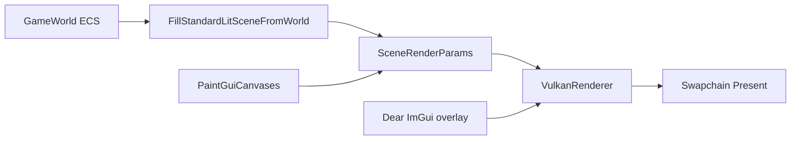

# Engine Capabilities

## Rendering Pipeline (High Level)



## UI toolkits

| Stack | When to use | Key APIs |
|-------|-------------|----------|
| **Spark GUI** (retained) | Menus, editor chrome, themed HUD | `GuiCanvasComponent`, `ProcessGuiCanvasesInput`, `PaintGuiCanvases` |
| **Dear ImGui** (optional, `SPARK_ENABLE_IMGUI`) | Docking tools, debug panels | `IImGuiLayer`, `GuiToolkitSettings`, build UI in `OnRender` |

Full guide: [UI and Toolkits](08-ui-and-toolkits.md).

## 3D Rendering

| Feature | Types / Components |
|---------|-------------------|
| Forward PBR | `MaterialComponent`, `SceneShadingModel::LitPbr` |
| Toon / cel | `SceneShadingModel::ToonCel` |
| Directional + CSM | Sun vector in `SceneRenderParams` |
| Point / spot lights | `PointLightComponent`, `SpotLightComponent` (clustered) |
| Skinned characters | `SkinnedMeshComponent`, `AnimatorComponent`, `AttachmentSocketComponent` |
| Billboards / decals / volumes | `BillboardComponent`, `DecalProjectorComponent`, `FogVolumeComponent`, `PostProcessVolumeComponent` |
| 3D camera rigs | `CameraComponent`, `SpringArm3DComponent`, `CameraFollow3DComponent` |
| Time of day | `TimeOfDayDriverComponent` → `SceneRenderParams::timeOfDay` |
| Terrain | `TerrainComponent` (heightfield) |
| Sky | `SkyComponent` + `SceneSkyMode` |
| Particles | `ParticleEmitterComponent` |
| SSAO / IBL | Fields on `SceneRenderParams` |

## 2D Rendering

| Feature | Types |
|---------|-------|
| Sprites | `SpriteComponent` → `SceneSpriteDraw` |
| Tilemaps | `TilemapComponent`, `TilemapGameplayGridComponent`, `TilemapMapSourceComponent`, layers/autotile/animator/object helpers |
| TMX import | `TmxImporter`, `ApplyTilemapDocument`, `ResolveTilemapAssetPath` |
| Orthographic camera | `Camera2DComponent`, `Camera2DRigComponent` |
| Y-sort occlusion | `SceneSpriteSortMode::SortOrderThenWorldY` |
| 2D sprite lighting modes | `SpriteLighting2DMode` on draw items |

## Simulation & Tools

```cpp
#include "spark/physics/PhysicsSubsystem.hpp"

PhysicsSubsystem physics;
physics.Simulate2D(world, timing);
physics.SimulateAll3D(world, timing);  // rigidbodies + character + triggers
Spark::SimulateGameAi(world, timing, context);
Spark::ProcessSoundCues(world, context);  // listeners + ambient zones + cue flush
Spark::ProcessGuiCanvasesInput(scene, input, fbW, fbH);
```

Legacy free functions (`SimulatePhysics2D`, `SimulatePhysics3D`, …) remain but are **deprecated** — prefer `PhysicsSubsystem`.

**70 built-in components** — full reference: [Game Component Reference](07-game-component-reference.md).

## Asset Loading on GameWorld

```cpp
Spark::GltfAsset asset = world.LoadGltf("assets/models/Cube.glb");
Spark::SkinnedGltfAsset fox = world.LoadSkinnedGltf("assets/models/Fox.glb");
auto tex = world.LoadTexture("assets/sprites/player.png");
world.RegisterMesh(mesh, "my_game/hero");
world.RegisterTexture(tex, "my_game/hero_albedo");
```

Next: [Building and Running](03-building-and-running.md).
