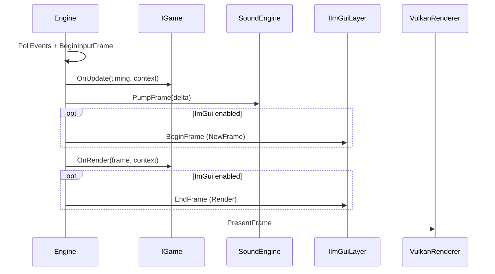

# The Engine Loop

## Class Design: `Engine`

`Spark::Engine` (`spark/engine/Engine.hpp`) owns the application lifetime:

| Responsibility | Detail |
|----------------|--------|
| Owns `IGame` | Unique pointer; destroyed on shutdown |
| Owns `VulkanRenderer` | Implements `IFramePresenter` |
| Owns `SoundEngine` | Pumped each frame |
| Drives loop | Poll → Update → Audio → Render → Present |

```cpp
class Engine {
public:
    explicit Engine(UniquePtr<IGame> game);
    void Run();

    template<typename GameType, typename... Args>
    static UniquePtr<IGame> NewGame(Args&&... args) {
        return UniquePtr<IGame>(new GameType(Forward<Args>(args)...));
    }
};
```

## Frame Sequence



When Dear ImGui is enabled, build all `ImGui::Begin` / widget code inside **`OnRender`**, not `OnUpdate`. See [UI and Toolkits](08-ui-and-toolkits.md).

## FrameTiming

```cpp
struct FrameTiming {
    float deltaTimeSeconds;   // Use for all motion
    float totalTimeSeconds;   // Elapsed since start
    std::uint64_t frameIndex;
};
```

## IEngineContext Facade

Games receive `IEngineContext` — a stable surface hiding engine internals:

```cpp
Window& GetWindow();
IInput& GetInput();
void GetFramebufferSize(int& outWidth, int& outHeight) const;
void SetSceneRenderParams(const SceneRenderParams& params);
IImGuiLayer* TryGetImGuiLayer() noexcept;  // null when SPARK_ENABLE_IMGUI=0
SoundEngine* TryGetSoundEngine() noexcept;
Scene* TryGetScene() noexcept;
```

## Input Example

```cpp
void OnUpdate(const FrameTiming& timing, IEngineContext& context) override {
    IInput& in = context.GetInput();
    if (in.IsKeyPressedThisFrame(GLFW_KEY_ESCAPE))
        glfwSetWindowShouldClose(context.GetWindow().Handle(), GLFW_TRUE);
    if (in.IsKeyPressedThisFrame(GLFW_KEY_F12))
        ; // Engine handles screenshot internally when bound
}
```

## Screenshots

F12 captures the framebuffer to `spark_runtime_assets/screenshots/`.

Next: [IGame and Game](05-igame-contract.md).
