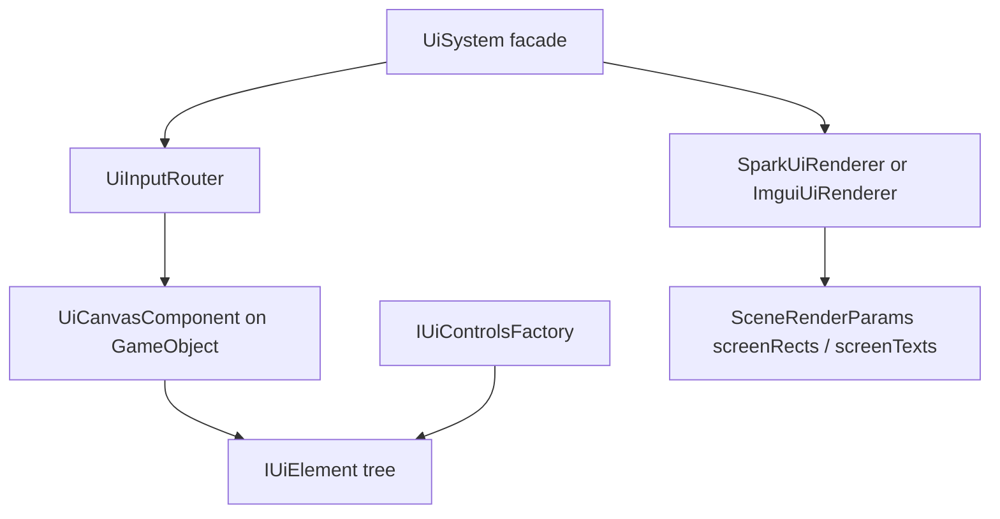
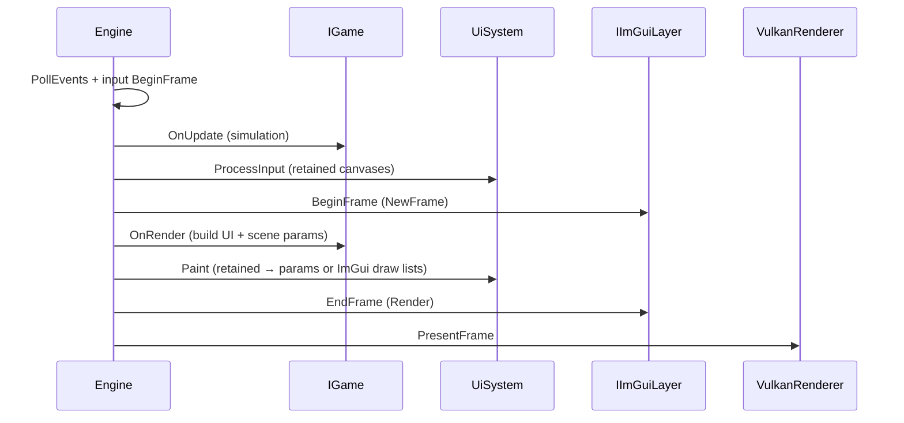

# UI and Toolkits

Spark’s UI lives in **`spark/ui/`** (umbrella header **`spark/ui/Ui.hpp`**). The stack is **retained-mode**: you build an **`IUiElement`** tree on a **`UiCanvasComponent`**, route input each frame, and paint into **`SceneRenderParams`** for the Vulkan screen-UI pass.

Two **backends** share the same factory interfaces:

| Backend | `UiBackendKind` | Factory | Best for |
|---------|-----------------|---------|----------|
| **Spark native** | `SparkNative` | `SparkUiControlsFactory` | Shipped menus, themed HUD, editor chrome |
| **Dear ImGui retained** | `DearImGui` | `DearImguiControlsFactory` | Docking tool panels, rapid internal editors |

Both compile when **`SPARK_ENABLE_IMGUI=ON`** (default). Use **`Ui::UiToolkitSettings`** to choose which backend owns pointer/keyboard routing for a mode.

## Architecture



| Piece | Role |
|-------|------|
| **`UiCanvasComponent`** | ECS root; sort order; hot / active / focus elements |
| **`IUiControlsFactory`** | Creates panels, buttons, lists, dock workspaces, … |
| **`UiSystem`** | Facade: active backend, `ProcessInput` / `Paint`, factory via `GetContext` |
| **`ProcessUiCanvasesInput` / `PaintUiCanvases`** | World-level input + paint entry points (`spark/ui/runtime/UiScene.hpp`) |
| **`UiTheme` / `UiThemeCatalog`** | Semantic colors per canvas (`spark/ui/core/`) |
| **`IDockWorkspace` / `SparkDockWorkspace`** | Editor-style left / center / right panes with collapse |
| **`UiContextMenu`** | Global right-click menus (`GetUiContextMenu()`) |

See also [`GUI_TOOLKIT_ARCHITECTURE.md`](../../../GUI_TOOLKIT_ARCHITECTURE.md), [`ARCHITECTURE_AND_DEVELOPER_GUIDE.md`](../../../ARCHITECTURE_AND_DEVELOPER_GUIDE.md), and [`GUI_EDITOR_ROADMAP.md`](../../../GUI_EDITOR_ROADMAP.md).

## Building a retained canvas

Attach **`UiCanvasComponent`** to a `GameObject`, build a tree with the active factory, then call the scene helpers each frame:

```cpp
#include "spark/ui/Ui.hpp"

Ui::IUiControlsFactory& factory =
    Ui::UiSystem::Get().GetActiveBackendPtr()->GetControlsFactory();

Ui::PanelDesc panelDesc{};
panelDesc.id = Utf8String("menu");
panelDesc.title = Utf8String("Pause");
panelDesc.centerInParent = true;
panelDesc.width = 280.0F;
auto panel = factory.CreatePanel(panelDesc);

Ui::ButtonDesc btnDesc{};
btnDesc.id = Utf8String("resume");
btnDesc.label = Utf8String("Resume");
auto btn = factory.CreateButton(btnDesc);
Ui::UiVoidCallback resumeCb{};
resumeCb.fn = [](void*) { paused = false; };
btn->SetOnClick(resumeCb);
Ui::AdoptUiChild(*panel, MoveTemp(btn));

auto* canvas = uiRoot->AddComponent<UiCanvasComponent>();
canvas->SetRoot(MoveTemp(panel));
```

**Input** (typically from `OnUpdate` or after polling input):

```cpp
Spark::ProcessUiCanvasesInput(world, input, fbW, fbH, contentScaleX, contentScaleY);

if (!Spark::UiScrollWheelConsumed()) {
    // apply camera zoom from scroll wheel
}
if (!Spark::UiConsumesGamePointer()) {
    // viewport pick / orbit / gameplay pointer
}
```

**Paint** (when building `SceneRenderParams`):

```cpp
Spark::PaintUiCanvases(world, params, fbW, fbH);
```

### Input gating helpers

| Function | Purpose |
|----------|---------|
| **`UiConsumesGamePointer()`** | UI owns gameplay pointer this frame (replaces legacy `GuiConsumesGamePointer`) |
| **`UiPointerOverUi()`** | Cursor is over UI chrome — gate viewport picking / orbit |
| **`UiScrollWheelConsumed()`** | UI ate the scroll wheel — gate 3D camera zoom |

### Themes

```cpp
canvas->SetTheme(Ui::UiTheme::SceneEditorDark());
// or Ui::UiTheme::ClassicMint(), Ui::ResolveUiTheme(Ui::UiThemePreset::TwilightSlate), …
```

### Editor docking

Use **`factory.CreateDockWorkspace(DockWorkspaceDesc{})`** (`SparkDockWorkspace` or `ImguiDockWorkspace` depending on backend). **`EditorDockShell`** in `spark/editor/` hosts hierarchy / inspector / viewport panes on a **`UiCanvasComponent`**.

### Context menus

```cpp
Ui::GetUiContextMenu().Open(
    screenX, screenY,
    {Utf8String("Delete"), Utf8String("Duplicate")},
    [](int index) { /* handle pick */ });
```

## Switching backends

```cpp
#include "spark/ui/runtime/UiToolkitSettings.hpp"

Ui::UiToolkitSettings::SetPreferred(Ui::UiBackendKind::DearImGui);
// … tool mode …
Ui::UiToolkitSettings::SetPreferred(Ui::UiBackendKind::SparkNative);
```

When Dear ImGui is preferred, **`UiToolkitSettings::ShouldProcessSparkUiInput()`** returns `false` so Spark-native canvases skip router hit-testing while ImGui owns input.

## Dear ImGui (optional immediate-mode layer)

CMake option **`SPARK_ENABLE_IMGUI`** (default **ON**) links the **docking** branch of Dear ImGui with GLFW + Vulkan backends (`cmake/SparkImGui.cmake`).

### Access from gameplay

```cpp
#include "spark/imgui/IImGuiLayer.hpp"
#include "spark/ui/runtime/UiToolkitSettings.hpp"

void MyToolMode::Enter(Spark::IEngineContext& context) {
    Ui::UiToolkitSettings::SetPreferred(Ui::UiBackendKind::DearImGui);
    if (Spark::IImGuiLayer* imgui = context.TryGetImGuiLayer()) {
        imgui->SetEnabled(imgui->IsAvailable());
    }
}

void MyToolMode::Leave(Spark::IEngineContext& context) noexcept {
    if (Spark::IImGuiLayer* imgui = context.TryGetImGuiLayer()) {
        imgui->SetEnabled(false);
    }
    Ui::UiToolkitSettings::SetPreferred(Ui::UiBackendKind::SparkNative);
}
```

You can mix **retained** ImGui-backend controls (`DearImguiControlsFactory`) with **raw** `ImGui::Begin` windows in **`OnRender`** for debug overlays.

### Engine frame order (ImGui enabled)



**Rules:**

1. Do **not** call `ImGui::Begin` from `OnUpdate` — `NewFrame` runs after update.
2. Call **`InstallPlatformCallbacks`** once after `GlfwInput::WireToWindow` (the engine does this automatically).
3. Gate game pointer with **`UiConsumesGamePointer()`** / **`UiPointerOverUi()`** when both stacks are compiled in.

### Demo

**SparkDemo** launcher item **19 — Dear ImGui tools (docking)** (hotkey **G**): docked Hierarchy / Inspector / Console, optional `ShowDemoWindow`, 3D backdrop. Source: `ImGuiShowcaseDemo` (`include/spark/demo/ImGuiShowcaseDemo.hpp`).

### Disable ImGui

```bash
cmake -S . -B build -DSPARK_ENABLE_IMGUI=OFF
```

`IImGuiLayer` becomes a null object; `SPARK_ENABLE_IMGUI=0` in `spark/config.hpp`.

## Choosing a toolkit

| Use Spark native (`SparkNative`) | Use Dear ImGui backend or raw ImGui |
|----------------------------------|-------------------------------------|
| Shipped game menus with consistent theming | Internal tools, profilers, temp editors |
| `UiCanvasComponent` in saved scenes | Docking-heavy IDE-style layouts |
| Full widget catalog (`TreeView`, lists, scroll panels, …) | ImGui ecosystem widgets / `imgui_demo.cpp` |

Next: [Sprites](../2-2d-graphics/01-sprites.md) (Part 2) or continue with [Game Component Reference](07-game-component-reference.md) for `UiCanvasComponent`.
