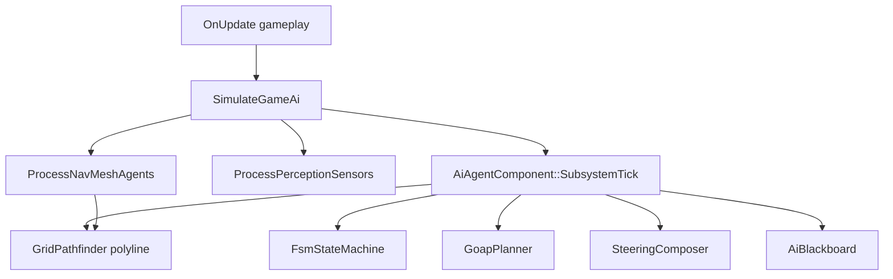

# AI Overview

## Architecture



## Entry Point

```cpp
#include "spark/ai/GameAiSubsystem.hpp"

void OnUpdate(const FrameTiming& timing, IEngineContext& context) override {
    Game::OnUpdate(timing, context);  // player input, physics, etc.
    SimulateGameAi(GetWorld(), timing, context);
}
```

`SimulateGameAi` runs `ProcessNavMeshAgents` and `ProcessPerceptionSensors`, then each enabled `AiAgentComponent::SubsystemTick`.

## End-to-End: Patrol Guard (from `Maze3DDemo`)

This pattern wires patrol path → nav mesh agent → AI agent → perception sensor:

```cpp
#include "spark/ecs/components/ai/AiAgentComponent.hpp"
#include "spark/ecs/components/ai/NavMeshAgentComponent.hpp"
#include "spark/ecs/components/ai/PatrolPathComponent.hpp"
#include "spark/ecs/components/ai/PerceptionSensorComponent.hpp"

// Patrol waypoints on a separate object
GameObject* patrolPathGo = world.CreateGameObject();
PatrolPathComponent* patrol = patrolPathGo->AddComponent<PatrolPathComponent>();
patrol->SetLooping(true);
patrol->GetWaypoints().PushBack(Vector3::Zero);
patrol->GetWaypoints().PushBack({leg, 0.0F, 0.0F});
patrol->GetWaypoints().PushBack({leg, 0.0F, leg});

// Guard entity
GameObject* guardGo = world.CreateGameObject();
guardGo->AddComponent<TransformComponent>()->SetTranslation({pathX, 0.85F, pathZ});
guardGo->AddComponent<MeshComponent>(unitCube, SceneMeshSlot::UnitCube, Vector3{0.92F, 0.22F, 0.18F});

NavMeshAgentComponent* nav = guardGo->AddComponent<NavMeshAgentComponent>();
nav->SetPatrolPathObject(patrolPathGo);

AiAgentComponent* agent = guardGo->AddComponent<AiAgentComponent>();
agent->SetMaxSpeed(3.2F);
agent->SetSteeringPlane(AiSteeringPlane::XzWorld);

PerceptionSensorComponent* perception = guardGo->AddComponent<PerceptionSensorComponent>();
perception->SetSightRadius(9.5F);
perception->SetSightFovDegrees(130.0F);
perception->SetHearingRadius(6.0F);
```

Each frame in `Simulate`:

```cpp
physics.SimulateAll3D(world, timing);
SimulateGameAi(world, timing, context);
```

## Class Design: `AiAgentComponent`

Central ECS hook (`spark/ecs/components/ai/AiAgentComponent.hpp`):

| Module | Enable flag | Storage |
|--------|-------------|---------|
| Blackboard | always | `AiBlackboard` |
| FSM | `fsmEnabled` | `UniquePtr<FsmStateMachine>` |
| GOAP | `goapEnabled` | `goapActions`, `goapPlan` |
| Path follow | implicit | `pathWorldXZ`, `pathIndex` (filled by `NavMeshAgentComponent` or manual grid path) |
| Fuzzy | `fuzzyEnabled` | `UniquePtr<FuzzyAdvisoryModule>` |
| Motion | — | `maxSpeed`, `AiSteeringPlane` |

```cpp
auto* agent = enemy->AddComponent<AiAgentComponent>();
agent->SetMaxSpeed(6.0F);
agent->SetSteeringPlane(AiSteeringPlane::XzWorld);  // or XyRigidbody2D
agent->SetFsmEnabled(true);
agent->SetFsm(MakeUnique<FsmStateMachine>(/* ... */));
```

## Steering Planes

| `AiSteeringPlane` | Maps steering to |
|-------------------|------------------|
| `XzWorld` | World XZ (`Vector2.x` = X, `.y` = Z) |
| `XyRigidbody2D` | `Rigidbody2DComponent` velocity XY |

See `SteeringShowcase3DDemo` (SparkDemo) for seek, flee, flock, and ECS patrol examples.

Next: [Steering Behaviors](02-steering.md).
