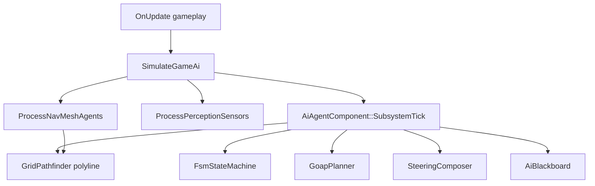

# AI Overview

## Architecture



## Entry Point

```cpp
#include "spark/ai/SimulateGameAi.hpp"

void OnUpdate(const FrameTiming& timing, IEngineContext& context) override {
    // Gameplay input first
    Game::OnUpdate(timing, context);
    SimulateGameAi(GetWorld(), timing, context);
}
```

`SimulateGameAi` runs `ProcessNavMeshAgents` and `ProcessPerceptionSensors`, then each enabled `AiAgentComponent::SubsystemTick`.

## Class Design: `AiAgentComponent`

Central ECS hook (`spark/ecs/components/AiAgentComponent.hpp`):

| Module | Enable flag | Storage |
|--------|-------------|---------|
| Blackboard | always | `AiBlackboard` |
| FSM | `fsmEnabled` | `UniquePtr<FsmStateMachine>` |
| GOAP | `goapEnabled` | `goapActions`, `goapPlan` |
| Path follow | implicit | `pathWorldXZ`, `pathIndex` (filled by `NavMeshAgentComponent` or manual grid path) |
| Fuzzy | `fuzzyEnabled` | `UniquePtr<FuzzyAdvisoryModule>` |
| Motion | — | `maxSpeed`, `AiSteeringPlane` |

```cpp
auto* agent = enemy->AddComponent<AiAgentComponent>();
agent->SetMaxSpeed(6.0F);
agent->SetSteeringPlane(AiSteeringPlane::XzWorld);  // or XyRigidbody2D
agent->SetFsmEnabled(true);
agent->SetFsm(MakeUnique<FsmStateMachine>(/* ... */));
```

## Steering Planes

| `AiSteeringPlane` | Maps steering to |
|-------------------|------------------|
| `XzWorld` | World XZ (`Vector2.x` = X, `.y` = Z) |
| `XyRigidbody2D` | `Rigidbody2DComponent` velocity XY |

Next: [Steering Behaviors](4-ai/02-steering.html).
