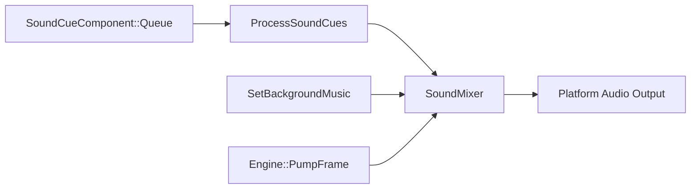

# Sound Engine

## Class Design



| Class | Role |
|-------|------|
| `SoundEngine` | Facade: startup, pump, BGM |
| `SoundMixer` | Voice pool, mixing |
| `SoundClip` | Decoded stereo float PCM |
| `SoundCueComponent` | Per-entity one-shot queue |

## SoundEngine API

```cpp
class SoundEngine {
public:
    bool Startup();
    void Shutdown() noexcept;
    void PumpFrame(float deltaTimeSeconds) noexcept;
    SoundMixer& GetMixer() noexcept;
    void SetBackgroundMusic(const SharedPtr<SoundClip>& clip,
                            float volume = 0.32F, bool loop = true) noexcept;
    void ClearBackgroundMusic() noexcept;
};
```

`Engine::Run` calls `PumpFrame` after `OnUpdate`. Games access audio via:

```cpp
SoundEngine* audio = context.TryGetSoundEngine();
if (audio) {
    audio->SetBackgroundMusic(ambienceClip, 0.25F, true);
}
```

Next: [Sound Clips](6-sound/02-clips.html).
